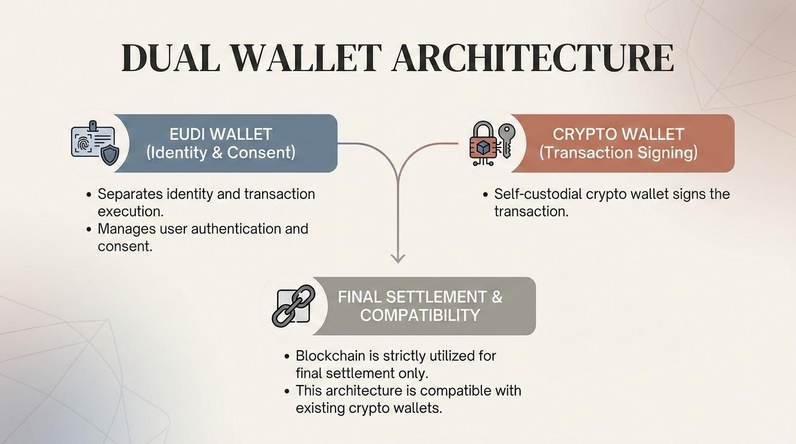
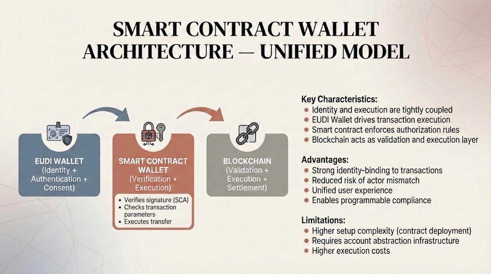
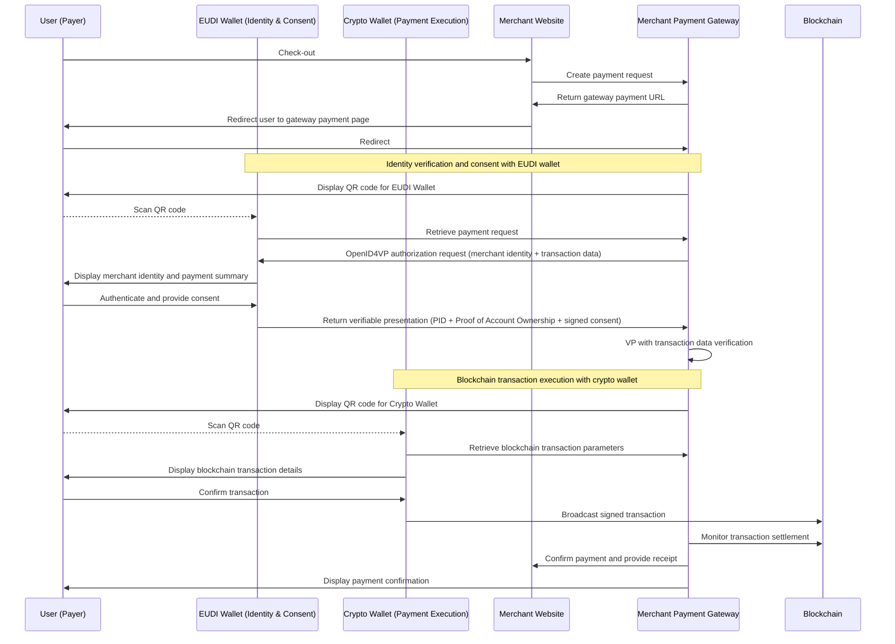
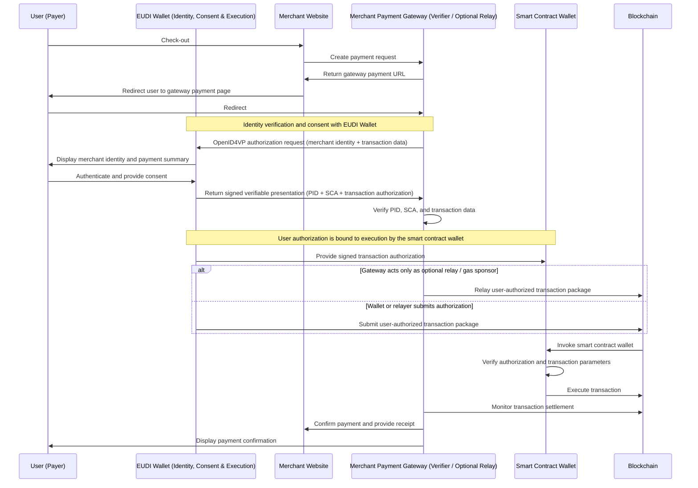

# Secure Identity-Bound Crypto Payments from Natural Persons to Merchants Using the EUDI Wallet

Version 0.8.3

23rd of March 2026

# 1. Executive Overview

This use case demonstrates how the **European Digital Identity Wallet (EUDI Wallet)** can enable secure and compliant **person-to-merchant (P2M) crypto-asset payments**, supporting both **self-custodial wallets on public blockchains** and **regulated or permissioned DLT infrastructures**, while preserving user control and verifiable settlement.

The model enables **identity-bound crypto payments**, where a natural person pays a merchant using a blockchain account that is **cryptographically linked to a verified identity**. The **EUDI Wallet** acts as the trusted identity, authentication, and consent layer.

Through verifiable attestations, the payer proves both:

- their identity
- their control of the blockchain address used for the payment

The architecture establishes a payment flow where:

- A natural person initiates a payment using the **EUDI Wallet**
- Identity authentication is performed using the **EUDI Wallet**
- User consent is captured and **legally binding**

Depending on the architecture:

- **Dual Wallet Model**: the user executes the blockchain transaction directly through a **self-custodial crypto wallet**, maintaining full control of their assets
- **Smart Contract Wallet Model**: the transaction is executed through a **smart contract wallet**, where authorization and execution are unified and can support **programmable controls and regulated environments**

In all cases, **transaction execution remains under user control or user-authorized logic**, and no third party independently executes the transaction on-chain.

This approach combines the strengths of blockchain-based settlement (public or permissioned) with the trust framework of the European Digital Identity ecosystem.

The architecture integrates:

- **Blockchain-based settlement**, either decentralized (public networks) or governed (permissioned DLTs)
- **Qualified Electronic Attestations of Attributes (QEAA)** for identity and blockchain address control
- **Privacy-preserving selective disclosure**
- **Strong Customer Authentication aligned with EU payment standards (ARF TS12)**
- **Regulatory alignment with EU frameworks including eIDAS 2.0 and GDPR**

By combining verifiable digital identity with crypto-asset payments, this model illustrates how the **EUDI Wallet can act as the trusted identity and consent layer for next-generation digital payments in Europe**, across both open and regulated blockchain environments.


# 2. Architecture Overview

The proposed architecture separates **identity, payment authorization, and transaction execution** into distinct components, while preserving the decentralized nature of blockchain settlement.

Two architectural options are considered to introduce an identity layer into crypto-asset transfers between non-custodial wallets on blockchains.

## Option 1 — Dual Wallet Model

The user controls two distinct wallets:

- an **EUDI Wallet** for identity, authentication, and consent
- a **self-custodial crypto wallet** for transaction execution

The **EUDI Wallet** provides the identity layer. It enables the payer to:

- present verifiable identity attestations
- prove control of a blockchain account through a **Proof of Crypto Account Ownership (SCA)**
- provide explicit, transaction-bound consent aligned with **ARF TS12**

This model requires an initial setup step:

- issuance of a **Proof of Crypto Account Ownership attestation**, bound to the user’s device

The **self-custodial crypto wallet** remains responsible for execution. It holds the user’s private keys and signs the blockchain transaction, ensuring full user control over funds.

The **merchant’s payment gateway** (acting as Relying Party) orchestrates the interaction by:

- generating the structured payment request
- providing merchant identity information
- initiating the OpenID4VP authentication request
- preparing transaction parameters (recipient, amount, asset, context)

The user’s crypto wallet independently signs and submits the transaction to the blockchain. The gateway only monitors settlement and confirms payment.

In this model:

- the blockchain acts as a **settlement layer only**
- identity verification and consent remain **off-chain**

This separation enables identity-verified crypto payments without introducing custodial intermediaries.



## Option 2 — Smart Contract Wallet Model

This model leverages **account abstraction**, where the user’s wallet is implemented as an **on-chain smart contract account**.

Initial setup includes:

- deployment of a **smart contract wallet**
- issuance of a **Proof of Crypto Account Ownership attestation** bound to the user

Once initialized, the **EUDI Wallet becomes the primary interface** for both authorization and execution.

The payment flow remains based on **OpenID4VP** and **ARF TS12**, but authorization artifacts are used directly on-chain. These are provided to the smart contract wallet, which performs:

1. **Signature verification** (e.g., P-256 via EIP-7212)
2. **Validation of transaction parameters** (amount, recipient, asset)
3. **Execution of the blockchain transaction**

In this model:

- identity-bound authorization is **verified on-chain**
- execution is **deterministically enforced by the smart contract**

The merchant’s payment gateway continues to:

- act as **Relying Party (Verifier)**
- prepare transaction data
- facilitate interaction

It does not execute or control the transaction.

The blockchain therefore becomes a **combined validation, execution, and settlement layer**.



## Architectural Trade-offs and Design Considerations


| Aspect                                     | Option 1 — Dual Wallet Model                                   | Option 2 — Smart Contract Wallet Model                                          |
| -------------------------------------------- | ----------------------------------------------------------------- | ---------------------------------------------------------------------------------- |
| **Wallet architecture**                    | EUDI Wallet + external self-custodial crypto wallet (EOA)       | EUDI Wallet acting as interface to a smart contract wallet (account abstraction) |
| **Transaction execution**                  | Off-chain signing + on-chain submission by crypto wallet        | On-chain execution triggered by smart contract wallet                            |
| **Signature verification**                 | Off-chain (EUDI + gateway verification)                         | On-chain (smart contract enforces verification)                                  |
| **Authorization ↔ execution coupling**    | Decoupled (identity/consent ≠ execution)                       | Strongly coupled (identity-bound authorization drives execution)                 |
| **Setup complexity**                       | Low (attestation issuance + wallet binding)                     | Higher (contract deployment + attestation issuance + infrastructure)             |
| **User experience (UX)**                   | Two-step flow (EUDI → crypto wallet)                           | Unified flow (single wallet interaction)                                         |
| **Blockchain role**                        | Settlement layer only                                           | Validation + execution + settlement layer                                        |
| **Identity ↔ account binding**            | Established at issuance, verified off-chain at execution time   | Established at issuance and enforced on-chain during execution                   |
| **Binding strength**                       | Strong (cryptographic + procedural, but split across systems)   | Native cryptographic (single execution environment)                              |
| **Execution control**                      | Controlled by external crypto wallet (private key holder)       | Controlled by smart contract logic driven by EUDI authorization artifacts        |
| **Trust model**                            | Layered (EUDI identity + external execution environment)        | Unified (identity, authorization, and execution converge)                        |
| **Risk of actor mismatch**                 | Possible (if crypto wallet is compromised or misused)           | Strongly reduced (execution bound to verified identity artifacts)                |
| **Attack surface**                         | Larger (two wallets, QR flows, relay risks)                     | Reduced (single interaction surface, but introduces smart contract risk)         |
| **Failure modes**                          | Split failures (identity OK but execution fails, or vice versa) | More atomic (authorization + execution linked, but contract failure possible)    |
| **Upgradability / flexibility**            | High (independent evolution of wallets and standards)           | Medium (depends on smart contract upgrade patterns)                              |
| **Interoperability with existing wallets** | High (leverages current crypto wallet ecosystem)                | Lower (requires account abstraction-compatible infrastructure)                   |
| **Regulatory alignment (eIDAS / SCA)**     | Strong (clear separation of identity and payment layers)        | Strong (with tighter enforcement of SCA on-chain)                                |
| **Privacy characteristics**                | Strong (identity remains off-chain)                             | Strong (identity off-chain; only authorization logic touches chain)              |
| **Infrastructure dependency**              | Low (standard wallets + gateway)                                | Higher (requires smart contracts, bundlers/relayers, gas abstraction)            |
| **Scalability considerations**             | High (minimal on-chain logic)                                   | Dependent on chain capacity and execution costs                                  |
| **Cost model**                             | Lower (simple transactions, no contract overhead)               | Higher (deployment + execution costs)                                            |
| **Auditability**                           | Split (off-chain logs + blockchain settlement)                  | More unified (on-chain enforcement + verifiable execution logic)                 |
| **Ecosystem maturity**                     | High (aligned with current Web3 practices)                      | Emerging (depends on account abstraction adoption)                               |

## When to Choose Each Option


| Scenario                                                               | Recommended Option                |
| ------------------------------------------------------------------------ | ----------------------------------- |
| Web3-native environments (DeFi, public blockchains, existing wallets)  | Option 1 — Dual Wallet           |
| Fast adoption and compatibility with existing crypto wallet ecosystems | Option 1 — Dual Wallet           |
| Minimal infrastructure / MVP deployment                                | Option 1 — Dual Wallet           |
| Open ecosystems prioritizing flexibility and interoperability          | Option 1 — Dual Wallet           |
| Regulated financial environments (e.g. banks, payment institutions)    | Option 2 — Smart Contract Wallet |
| Permissioned or hybrid DLT infrastructures                             | Option 2 — Smart Contract Wallet |
| High-value payments requiring strong guarantees and enforcement        | Option 2 — Smart Contract Wallet |
| Need for programmable compliance, policy enforcement, or auditability  | Option 2 — Smart Contract Wallet |
| Desire for unified UX and reduced user friction                        | Option 2 — Smart Contract Wallet |

# 3. Actors and components

## User (Payer)

The payer uses an **EUDI Wallet** for identity authentication and transaction consent, holding:

- a **Person Identification Data (PID)** (or equivalent)
- a **Proof of Crypto Account Ownership** (SCA as QEAA)

Depending on the architecture:

- **Dual Wallet Model**
  The user executes the transaction via a **self-custodial crypto wallet (EOA)**
- **Smart Contract Wallet Model**
  The **EUDI Wallet acts as the primary interface**, triggering execution through a **smart contract wallet** based on identity-bound authorization

## Merchant (Payee)

- Registered legal entity providing goods or services
- Registered as a Relying Party
- Holds a **receiving blockchain account**
- Operates the payment gateway
- May present **verifiable attestations** of legal identity and account ownership

## Payment Gateway (Verifier / Orchestration Layer)

The Payment Gateway is a **technical component operated by the merchant as part of its own infrastructure**.

In this architecture, the gateway acts as the **Relying Party (Verifier)** in OpenID4VP flows and represents the merchant within the EUDI trust framework.

The gateway’s functions are limited to technical processing and communication, including:

- initiating authentication and SCA requests to the EUDI Wallet on behalf of the merchant
- transmitting **merchant-defined** structured transaction data (recipient, amount, asset, context)
- verifying the integrity and validity of identity and SCA attestations returned by the wallet
- facilitating technical communication between the payer, the merchant, and the user’s wallets
- monitoring blockchain settlement and confirming payment to the merchant

The gateway does not at any time:

- hold or control crypto-assets
- initiate transactions on behalf of the user
- modify transaction parameters after user consent
- have signing authority over the transaction
- determine whether a transaction is executed

The execution of the transaction remains **exclusively under the control of the user’s wallet**.

AML/CFT obligations related to the payment flow are performed at the level of the **Payment Gateway as part of the merchant’s infrastructure**, under the responsibility of the merchant as the obligated entity.

These obligations may include:

- transaction monitoring
- detection of suspicious activity
- reporting to competent authorities

Depending on the architecture:

- **Dual Wallet Model**
  The transaction is executed exclusively by the user’s self-custodial crypto wallet.
- **Smart Contract Wallet Model**
  The Payment Gateway may optionally act as a relay or gas sponsor. In this role, it only transmits a **user-authorized transaction package** and cannot independently initiate, modify, or control execution of the payment.

  The gateway does not hold funds, does not have signing authority over the transaction, and does not determine whether a transaction is executed.

## Blockchain Network

DLT infrastructure providing:

- **Dual Wallet Model** → **Settlement layer only**
- **Smart Contract Wallet Model** → **Validation, execution, and settlement**

# 4. Alignment with ARF TS12 Strong Customer Authentication

This payment flow aligns with the **Strong Customer Authentication (SCA) framework defined in ARF Technical Specification TS12**, using wallet-based attestations and transaction-bound consent.

SCA is implemented through a **Proof of Crypto Account Ownership**, issued as an **Electronic Attestation of Attributes QEAA)** by a **Qualified Trust Service Provider (QTSP)**.
This attestation provides verifiable proof that the payer controls a specific blockchain address without exposing private keys or sensitive data.

The payment authorization follows a **third-party requested SCA flow**, where the **Merchant Payment Gateway acts as a Verifier (Registered Relying Party)** initiating an OpenID4VP authorization request.

The request includes structured transaction data and requires the user to present:

- a **Person Identification Data (PID)**  (or equivalent)
- a **Proof of Crypto Account Ownership** (SCA)

The **EUDI Wallet** processes the request, presents the transaction details to the user, and—upon consent—returns a **verifiable presentation** containing identity attributes and SCA proof bound to the transaction.

Payment execution remains under the control of the user:

- In the **Dual Wallet Model**, the user signs and submits the transaction via a self-custodial crypto wallet
- In the **Smart Contract Wallet Model**, execution is performed by the smart contract wallet based on EUDI authorization artifacts

The **Payment Gateway** prepares the transaction data and verifies settlement by monitoring the blockchain, without custody or execution capabilities.

A shared **transaction identifier (`transaction_id`)** can link authentication and settlement.

No personal data is written on-chain; identity verification remains off-chain within the EUDI Wallet.

# 5. SCA Issuance

The detailed technical implementation of the issuance of the **Proof of Crypto Account Ownership (SCA)** is out of scope. This specification focuses on its use within a payment flow aligned with **ARF TS12**.

For regulatory alignment, the credential **MUST be issued as a Qualified Electronic Attestation of Attributes (QEAA)** by a **Qualified Trust Service Provider (QTSP)** in accordance with **eIDAS 2.0**.

## AML and Identity Assurance at Issuance

The issuance of the SCA credential represents a critical step in establishing a **trusted binding between a verified identity and a blockchain account**.

As part of this process, the QTSP may perform **Customer Due Diligence (CDD)** measures in line with applicable **AML/CFT requirements**, including:

- verification of the user’s identity based on **high-assurance identity credentials** (e.g. PID)
- validation of the authenticity and integrity of identity attributes
- where applicable, screening against relevant risk indicators (e.g. sanctions lists)

This issuance step provides a **reusable, high-assurance identity-to-account binding**, which can be leveraged across multiple transactions.

However, this does not replace ongoing AML/CFT obligations.
Entities involved in the payment flow (e.g. merchants) remain responsible for:

- **transaction monitoring**
- **detection of suspicious activity**
- **reporting obligations under applicable AML regulations**

## Issuance Models

The issuance process depends on the wallet architecture:

### Option 1 — Dual Wallet Model

- The blockchain account is generated and controlled by the user’s **self-custodial crypto wallet**
- The QTSP issues the QEAA based on **proof of control of this account**

### Option 2 — Smart Contract Wallet Model

- The blockchain account is an **on-chain smart contract account**
- The QTSP (or a delegated issuer) **deploys the smart contract wallet** and issues the QEAA

In this model, the **identity, wallet key, and blockchain account are bound at issuance**, forming a single cryptographic trust anchor.

## Consistency Requirements

In all cases:

- The blockchain account referenced in the QEAA is the **security anchor**
- The QEAA provides **verifiable proof of control** of that account
- The payment **MUST be executed using the same account**

Relying parties **MUST verify** that the blockchain address in the QEAA matches the address used in the transaction.

This ensures that the **authenticated user and the transaction executor are cryptographically linked**.

## Implementation Principles

Implementations MUST ensure:

- **Cryptographic proof of account control**
- **Secure binding** between the blockchain account and the EUDI Wallet holder
- **Replay and relay protection**
- A **verifiable and consistent link** between identity, wallet key, and blockchain account

The specific binding mechanisms are implementation-dependent.

# 6. Regulatory Positioning

## eIDAS 2.0

- Identity authentication is performed via the **EUDI Wallet**
- Use of **Qualified Electronic Attestations of Attributes (QEAA)** issued by **Qualified Trust Service Providers (QTSPs)**
- Authentication and signatures are **legally recognized across EU Member States**

This architecture leverages the **EUDI trust framework** to provide high-assurance, cross-border identity and authentication.

## MiCA and TFR

MiCA and TFR regulate **crypto-asset services provided by intermediaries (CASPs)** and do not directly apply to **peer-to-peer transfers between self-custodial wallets**.

This architecture operates outside the scope of CASP services, as it:

- does not provide custody, exchange, or transfer services
- relies exclusively on **user-controlled, self-custodial wallets**

However, it aligns with the regulatory objectives of MiCA and TFR by:

- enabling **identification of the payer and (optionally) the merchant**
- strengthening the **binding between identity and blockchain accounts**
- improving **traceability and auditability of transactions**

This supports a level of transparency comparable to regulated environments, without introducing intermediaries.

## AML / CFT Considerations

This architecture introduces a **layered approach to AML/CFT compliance**, combining identity assurance at issuance with transaction-level controls.

- At issuance, the **Proof of Crypto Account Ownership (SCA)** may be issued by a **QTSP** following **Customer Due Diligence (CDD)** measures, establishing a **trusted binding between a verified identity and a blockchain account**.
- During the payment flow, AML/CFT obligations remain applicable to relevant actors (e.g. merchants), including:

  - **transaction monitoring**
  - **detection of suspicious activity**
  - **reporting obligations under applicable regulations**

The solution therefore supports AML objectives by enabling **reliable identification of the payer and strong linkage between identity and transaction execution**, while preserving a self-custodial model.

## GDPR

The architecture follows **privacy-by-design principles**, including:

- **Data minimization** (only required attributes are disclosed)
- **Selective disclosure** through verifiable credentials
- **No personal data written on-chain**
- Off-chain identity processing within the EUDI Wallet

This ensures compliance with GDPR while preserving user privacy.

## PSD2 / PSD3 Alignment

PSD2 regulates **fiat-based payment services involving payment accounts** and does not directly apply to **crypto-asset transfers between self-custodial wallets**.

This architecture does not fall within the scope of payment services under PSD2, as it:

- does not involve payment accounts
- does not include a payment service provider executing or initiating transactions
- maintains **full user control over transaction execution**

However, it aligns with key PSD2 security principles:

- **Strong Customer Authentication (SCA)**-like mechanisms via the EUDI Wallet
- **Explicit user consent** prior to transaction execution
- **Dynamic linking** of authentication to transaction data through cryptographic binding

As such, the model is **PSD2-aligned from a security perspective**, while remaining outside its regulatory scope.

# 7. Business & Ecosystem Impact

## For Merchants

- **Reduced fraud and phishing risks** through identity-bound payments and structured transaction requests
- **Stronger payer authentication** based on verified digital identity (EUDI Wallet)
- **Lower transaction costs** compared to traditional payment infrastructures and intermediaries
- **Improved trust and conversion** through verifiable merchant identity and transparent payment flows
- **Seamless cross-border readiness** within the EU through alignment with eIDAS and EUDI frameworks

## For Consumers

- **Full control over digital assets** via self-custodial wallets
- **Transparent and verifiable merchant identity**, reducing the risk of fraud
- **Strong consent and transaction protection**, with clear, user-verified payment details
- **Reduced reliance on intermediaries**, enabling more efficient transactions
- Ability to use crypto-assets in **identity-enabled and compliant commercial transactions**

## For the EUDI Wallet Ecosystem

- Enables **identity-bound Web3 payments**, bridging digital identity and decentralized finance
- Attracts **digitally native users and innovative services**
- Supports future integration with **Digital Euro and regulated payment infrastructures**
- Contributes to a **trusted European digital payment ecosystem** combining identity, compliance, and decentralization

# 8. Trust Model

Trust in the system is established through two complementary relationships:

1. **User → Merchant (via its Payment Gateway acting as Relying Party)**
2. **Merchant → User Wallet attestations and signatures**

These relationships rely on **EUDI-based identity verification, cryptographic attestations, and blockchain settlement**.

## Trust from the User Perspective

The user’s EUDI Wallet interacts with the **merchant’s Payment Gateway**, which acts as the **Relying Party (RP)** in the OpenID4VP flow.

Trust is established by ensuring that the RP:

- is authenticated and authorized within the **EUDI trust framework**
- is entitled to request the required attestations
- presents accurate **transaction data** (merchant identity, amount, recipient address)

The user then:

- reviews the transaction details
- provides **explicit consent and authentication** via an advanced electronic signature

The trusted counterparty for the user is therefore the **merchant, represented by its gateway**.

### Merchant Attestation (Optional)

The flow may include **merchant attestations** to strengthen trust.

These provide cryptographic proof of:

- merchant legal identity
- control of the receiving blockchain account
- binding between identity and account

The wallet may verify that:

- the attestation is valid and issued by a trusted issuer
- the merchant identity matches the payment request
- the receiving address is consistent

This reduces risks such as **merchant impersonation or address substitution**.

NB : TS12 does not support this feature as of today.

## Trust from the Merchant Perspective

The merchant relies on **wallet-issued attestations and signatures**, including:

- **PID (or equivalent)** for payer identity
- **Proof of crypto account ownership (SCA as QEAA)**
- **user-generated signature** authorizing the transaction
- **blockchain settlement** as verifiable confirmation

Trust is therefore derived from **cryptographic proofs and on-chain execution**, rather than direct identity verification by the merchant.

## Decentralized Settlement

Transactions are executed on the **blockchain**, which provides a **neutral and verifiable settlement layer**.

No intermediary executes or validates the payment.The Payment Gateway, as part of the merchant’s infrastructure, only:

- verifies attestations
- prepares transaction data
- facilitates interaction

## Trust and Integrity Considerations

As the component preparing transaction data, the **Payment Gateway** is a critical trust element. If compromised, it could misrepresent transaction details before user consent.

This risk is mitigated through:

- **user verification of transaction details in the EUDI Wallet**
- **cryptographic binding of consent to transaction data (dynamic linking)**
- optional **merchant attestation verification**

The **EUDI Wallet remains the final trust anchor**, ensuring user-controlled approval before execution.

In the Smart Contract Wallet Model, the gateway does not control execution. Even if it relays the transaction, execution is strictly determined by user-signed authorization and enforced by the smart contract logic.

## Trust Models by Architecture

### Dual Wallet Model (Layered Trust)

- Identity and consent are handled by the **EUDI Wallet**
- Execution is performed by a **separate crypto wallet**
- Settlement occurs on the **blockchain**

➡️ Trust is **distributed** across identity, execution, and settlement layers

### Smart Contract Wallet Model (Unified Trust)

- Identity, authorization, and execution are **cryptographically linked**
- The **smart contract wallet** verifies and enforces authorization on-chain

➡️ Trust is **unified within a single execution environment**

## Key Insight

- **Dual Wallet Model** → distributed trust across components
- **Smart Contract Wallet Model** → unified, on-chain enforced trust

Both rely on the **blockchain as a shared settlement layer**, while differing in how tightly identity and execution are coupled.

# 9. Risk & Liability Analysis

## Reduced Risks

This architecture mitigates key risks associated with crypto-asset payments:

- **Merchant address substitution**
  The payer verifies merchant identity and payment details within the EUDI Wallet before authorizing the transaction.
- **Malicious payment links or QR codes**
  Structured payment requests ensure that transaction parameters are clearly presented and cannot be blindly executed.
- **Merchant impersonation**
  Merchant identity information, optionally supported by attestations, allows the payer to verify the entity requesting payment.
- **Transaction tampering**
  Transaction parameters (amount, asset, recipient address) are included in the authorization and **cryptographically bound to user consent**.
- **Address-replacement malware**
  The payer reviews a trusted transaction summary in the EUDI Wallet prior to execution.
- **Unattributed transfers**
  The use of **PID and proof of crypto account ownership** introduces identity accountability where required.

## Legal Strength

The architecture introduces safeguards that are typically absent from conventional crypto-asset payments:

- **Explicit and informed user consent**
  The transaction is approved through a **signed authorization in the EUDI Wallet**, based on clearly presented transaction data.
- **Identity-bound authorization (eIDAS-aligned)**
  Authentication relies on **PID and Qualified Electronic Attestations of Attributes (QEAA)**, linking the transaction to a **verified legal identity**.
- **End-to-end transaction integrity**
  The signed authorization is **cryptographically bound to the blockchain transaction**, ensuring consistency between consent and execution.
- **Verifiable audit trail**
  The combination of **identity attestations, signed consent, and blockchain settlement** provides a **traceable and auditable record** of the transaction.

These elements provide a stronger foundation for **compliance, dispute resolution, and fraud investigation** compared to standard crypto transfers.

The integration of **eIDAS-qualified identity and cryptographic authorization** introduces a level of legal assurance not typically present in decentralized payment systems.

## Transaction Submission Model (Smart Contract Wallet)

In the Smart Contract Wallet Model, transaction submission is separated from authorization:

- The EUDI Wallet produces a signed, self-contained authorization
- This authorization can be submitted by any actor (wallet, relayer, or gateway)
- The smart contract enforces validity and executes deterministically

As a result:

- submission does not imply control
- the gateway does not act as a payment initiator

# 10. Scenario — Merchant Requested Payment Flow

This section illustrates the interaction between the payer, the EUDI Wallet, the payment gateway, and the blockchain during a P2M crypto payment.

Two execution models are supported:

- **Dual Wallet Model** (external crypto wallet)
- **Smart Contract Wallet Model** (account abstraction)

## Dual Wallet Model

The following sequence diagram illustrates the interaction between the payer, the EUDI Wallet, the payer’s crypto wallet, the payment gateway, and the blockchain.



## Smart Contract Wallet Model

The following sequence diagram illustrates the flow where the **EUDI Wallet directly interacts with a smart contract wallet**, removing the need for a separate crypto wallet.

In this model, the transaction authorization produced by the EUDI Wallet is self-contained and can be submitted to the blockchain by any actor (wallet, relayer, or gateway). The Payment Gateway may optionally broadcast the transaction and sponsor network fees, but does not control execution, which is fully determined by user authorization and enforced by the smart contract.



# 11. Technical Annex

## SCA example

Ethereum account

```json
{
  "iss": "https://issuer.qtsp.com",
  "iat": 1683000000,
  "nbf": 1683000000,
  "exp": 1883000000,
  "vct": "urn:eudi:sca:crypto:1",
  "cnf": {
    "jwk": {
      "kty": "EC",
      "crv": "P-256",
      "x": "TCAER19Zvu3OHF4j4W4vfSVoHIP1ILilDls7vCeGemc",
      "y": "ZxjiWWbZMQGHVWKVQ4hbSIirsVfuecCE6t4jT9F2HZQ"
    }
  },
  "blockchain_network": "Ethereum",
  "caip2_chain_id": "eip155:1",
  "account_address": "0xc5d4d295878ca7a846614104d5ea3f00fcf408f2",
  "status": {
    "status_list": {
      "idx": 0,
      "uri": "https://example.com/statuslists/1"
    }
  }
}
```

Tezos account

```json
{
  "iss": "https://issuer.qtsp.com",
  "iat": 1683000000,
  "nbf": 1683000000,
  "exp": 1883000000,
  "vct": "urn:eudi:sca:crypto:1",
  "cnf": {
    "jwk": {
      "kty": "EC",
      "crv": "P-256",
      "x": "TCAER19Zvu3OHF4j4W4vfSVoHIP1ILilDls7vCeGemc",
      "y": "ZxjiWWbZMQGHVWKVQ4hbSIirsVfuecCE6t4jT9F2HZQ"
    }
  },
  "blockchain_network": "Tezos",
  "caip2_chain_id": "tezos:NetXdQprcVkpaWU",
  "account_address": "tz1VSUr8wwNhLAzempoch5d6hLRiTh8Cjcjb",
  "status": {
    "status_list": {
      "idx": 0,
      "uri": "https://example.com/statuslists/1"
    }
  }
}
```

## SCA metadata example

```json
{
  "vct": "urn:eudi:sca:crypto:1",
  "name": "Crypto Payment SCA Credential",
  "description": "Credential proving control of a blockchain address for crypto asset-payments",
  "claims": [
    {
      "path": ["blockchain_network"],
      "display": [
        {
          "label": "Blockchain",
          "locale": "en-GB"
        }
      ]
    },
    {
      "path": ["account_address"],
      "display": [
        {
          "label": "Account",
          "locale": "en-GB"
        }
      ]
    }
  ],
  "transaction_data_types": [
    {
      "type": "urn:eudi:sca:crypto:transaction:1",
      "claims": [
        {
          "path": ["payload", "transaction_id"],
          "display": [
            {
              "locale": "en-GB",
              "label": "Transaction ID"
            }
          ]
        },
        {
          "path": ["payload", "amount"],
          "display": [
            {
              "locale": "en-GB",
              "label": "Amount"
            }
          ]
        },
        {
          "path": ["payload", "asset", "symbol"],
          "display": [
            {
              "locale": "en-GB",
              "label": "Asset"
            }
          ]
        },
        {
          "path": ["payload", "payee", "name"],
          "display": [
            {
              "locale": "en-GB",
              "label": "Payee"
            }
          ]
        }
      ],
      "ui_labels": {
        "affirmative_action_label": [
          {
            "locale": "en-GB",
            "value": "Confirm Payment"
          }
        ]
      }
    }
  ]
}
```

## Transactional data example

```json
{
  "type": "urn:eudi:sca:crypto:transaction:1",
  "credential_ids": [
    "crypto_sca"
  ],
  "payload": {
    "transaction_id": "657655",
    "payee": {
      "name": "Pizza Shop",
      "id": "HGHG-1",
      "logo": "https://example.com/pizza-shoplogo",
      "website": "https://pizza-shop.com/",
      "account_address": "0xc5d4d295878ca7a846614104d5ea3f00fcf408f2"
    },
    "asset": {
      "symbol": "USDC",
      "address": "0xA0b86991c6218b36c1d19D4a2e9Eb0cE3606eB48",
      "decimals": 6
    },
    "amount": 10000000,
    "caip2_chain_id": "eip155:1"
  }
}
```
