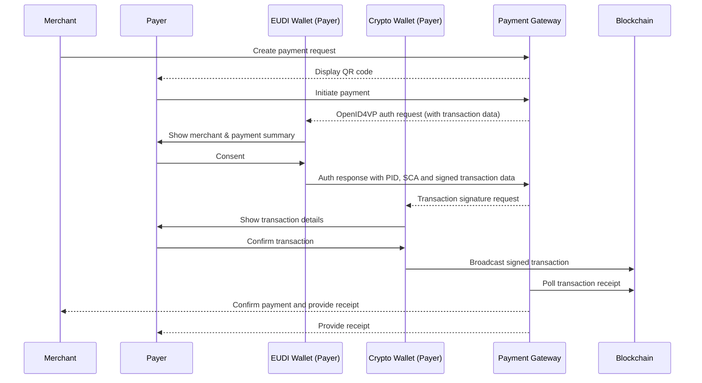

# Use Case: Secure Identity-Assured Crypto Payments from Natural Persons to Merchants Using the EUDI Wallet

**Project:** LSP Aptitude -- WP6
Verifiables, Web3 Digital Wallet, Nomadics Labs

Version 0.4
9th March 2026

# 1. Executive Overview

This use case demonstrates how the **European Digital Identity Wallet (EUDI Wallet)** can enable secure, compliant, and decentralized **Person-to-Merchant (P2M) crypto payments**.

The model allows a natural person to pay a merchant using a **self-custodial crypto wallet**, while relying on the **EUDI Wallet as the trusted identity and authentication layer**. Through verifiable credentials and Strong Customer Authentication (SCA), the payer can securely prove their identity and their control over a blockchain account before executing the transaction.

The architecture establishes a payment flow where:

- A natural person initiates a payment using their **non-custodial crypto wallet**
- Identity authentication is performed using the **EUDI Wallet**
- Merchant identity can be **cryptographically verified**
- User consent is captured and **legally binding**
- The **user executes the blockchain transaction directly**, maintaining full control of their assets
- **No custodial intermediary or payment processor** executes the transaction on-chain

This approach combines the strengths of decentralized blockchain infrastructure with the trust framework of the European Digital Identity ecosystem.

The architecture integrates:

- **Decentralized blockchain settlement**
- **Qualified Electronic Attestations of Attributes ((Q)EAA)** for identity and wallet control
- **Privacy-preserving selective disclosure**
- **Strong Customer Authentication aligned with EU payment standards**
- **Regulatory alignment with EU frameworks including eIDAS 2.0, MiCA, and GDPR**

By connecting verifiable digital identity with self-custodial crypto payments, this model demonstrates how the **EUDI Wallet can serve as the trusted identity layer for next-generation digital payments in Europe**.

# 2. Alignment with ARF TS12 Strong Customer Authentication

This payment flow aligns with the **Strong Customer Authentication (SCA) framework defined in ARF Technical Specification TS12**, which specifies how wallet-based attestations can be used to authorize transactions through verifiable presentations and transaction-bound consent.

In this use case, the SCA mechanism is implemented through a **Proof of Crypto Account Ownership credential** issued as a **Qualified Electronic Attestation of Attributes (QEAA)** by a **Qualified Trust Service Provider (QTSP)**. This credential provides verifiable proof that the payer controls a specific blockchain account address without exposing private keys and user data.

The payment authorization follows a **third-party requested SCA flow**, where the **Payment Gateway acts as a Verifier (Relying Party)** initiating the OpenID4VP Authorization Request. The request contains structured transaction data describing the crypto payment and asks the user to present:

- a **Person Identification Data (PID)** credential or another suitable **identity attestation**, and
- an **SCA attestation proving control of the crypto account address**.

The wallet processes the authorization request, displays the transaction details to the user, and — upon explicit consent — returns a **verifiable presentation** including the requested identity attributes and the SCA proof bound to the transaction.

After the authentication step, the **actual payment execution is performed directly by the user using their own non-custodial crypto wallet**. The user signs and broadcasts the blockchain transaction themselves. No intermediary, payment processor, or gateway executes the on-chain transaction on behalf of the user.

The **Payment Gateway does not custody funds and does not interact with the blockchain on behalf of the user**. Instead, it verifies that the payment has been successfully executed by monitoring the blockchain and matching the transaction to the original payment request.

The **link between the authenticated identity and the blockchain transaction is established through a shared `transaction_id`** which is included both in the SCA transaction data and in the merchant payment request. The payment gateway uses this identifier to associate the authenticated payment intent with the corresponding on-chain transaction.

Importantly, **no personal data or identity attributes are written to the blockchain**. Identity verification and authentication occur entirely off-chain through the EUDI Wallet. The blockchain is used solely as a settlement layer for the crypto transfer.

This architecture preserves the **decentralized nature of blockchain payments**, ensures **user-controlled transaction execution**, and remains **compliant with the SCA processing model defined in ARF TS12**.

# 3. Regulatory Positioning

## eIDAS 2.0

- Identity authentication via EUDI Wallet
- Qualified or advanced electronic signatures
- Qualified Electronic Attestations of Attributes ((Q)EAA)
- Cross-border legal recognition

## MiCA (Markets in Crypto-Assets Regulation)

- Supports compliance for crypto-asset acceptance
- Enables off-chain identity-bound transactions
- Facilitates traceability for regulated commerce

## TFR (Travel Rule)

- Enables originator identification where required
- Allows selective disclosure
- Supports risk-based compliance

## GDPR

- Data minimization
- No personal data written on-chain
- Selective disclosure mechanisms
- Privacy-by-design architecture

# 4. Strategic Sovereignty for Europe

The use of the European Digital Identity Wallet (EUDI Wallet) as the trust anchor for crypto-asset transactions also represents a strategic element of European digital sovereignty.

Today, most infrastructures enabling compliant crypto transfers — including identity layers, travel rule networks, custody providers, and payment orchestration platforms — **are developed and operated by non-European companies**. Reliance on such infrastructures may expose European economic actors to jurisdictional dependencies, regulatory asymmetries, and potential extraterritorial enforcement risks.

By leveraging the EUDI Wallet as the identity and consent layer for wallet-to-wallet crypto payments, **Europe can establish a sovereign trust framework** that:

- Anchors transaction authentication in a European regulatory and technological framework (eIDAS 2.0)
- Ensures that identity verification, consent management, and attribute attestations remain under European governance
- Reduces dependency on non-European compliance infrastructures
- Enables interoperable and privacy-preserving identity-based payments across the EU single market
- Provides a foundation for future integration with European financial infrastructures, including the Digital Euro

In this model, the EUDI Wallet becomes the sovereign identity layer for decentralized financial interactions, enabling compliant crypto-asset transfers without relying on centralized intermediaries or foreign infrastructure providers.

This approach strengthens the strategic autonomy of the European digital economy while preserving the decentralized nature of blockchain-based payments.

# 5. Business & Ecosystem Impact

## For Merchants

- Reduced fraud and phishing risks
- Identity-assured payer authentication
- Lower fees vs traditional payment solutions supported by intermediaries (card networks, banks, ...)
- Cross-border EU readiness

## For Consumers

- Full control of assets
- Transparent merchant verification
- Strong consent protection
- Reduced intermediary costs

## For EUDIW ecosystem

- Introduce innovation with a Web3 identity bound payment initiative
- Attract digitally native and next generation users
- Prepares ecosystem for Digital Euro integration

# 6. Actors

## Payer (Natural Person)

- Holds an EUDI Wallet
- Holds a non-custodial crypto wallet
- Holds a Proof of Crypto Account Ownership ((Q)EAA)

## Merchant (Legal Person)

- Registered legal entity
- Holds organizational EUDI Wallet
- Holds receiving crypto wallet
- Can present verifiable business credentials

## Payment Gateway (Verification and Orchestration Layer)

- Coordinates OpenID4VP flows
- Displays transaction summary
- Anchors consent hash (optional)
- No custody
- Not a PSP or CASP

## Blockchain Network

- Ethereum / Tezos / compatible DLT
- Records transaction immutably

# 7. Trust Model

Trust is achieved via:

1. Merchant verifiable credential
2. Payer identity authentication
3. Proof of Crypto Account Ownership (Q)EAA
4. Advanced electronic signature
5. Blockchain timestamping

No centralized payment processor validates the transaction.

# 8. Detailed Transaction Flow

## Step 1 -- Merchant Payment Request

Merchant creates structured request including:

- Legal name
- Wallet address
- Amount
- Asset
- Invoice reference

## Step 2 -- Merchant Identity Verification

Payer verifies merchant credential via EUDI Wallet.

## Step 3 -- Payer Authentication with PID and SCA as Proof of Crypto Account Ownership (EUDI Wallet)

The flow is initiated through an OpenID4VP Authorization Request aligned with ARF TS12 (Payment with SCA).

The user presents:

- a Person Identification Data (PID) credential or another identity attestation
- a Proof of Crypto Account Ownership credential ((Q)EAA)

Selective disclosure is applied and no private keys are exposed.
No exposure of private keys.

## Step 4 -- Explicit Consent (EUDI wallet)

Advanced electronic signature applied to structured transaction summary.

## Step 5 -- Blockchain Execution (Crypto Wallet)

Transaction broadcast from payer wallet directly to merchant wallet.

## Step 6 -- Receipt & Confirmation

Gateway polls blockchain and confirms settlement.

# 9. Risk & Liability Analysis

## Reduced Risks

- Merchant wallet spoofing
- Fake QR codes
- Phishing
- Anonymous high-value transactions

## Legal Strength

- Signed consent evidence
- Identity-bound audit trail
- Regulatory defensibility

# 10. Digital Euro Readiness

This model creates the foundation for:

- Identity-bound CBDC wallets
- Merchant acceptance of digital euro
- Strong Customer Authentication alignment
- Cross-border interoperable payments

It validates the EUDI Wallet as the trusted identity layer for
next-generation European digital payments.

# 11. Scenario -- Merchant Requested Payment Flow



# 12. Technical Annex

## SCA example

Ethereum account

```json
{
  "iss": "https://issuer.qtsp.com",
  "iat": 1683000000,
  "nbf": 1683000000,
  "exp": 1883000000,
  "vct": "https://talao.co/vct/crypto",
  "cnf": {
    "jwk": {
      "kty": "EC",
      "crv": "P-256",
      "x": "TCAER19Zvu3OHF4j4W4vfSVoHIP1ILilDls7vCeGemc",
      "y": "ZxjiWWbZMQGHVWKVQ4hbSIirsVfuecCE6t4jT9F2HZQ"
    }
  },
  "blockchain_network": "Ethereum",
  "caip2_chain_id": "eip155:1",
  "account_address": "0xc5d4d295878ca7a846614104d5ea3f00fcf408f2",
  "blockchain_logo": "https://talao.co/ethereum_logo.jpeg"
}
```

Tezos account

```json
{
  "iss": "https://issuer.qtsp.com",
  "iat": 1683000000,
  "nbf": 1683000000,
  "exp": 1883000000,
  "vct": "https://talao.co/vct/crypto",
  "cnf": {
    "jwk": {
      "kty": "OKP",
      "crv": "Ed25519",
      "x": "VCpo2LMLhn6iWku8MKvSLg2ZAoC-nlOyPVQaO3FxVeQ"
    }
  },
  "blockchain_network": "Tezos",
  "caip2_chain_id": "tezos:NetXdQprcVkpaWU",
  "account_address": "tz1VSUr8wwNhLAzempoch5d6hLRiTh8Cjcjb",
  "blockchain_logo": "https://talao.co/tezos_logo.jpeg"
}
```

## VC type metadata example

```json
{
  "vct": "https://talao.co/vct/crypto",
  "name": "Crypto Payment SCA Credential",
  "description": "Credential proving control of a blockchain account for crypto payments",
  "claims": [
    {
      "path": ["blockchain_network"],
      "display": [
        {
          "label": "Blockchain",
          "locale": "en-GB"
        }
      ]
    },
    {
      "path": ["account_address"],
      "display": [
        {
          "label": "Account",
          "locale": "en-GB"
        }
      ]
    }
  ],
  "transaction_data_types": [
    {
      "type": "urn:eudi:sca:crypto:payment:1",
      "claims": [
        {
          "path": ["payload", "transaction_id"],
          "display": [
            {
              "locale": "en-GB",
              "label": "Transaction ID"
            }
          ]
        },
        {
          "path": ["payload", "purpose"],
          "display": [
            {
              "locale": "en-GB",
              "label": "Payment description"
            }
          ]
        },
        {
          "path": ["payload", "amount"],
          "display": [
            {
              "locale": "en-GB",
              "label": "Amount"
            }
          ]
        },
        {
          "path": ["payload", "asset", "symbol"],
          "display": [
            {
              "locale": "en-GB",
              "label": "Asset"
            }
          ]
        },
        {
          "path": ["payload", "payee", "name"],
          "display": [
            {
              "locale": "en-GB",
              "label": "Payee"
            }
          ]
        }
      ],
      "ui_labels": {
        "affirmative_action_label": [
          {
            "locale": "en-GB",
            "value": "Confirm Payment"
          }
        ]
      }
    }
  ]
}
```

## Transactional data object

```json
{
  "type": "urn:eudi:sca:crypto:payment:1",
  "credential_ids": [
    "crypto_sca"
  ],
  "payload": {
    "transaction_id": "657655",
    "payee": {
      "name": "Pizza Shop",
      "id": "HGHG-1",
      "logo": "https://example.com/pizza-shoplogo",
      "website": "https://pizza-shop.com/",
      "account_address": "0xc5d4d295878ca7a846614104d5ea3f00fcf408f2"
    },
    "asset": {
      "symbol": "USDC",
      "address": "0xA0b86991c6218b36c1d19D4a2e9Eb0cE3606eB48",
      "decimals": 6
    },
    "amount": 10,
    "caip2_chain_id": "eip155:1",
    "purpose": "Buy 1 Chorizo Pizza"
  }
}
```
