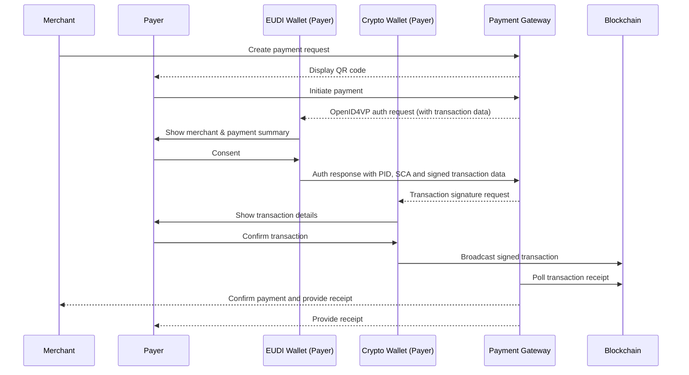

# Secure Crypto Payments from Natural Persons to Merchants Using the EUDI Wallet

**Project:** LSP Aptitude/WP6/crypto
Verifiables, Web3 Digital Wallet, Nomadics Labs

Version 0.5

10th March 2026

# 1. Executive Overview

This use case demonstrates how the **European Digital Identity Wallet (EUDI Wallet)** can enable secure, compliant, and decentralized **Person-to-Merchant (P2M) crypto payments**.

The model allows a natural person to pay a merchant using a **self-custodial crypto wallet**, while relying on the **EUDI Wallet as the trusted identity and authentication layer**. Through verifiable credentials and Strong Customer Authentication (SCA), the payer can securely prove their identity and their control over a blockchain account before executing the transaction.

The architecture establishes a payment flow where:

- A natural person initiates a payment using their **non-custodial crypto wallet**
- Identity authentication is performed using the **EUDI Wallet**
- Merchant identity can be **cryptographically verified**
- User consent is captured and **legally binding**
- The **user executes the blockchain transaction directly**, maintaining full control of their assets
- **No custodial intermediary or payment processor** executes the transaction on-chain

This approach combines the strengths of decentralized blockchain infrastructure with the trust framework of the European Digital Identity ecosystem.

The architecture integrates:

- **Decentralized blockchain settlement**
- **Qualified Electronic Attestations of Attributes ((Q)EAA)** for identity and blockchain account address control
- **Privacy-preserving selective disclosure**
- **Strong Customer Authentication aligned with EU payment standards**
- **Regulatory alignment with EU frameworks including eIDAS 2.0, MiCA, and GDPR**

By connecting verifiable digital identity with self-custodial crypto payments, this model demonstrates how the **EUDI Wallet can serve as the trusted identity layer for next-generation digital payments in Europe**.

# 2. Alignment with ARF TS12 Strong Customer Authentication

This payment flow aligns with the **Strong Customer Authentication (SCA) framework defined in ARF Technical Specification TS12**, which specifies how wallet-based attestations can be used to authorize transactions through verifiable presentations and transaction-bound consent.

In this model, SCA is implemented through a **Proof of Crypto Account Ownership credential**, issued as a **Qualified Electronic Attestation of Attributes (QEAA)** by a **Qualified Trust Service Provider (QTSP)**.

This credential provides verifiable proof that the payer controls a specific blockchain account address without exposing private keys or sensitive wallet information.

The payment authorization follows a **third-party requested SCA flow**, where the **Payment Gateway acts as a Verifier (Relying Party)** initiating the OpenID4VP Authorization Request.

The request contains structured transaction data describing the crypto payment and asks the user to present:

* a **Person Identification Data (PID)** credential or equivalent identity attestation
* a **Proof of Crypto Account Ownership credential (SCA)**

The EUDI Wallet processes the authorization request, displays the transaction details to the user, and—upon explicit consent—returns a **verifiable presentation** containing the requested identity attributes and the SCA proof bound to the transaction.

After authentication, the **actual payment execution is performed directly by the user using their own self-custodial crypto wallet**.

The user signs and broadcasts the blockchain transaction themselves. No intermediary executes the on-chain transaction on behalf of the user.

The **Payment Gateway does not custody funds and does not sign or submit blockchain transactions on behalf of the user**.

Instead, it verifies that the payment has been executed successfully by monitoring the blockchain and matching the transaction to the original payment request.

The association between authentication and settlement can be established through a shared **transaction identifier (`transaction_id`)** included in both the payment request and the blockchain transaction.

Importantly, **no personal data or identity attributes are written to the blockchain**.

Identity verification occurs entirely off-chain through the EUDI Wallet, while the blockchain is used solely as the **settlement layer** for the crypto transfer.

# 3. Regulatory Positioning

## eIDAS 2.0

* Identity authentication via the **EUDI Wallet**
* Use of **Qualified Electronic Attestations of Attributes (QEAA)**
* Legally recognized authentication across EU Member States

## MiCA (Markets in Crypto-Assets Regulation)

- Supports compliance for crypto-asset acceptance
- Enables off-chain identity-bound transactions
- Facilitates traceability for regulated commerce

## TFR (Travel Rule)

- Enables originator identification where required
- Allows selective disclosure
- Supports risk-based compliance

## GDPR

- Data minimization
- No personal data written on-chain
- Selective disclosure mechanisms
- Privacy-by-design architecture

## PSD2 Alignment

* Payment authorization remains under **direct control of the payer**
* Authentication follows **Strong Customer Authentication principles**
* No payment service provider executes the transaction

# 4. Strategic Sovereignty for Europe

Using the **European Digital Identity Wallet** as the trust anchor for crypto-asset transactions represents a strategic opportunity for **European digital sovereignty**.

Today, many infrastructures supporting regulated crypto-asset transfers—including identity layers, compliance infrastructures, and payment orchestration systems—are developed and operated by non-European providers.

This dependence can expose European economic actors to:

* jurisdictional dependencies
* regulatory asymmetries
* extraterritorial enforcement risks

By leveraging the **EUDI Wallet** as the identity and consent layer for wallet-to-wallet crypto payments, Europe can establish a **sovereign trust framework** that:

* Anchors authentication in a **European regulatory framework (eIDAS 2.0)**
* Ensures identity verification and consent management remain under **European governance**
* Reduces dependency on non-European compliance infrastructures
* Enables interoperable identity-based payments across the EU Single Market
* Provides a foundation for integration with **European financial infrastructures**, including the **Digital Euro**

This architecture preserves the **decentralized nature of blockchain settlement** while reinforcing European control over the **identity and trust layers of digital financial interactions**.

# 5. Business & Ecosystem Impact

## For Merchants

* Reduced fraud and phishing risks
* Strong payer authentication through verified digital identity
* Lower transaction costs compared to traditional payment infrastructures
* Seamless readiness for cross-border EU payments

## For Consumers

* Full control over their digital assets
* Transparent and verifiable merchant identity
* Strong transaction consent protection
* Reduced intermediary costs
* Ability to use cryptocurrency in **legally compliant commercial transactions**

## For the EUDIW Ecosystem

* Introduces innovation through **Web3 identity-bound payments**
* Attracts digitally native and next-generation users
* Prepares the ecosystem for future **Digital Euro integration**

## 6. Actors

### Payer (Natural Person)

* Holds an **EUDI Wallet** used for identity authentication and explicit transaction consent
* Holds a **self-custodial crypto wallet** used to execute the blockchain transaction
* Holds a **Proof of Identity credential (PID or equivalent)** linking their identity to the wallet device
* Holds a **Proof of Crypto Account Ownership credential (SCA as QEAA)** linking their blockchain account address to the wallet device

### Merchant (Legal Person)

* Registered legal entity providing goods or services
* Holds a **receiving self-custodial crypto wallet address**
* May present **verifiable attestations proving legal identity and blockchain account ownership**

### Payment Gateway (Verification and Orchestration Layer)

* Onboards and verifies merchants (KYB process or EU Business Wallet credentials)
* Acts as the **Verifier / Relying Party** in OpenID4VP authentication flows with the EUDI Wallet
* Orchestrates the payment authorization session and manages transaction context
* Prepares the structured **payment request and transaction payload** presented to the payer
* Verifies identity and **Strong Customer Authentication (SCA)** attestations returned by the EUDI Wallet
* Monitors the blockchain to detect and match the corresponding on-chain transaction
* Generates and distributes payment confirmations and transaction receipts
* **Does not hold or control user funds (non-custodial)**
* **Does not execute blockchain transactions on behalf of the user**
* **Not a Payment Service Provider (PSP) nor a Crypto-Asset Service Provider (CASP)**

### Blockchain Network

* Public blockchain infrastructure (e.g., Ethereum, Tezos, or compatible DLT)
* Serves as the **settlement layer** for the crypto transaction
* Records transactions immutably and provides publicly verifiable confirmation

# 7. Trust Model

Trust in the system is established through a combination of **identity verification, cryptographic attestations, and decentralized settlement mechanisms**:

1. Merchant identity verification through **KYB or EU Business Wallet credentials**
2. Merchant proof of **blockchain account ownership**
3. Payer authentication through **PID or equivalent identity credential**
4. Proof of crypto account ownership issued as a **QEAA**
5. Explicit user consent through **advanced electronic signature**
6. Blockchain settlement providing **publicly verifiable timestamped confirmation**

No centralized payment processor validates or executes the transaction.

# 8. Detailed Transaction Flow

## Step 1 -- Merchant Payment Request

Merchant creates structured request including:

- Legal name
- Blockchain account address
- Amount
- Asset

## Step 2 -- Merchant Identity Verification

Payer verifies merchant identity via EUDI Wallet.

## Step 3 -- Payer Authentication with PID and SCA as Proof of Crypto Account Ownership (EUDI Wallet)

The flow is initiated through an OpenID4VP Authorization Request aligned with ARF TS12 (Payment with SCA).

The user presents:

- a Person Identification Data (PID) credential or another identity attestation
- a Proof of Crypto Account Ownership credential (SCA as a (Q)EAA)

Selective disclosure is applied and no private keys are exposed.
No exposure of private keys.

## Step 4 -- Explicit Consent (EUDI wallet)

Advanced electronic signature applied to structured transaction summary.

## Step 5 -- Blockchain Execution (Crypto Wallet)

Transaction broadcast from payer wallet directly to merchant wallet.

## Step 6 -- Receipt & Confirmation

Gateway polls blockchain and confirms settlement.

# 9. Risk & Liability Analysis

## Reduced Risks

* Merchant wallet spoofing
* Fake QR codes
* Phishing attacks
* Merchant impersonation
* Payment request tampering
* Anonymous high-value transactions

## Legal Strength

* Signed user consent
* Identity-bound transaction authorization
* Verifiable audit trail
* Strong regulatory defensibility

# 10. Digital Euro Readiness

This architecture creates a foundation for future **European Central Bank Digital Currency (CBDC)** use cases, including:

* Identity-bound CBDC wallets
* Merchant acceptance of the **Digital Euro**
* SCA-compliant digital currency payments
* Cross-border interoperable payments within the EU

The model demonstrates how the **EUDI Wallet can act as the trusted identity layer for future European digital payment infrastructures**.

# 11. Scenario -- Merchant Requested Payment Flow



# 12. Technical Annex

## SCA example

Ethereum account

```json
{
  "iss": "https://issuer.qtsp.com",
  "iat": 1683000000,
  "nbf": 1683000000,
  "exp": 1883000000,
  "vct": "https://talao.co/vct/crypto",
  "cnf": {
    "jwk": {
      "kty": "EC",
      "crv": "P-256",
      "x": "TCAER19Zvu3OHF4j4W4vfSVoHIP1ILilDls7vCeGemc",
      "y": "ZxjiWWbZMQGHVWKVQ4hbSIirsVfuecCE6t4jT9F2HZQ"
    }
  },
  "blockchain_network": "Ethereum",
  "caip2_chain_id": "eip155:1",
  "account_address": "0xc5d4d295878ca7a846614104d5ea3f00fcf408f2",
  "blockchain_logo": "https://talao.co/ethereum_logo.jpeg"
}
```

Tezos account

```json
{
  "iss": "https://issuer.qtsp.com",
  "iat": 1683000000,
  "nbf": 1683000000,
  "exp": 1883000000,
  "vct": "https://talao.co/vct/crypto",
  "cnf": {
    "jwk": {
      "kty": "OKP",
      "crv": "Ed25519",
      "x": "VCpo2LMLhn6iWku8MKvSLg2ZAoC-nlOyPVQaO3FxVeQ"
    }
  },
  "blockchain_network": "Tezos",
  "caip2_chain_id": "tezos:NetXdQprcVkpaWU",
  "account_address": "tz1VSUr8wwNhLAzempoch5d6hLRiTh8Cjcjb",
  "blockchain_logo": "https://talao.co/tezos_logo.jpeg"
}
```

## VC type metadata example

```json
{
  "vct": "https://talao.co/vct/crypto",
  "name": "Crypto Payment SCA Credential",
  "description": "Credential proving control of a blockchain account for crypto payments",
  "claims": [
    {
      "path": ["blockchain_network"],
      "display": [
        {
          "label": "Blockchain",
          "locale": "en-GB"
        }
      ]
    },
    {
      "path": ["account_address"],
      "display": [
        {
          "label": "Account",
          "locale": "en-GB"
        }
      ]
    }
  ],
  "transaction_data_types": [
    {
      "type": "urn:eudi:sca:crypto:1",
      "claims": [
        {
          "path": ["payload", "transaction_id"],
          "display": [
            {
              "locale": "en-GB",
              "label": "Transaction ID"
            }
          ]
        },
        {
          "path": ["payload", "amount"],
          "display": [
            {
              "locale": "en-GB",
              "label": "Amount"
            }
          ]
        },
        {
          "path": ["payload", "asset", "symbol"],
          "display": [
            {
              "locale": "en-GB",
              "label": "Asset"
            }
          ]
        },
        {
          "path": ["payload", "payee", "name"],
          "display": [
            {
              "locale": "en-GB",
              "label": "Payee"
            }
          ]
        }
      ],
      "ui_labels": {
        "affirmative_action_label": [
          {
            "locale": "en-GB",
            "value": "Confirm Payment"
          }
        ]
      }
    }
  ]
}
```

## Transactional data object

```json
{
  "type": "urn:eudi:sca:crypto:1",
  "credential_ids": [
    "crypto_sca"
  ],
  "payload": {
    "transaction_id": "657655",
    "payee": {
      "name": "Pizza Shop",
      "id": "HGHG-1",
      "logo": "https://example.com/pizza-shoplogo",
      "website": "https://pizza-shop.com/",
      "account_address": "0xc5d4d295878ca7a846614104d5ea3f00fcf408f2"
    },
    "asset": {
      "symbol": "USDC",
      "address": "0xA0b86991c6218b36c1d19D4a2e9Eb0cE3606eB48",
      "decimals": 6
    },
    "amount": 10,
    "caip2_chain_id": "eip155:1"
  }
}
```
