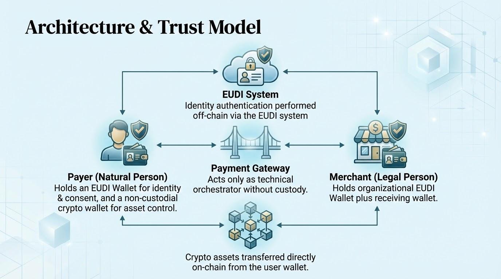
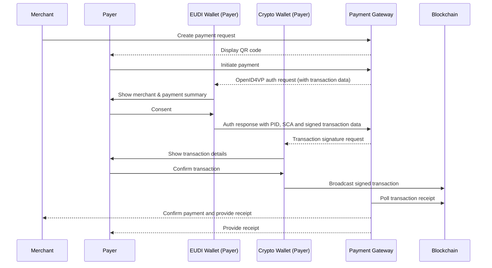

# Secure Crypto Payments from Natural Persons to Merchants Using the EUDI Wallet

Version 0.6.2

12th March 2026

# 1. Executive Overview

This use case demonstrates how the **European Digital Identity Wallet (EUDI Wallet)** can enable secure, compliant, and decentralized **Person-to-Merchant (P2M) crypto payments**.

The model allows a natural person to pay a merchant using a **self-custodial crypto wallet**, while relying on the **EUDI Wallet as the trusted identity and authentication layer**. Through verifiable attestations, the payer can securely prove their identity and their control over a blockchain account before executing the transaction.

The architecture establishes a payment flow where:

- A natural person initiates a payment using their **non-custodial crypto wallet**
- Identity authentication is performed using the **EUDI Wallet**
- User consent is captured and **legally binding**
- The **user executes the blockchain transaction directly**, maintaining full control of their assets
- **No custodial intermediary or payment processor** executes the transaction on-chain

This approach combines the strengths of decentralized blockchain infrastructure with the trust framework of the European Digital Identity ecosystem.

The architecture integrates:

- **Decentralized blockchain settlement**
- **Qualified Electronic Attestations of Attributes ((Q)EAA)** for identity and blockchain account address control
- **Privacy-preserving selective disclosure**
- **Strong Customer Authentication aligned with EU payment standards (current TS12)**
- **Regulatory alignment with EU frameworks including eIDAS 2.0, MiCA, and GDPR**

By connecting verifiable digital identity with self-custodial crypto payments, this model demonstrates how the **EUDI Wallet can serve as the trusted identity layer for next-generation digital payments in Europe**.

# 2. Alignment with ARF TS12 Strong Customer Authentication

This payment flow aligns with the **Strong Customer Authentication (SCA) framework defined in ARF Technical Specification TS12**, which specifies how wallet-based attestations can be used to authorize transactions through verifiable presentations and transaction-bound consent.

In this model, SCA is implemented through a **Proof of Crypto Account Ownership credential**, issued as a **Qualified Electronic Attestation of Attributes (QEAA)** by a **Qualified Trust Service Provider (QTSP)**.

This credential provides verifiable proof that the payer controls a specific blockchain account address without exposing private keys, sensitive wallet information or user data.

The payment authorization follows a **third-party requested SCA flow**, where the **Payment Gateway acts as a Verifier (Registered Relying Party)** initiating the OpenID4VP Authorization Request.

The request contains structured transaction data describing the crypto payment and asks the user to present:

* a **Person Identification Data (PID)** credential or equivalent identity attestation
* a **Proof of Crypto Account Ownership credential (as an SCA in TS12)**

The EUDI Wallet processes the authorization request, displays the transaction details to the user, and—upon explicit consent—returns a **verifiable presentation** containing the requested identity attributes and the SCA proof bound to the transaction.

After authentication, the **actual payment execution is performed directly by the user using their own self-custodial crypto wallet**.

The user signs and broadcasts the blockchain transaction themselves. No intermediary executes the on-chain transaction on behalf of the user.

The **Payment Gateway does not custody funds and does not sign or submit blockchain transactions on behalf of the user**.

Instead, it verifies that the payment has been executed successfully by monitoring the blockchain and matching the transaction to the original payment request.

The association between authentication and settlement can be eventually established through a shared **transaction identifier (`transaction_id`)** included in both the payment request and the blockchain transaction. However this docuent does not specify the technical implementtaon of the Payment Gateway.

Importantly, **no personal data or identity attributes are written to the blockchain**.

Identity verification occurs entirely off-chain through the EUDI Wallet, while the blockchain is used solely as the **settlement layer** for the crypto transfer.

# 3. Strategic Sovereignty for Europe

Using the **European Digital Identity Wallet (EUDI Wallet)** as the trust anchor for crypto-asset transactions represents a strategic opportunity for **European digital sovereignty**.

Today, many infrastructures supporting regulated crypto-asset transfers—including identity layers, compliance services, and payment orchestration platforms—are developed and operated by non-European providers. This dependence can expose European economic actors to:

* jurisdictional dependencies
* regulatory asymmetries
* extraterritorial enforcement risks

The introduction of **EUDI Wallets for both natural and legal persons under eIDAS 2.0** enables a European identity framework that can support **wallet-to-wallet crypto transactions for both individuals and businesses**.

In this model:

* **Individuals** authenticate and authorize transactions using their personal **EUDI Wallet**
* **Companies and merchants** can use **EUDI Wallets for legal persons** to disclose verified organizational identity attributes
* **B2B and B2C crypto payments** can rely on verifiable European digital identity attestations rather than identity services operated by non-European platforms that currently dominate crypto compliance and payment infrastructures.

By leveraging the **EUDI Wallet** as the identity and consent layer for crypto transfers, Europe can establish a **sovereign trust framework** that:

* Anchors authentication in a **European regulatory framework (eIDAS 2.0)**
* Enables **verified identities for both individuals and companies** participating in crypto transactions
* Ensures identity verification and consent management remain under **European governance**
* Reduces dependency on non-European identity and compliance infrastructures
* Enables interoperable **identity-based crypto payments across the EU Single Market**
* Provides a foundation for integration with European financial infrastructures, including the **Digital Euro**

This architecture preserves the **decentralized nature of blockchain settlement** while reinforcing European control over the **identity, authentication, and trust layers of digital financial interactions**.

# 4. Regulatory Positioning

## eIDAS 2.0

* Identity authentication via the **EUDI Wallet**
* Use of **Qualified Electronic Attestations of Attributes (QEAA)**
* Legally recognized authentication across EU Member States

## MiCA (Markets in Crypto-Assets Regulation)

- Supports compliance for crypto-asset acceptance
- Enables off-chain identity-bound transactions
- Facilitates traceability for regulated commerce

## TFR (Travel Rule)

- Enables originator identification where required
- Allows selective disclosure
- Supports risk-based compliance

## GDPR

- Data minimization
- No personal data written on-chain
- Selective disclosure mechanisms
- Privacy-by-design architecture

## PSD2 / PSD3 Alignment

* Payment authorization remains under **direct control of the payer**
* Authentication follows principles comparable to **Strong Customer Authentication (SCA)**
* Transaction approval includes **dynamic linking of transaction parameters** (e.g., payee and amount)
* No intermediary **payment service provider executes the transaction**

PSD2 primarily regulates **fiat payment services provided by regulated payment service providers** and does not directly govern **peer-to-peer crypto-asset transfers executed from self-custodial wallets**.

However, this architecture aligns with key **PSD2 security principles**, including strong user authentication, explicit user consent, and **dynamic linking of authentication to transaction data through cryptographic signing**.

The design is also compatible with the direction of **PSD3 and the upcoming Payment Services Regulation (PSR)**, which reinforce authentication, fraud prevention, and user protection requirements. Because transactions are executed directly by the user without an intermediary payment service provider, most regulatory obligations applicable to PSPs do not apply.

# 5. Business & Ecosystem Impact

## For Merchants

* Reduced fraud and phishing risks
* Strong payer authentication through verified digital identity
* Lower transaction costs compared to traditional payment infrastructures
* Seamless readiness for cross-border EU payments

## For Consumers

* Full control over their digital assets
* Transparent and verifiable merchant identity
* Strong transaction consent protection
* Reduced intermediary costs
* Ability to use cryptocurrency in **legally compliant commercial transactions**

## For the EUDIW Ecosystem

* Introduces innovation through **Web3 identity-bound payments**
* Attracts digitally native and next-generation users
* Prepares the ecosystem for future **Digital Euro integration**

## 6. Actors

### Payer (Natural Person)

* Holds an **EUDI Wallet** used for identity authentication and explicit transaction consent
* Holds a **self-custodial crypto wallet** used to execute the blockchain transaction
* Holds a **Proof of Identity credential (PID or equivalent)** linking their identity to the wallet device
* Holds a **Proof of Crypto Account Ownership credential (SCA as QEAA)** linking their blockchain account address to the wallet device

### Merchant (Legal Person)

* Registered legal entity providing goods or services
* Holds a **receiving self-custodial crypto wallet address**
* May present **verifiable attestations proving legal identity and blockchain account ownership**

### Payment Gateway (Verification and Orchestration Layer)

* Onboards and verifies merchants (KYB process or EU Business Wallet credentials)
* Acts as the **Verifier / Relying Party** in OpenID4VP authentication flows with the EUDI Wallet
* Orchestrates the payment authorization session and manages transaction context
* Prepares the structured **payment request and transaction payload** presented to the payer
* Verifies identity and **Strong Customer Authentication (SCA)** attestations returned by the EUDI Wallet
* Monitors the blockchain to detect and match the corresponding on-chain transaction
* Generates and distributes payment confirmations and transaction receipts
* **Does not hold or control user funds (non-custodial)**
* **Does not execute blockchain transactions on behalf of the user**
* **Not a Payment Service Provider (PSP) nor a Crypto-Asset Service Provider (CASP)**

### Blockchain Network

* Public blockchain infrastructure (e.g., Ethereum, Tezos, or compatible DLT)
* Serves as the **settlement layer** for the crypto transaction
* Records transactions immutably and provides publicly verifiable confirmation

# 7. Trust Model

Trust in the system is established through **two complementary trust relationships**:

1. Trust between the **user wallet and the Relying Party (payment gateway)**
2. Trust between the **merchant and the payer’s wallet attestations**

These relationships are supported by **identity verification, cryptographic attestations, and decentralized blockchain settlement**.

## 7.1 Trust from the User Wallet Perspective

The user’s wallet interacts only with the **Relying Party (RP)** that initiates the credential request using the **OpenID4VP protocol**.
The RP in this architecture is the **payment gateway**.

The wallet establishes trust by verifying that the RP is authorized within the **EUDI trust framework**.

This trust is established through:

1. **Relying Party authentication** using a *Wallet Relying Party Access Certificate* issued under the EUDI trust framework.
2. Verification that the RP is **registered and authorized** to request the required credentials.
3. Presentation of the **transaction context** (merchant name, payment amount, blockchain address) to the user before consent.
4. **Explicit user consent and authentication** using an **advanced electronic signature** generated by the wallet.

From the wallet’s perspective, the trusted counterparty is therefore the **Relying Party operating the payment gateway**, which is responsible for presenting accurate transaction information.

## 7.2 Trust from the Merchant Perspective

The merchant obtains trust from the **cryptographically verifiable attestations and signatures generated by the user’s wallet**.

This trust is established through:

1. **Payer identity verification** using the **PID (or equivalent identity attestation)** issued within the EUDI ecosystem.
2. **Proof of crypto account ownership**, issued as a **Qualified Electronic Attestation of Attributes (QEAA)** linking the payer to a blockchain address.
3. A **user-generated advanced electronic signature** authorizing the transaction.
4. **Blockchain settlement**, providing publicly verifiable and timestamped confirmation that the payment has been executed.

The merchant therefore relies on **wallet-issued attestations and blockchain confirmation**, rather than performing direct identity verification of the payer.

## 7.3 Decentralized Settlement

The payment itself is executed through the **blockchain network**, which provides a **decentralized and publicly verifiable settlement layer**.

No centralized payment processor validates or executes the transaction itself.
The payment gateway acts only as a **Relying Party that verifies credentials and facilitates the interaction between the wallet, the merchant, and the blockchain network**.

## 7.4 Summary of Trust Relationships

The overall trust model can be summarized as follows:

`User Wallet → trusts → Payment Gateway (Relying Party)`

`Merchant → trusts → Wallet attestations and signatures`

`Both parties → trust → Blockchain settlement`



# 8. Detailed Transaction Flow

> The flow involves **two distinct user wallets**:
> the **EUDI Wallet**, used for identity verification and payment authorization, and the **crypto wallet**, which holds the user’s private keys and executes the blockchain transaction.

## Step 1 — Merchant Payment Request

The merchant generates a structured payment request through the **payment gateway**, including:

- Merchant identifier (provided by the gateway)
- Legal name
- Blockchain account address
- Amount
- Asset

The gateway delivers the payment request to the payer.

## Step 2 — Merchant Identity Disclosure (EUDI Wallet)

The **payment gateway provides verified merchant identity attributes** associated with the payment request.

The payer reviews these attributes in the **EUDI Wallet** before continuing.

## Step 3 — Payer Authentication (EUDI Wallet)

The flow is initiated through an **OpenID4VP Authorization Request** aligned with **ARF TS12 (Payment with SCA)**.

The user presents:

- a **Person Identification Data (PID)** credential or another identity attestation
- a **Proof of Crypto Account Ownership credential** (SCA as a (Q)EAA)

Selective disclosure is applied and **no private keys are exposed**.

This step proves that the payer **controls the crypto account that will execute the payment**.

## Step 4 — Payment Authorization (EUDI Wallet)

The payer reviews a **structured transaction summary** including:

- merchant identity (from the gateway)
- blockchain address
- amount
- asset

The user provides **explicit consent** using an **advanced electronic signature**.

## Step 5 — Transaction Execution (Crypto Wallet)

After authorization, the payer is redirected to their **crypto wallet application**.

The crypto wallet:

- retrieves the transaction parameters
- signs the transaction using the payer’s **private key**
- broadcasts the transaction to the **blockchain network**

This step is executed **entirely within the user's crypto wallet**, which remains **separate from the EUDI Wallet**.

## Step 6 — Receipt & Confirmation

The **payment gateway monitors the blockchain** and confirms settlement once the transaction is included on-chain.

A receipt or confirmation can then be returned to the merchant and payer.

# 9. Risk & Liability Analysis

## Reduced Risks

This architecture mitigates several risks commonly associated with crypto payments:

* **Merchant address substitution**
  The payer reviews merchant identity attributes provided by the payment gateway before authorizing the transaction.
* **Fake QR codes or malicious payment links**
  Structured payment requests prevent users from blindly sending funds to arbitrary blockchain addresses.
* **Merchant impersonation**
  Merchant identity information disclosed through the gateway allows the payer to verify the entity requesting payment.
* **Payment request tampering**
  Transaction parameters (amount, asset, and destination address) are included in the consent step and bound to the authorization.
* **Address-replacement malware**
  The payer reviews the structured transaction summary in the EUDI Wallet before the transaction is executed.
* **Unattributed high-value transfers**
  Authentication using PID and proof of crypto account ownership introduces **identity accountability** for transactions when required.

## Legal Strength

The flow introduces legally relevant safeguards that are typically absent from standard crypto payments:

* **Explicit user consent**
  The payer approves the transaction through a signed authorization step in the EUDI Wallet.
* **Identity-bound authorization**
  Authentication with PID and proof of crypto account ownership links the transaction approval to a verified user identity.
* **Cryptographic transaction integrity**
  The blockchain transaction is signed by the payer’s crypto wallet, ensuring integrity of the payment execution.
* **Verifiable audit trail**
  The combination of identity authentication, signed consent, and blockchain settlement creates a **traceable and auditable payment flow**.

These elements provide a stronger foundation for **regulatory compliance, dispute resolution, and fraud investigation** compared to conventional anonymous crypto transfers.

# 10. Digital Euro Readiness

The architecture is compatible with emerging design principles of the **Digital Euro** being developed by the European Central Bank.

Key aspects of the model align with publicly stated Digital Euro requirements:

* **Identity–payment separation**: The EUDI Wallet provides a trusted identity layer while payment execution can remain under supervised financial intermediaries, consistent with the Digital Euro’s **intermediated distribution model**.
* **Strong authentication**: Transaction authorization follows mechanisms comparable to **Strong Customer Authentication (SCA)** expected for Digital Euro payments.
* **Pan-European merchant payments**: The flow supports **payer-initiated merchant payments** compatible with EU-wide acceptance requirements.
* **Privacy-preserving identity**: Selective disclosure through the EUDI Wallet allows identity verification without exposing unnecessary personal data, aligning with the Digital Euro’s **privacy-by-design objectives**.

This architecture demonstrates how the **EUDI Wallet can function as the identity and consent layer for future European digital payment infrastructures**, including potential Digital Euro payment flows.

# 11. Scenario -- Merchant Requested Payment Flow



# 12. Technical Annex

## SCA example

Ethereum account

```json
{
  "iss": "https://issuer.qtsp.com",
  "iat": 1683000000,
  "nbf": 1683000000,
  "exp": 1883000000,
  "vct": "https://talao.co/vct/crypto",
  "cnf": {
    "jwk": {
      "kty": "EC",
      "crv": "P-256",
      "x": "TCAER19Zvu3OHF4j4W4vfSVoHIP1ILilDls7vCeGemc",
      "y": "ZxjiWWbZMQGHVWKVQ4hbSIirsVfuecCE6t4jT9F2HZQ"
    }
  },
  "blockchain_network": "Ethereum",
  "caip2_chain_id": "eip155:1",
  "account_address": "0xc5d4d295878ca7a846614104d5ea3f00fcf408f2",
  "blockchain_logo": "https://talao.co/image/server/ethereum_logo.jpeg"
}
```

Tezos account

```json
{
  "iss": "https://issuer.qtsp.com",
  "iat": 1683000000,
  "nbf": 1683000000,
  "exp": 1883000000,
  "vct": "https://talao.co/vct/crypto",
  "cnf": {
    "jwk": {
      "kty": "EC",
      "crv": "P-256",
      "x": "TCAER19Zvu3OHF4j4W4vfSVoHIP1ILilDls7vCeGemc",
      "y": "ZxjiWWbZMQGHVWKVQ4hbSIirsVfuecCE6t4jT9F2HZQ"
    }
  },
  "blockchain_network": "Tezos",
  "caip2_chain_id": "tezos:NetXdQprcVkpaWU",
  "account_address": "tz1VSUr8wwNhLAzempoch5d6hLRiTh8Cjcjb",
  "blockchain_logo": "https://talao.co/image/server/TezosLogo_Icon_Blue.png"
}
```

## VC type metadata example

```json
{
  "vct": "https://talao.co/vct/crypto",
  "name": "Crypto Payment SCA Credential",
  "description": "Credential proving control of a blockchain account for crypto payments",
  "claims": [
    {
      "path": ["blockchain_network"],
      "display": [
        {
          "label": "Blockchain",
          "locale": "en-GB"
        }
      ]
    },
    {
      "path": ["account_address"],
      "display": [
        {
          "label": "Account",
          "locale": "en-GB"
        }
      ]
    }
  ],
  "transaction_data_types": [
    {
      "type": "urn:eudi:sca:crypto:1",
      "claims": [
        {
          "path": ["payload", "transaction_id"],
          "display": [
            {
              "locale": "en-GB",
              "label": "Transaction ID"
            }
          ]
        },
        {
          "path": ["payload", "amount"],
          "display": [
            {
              "locale": "en-GB",
              "label": "Amount"
            }
          ]
        },
        {
          "path": ["payload", "asset", "symbol"],
          "display": [
            {
              "locale": "en-GB",
              "label": "Asset"
            }
          ]
        },
        {
          "path": ["payload", "payee", "name"],
          "display": [
            {
              "locale": "en-GB",
              "label": "Payee"
            }
          ]
        }
      ],
      "ui_labels": {
        "affirmative_action_label": [
          {
            "locale": "en-GB",
            "value": "Confirm Payment"
          }
        ]
      }
    }
  ]
}
```

## Transactional data object

```json
{
  "type": "urn:eudi:sca:crypto:1",
  "credential_ids": [
    "crypto_sca"
  ],
  "payload": {
    "transaction_id": "657655",
    "payee": {
      "name": "Pizza Shop",
      "id": "HGHG-1",
      "logo": "https://example.com/pizza-shoplogo",
      "website": "https://pizza-shop.com/",
      "account_address": "0xc5d4d295878ca7a846614104d5ea3f00fcf408f2"
    },
    "asset": {
      "symbol": "USDC",
      "address": "0xA0b86991c6218b36c1d19D4a2e9Eb0cE3606eB48",
      "decimals": 6
    },
    "amount": 10,
    "caip2_chain_id": "eip155:1"
  }
}
```

## Payment Gateway Implementation Options

The mechanism used to link an off-chain payment request with the corresponding on-chain transaction is not mandated by this specification. Implementers may select an architecture appropriate to their operational, security, and user-experience requirements. The following approaches represent commonly used patterns for handling cryptocurrency payments within an EVM-compatible environment.

### ERC-20 Token Payments

For payments involving standard ERC-20 tokens, several implementation models are commonly used.

**Event-based transaction identification**

The simplest implementation consists of monitoring ERC-20 `Transfer` events on the blockchain and identifying transactions that match the expected payment parameters, such as the recipient address and transfer amount. When a matching event is detected, the gateway associates the corresponding blockchain transaction with the off-chain payment request.

**Gateway contract using `transferFrom`**

In this model, the payment gateway is implemented as a smart contract that receives payment requests and performs token transfers using the ERC-20 `transferFrom` function. The payer first authorizes the gateway contract through an allowance (`approve`), after which the gateway executes the transfer to the merchant account or settlement vault.

The contract emits an event containing the payment identifier and transaction details, allowing off-chain systems to reconcile the payment with the originating payment request.

This approach is widely compatible with standard ERC-20 tokens and provides deterministic linkage between the off-chain payment request and the on-chain settlement event.

**Gateway contract using ERC-2612 `permit`**

Where supported by the token, implementers may use the ERC-2612 `permit` extension to streamline the payment flow. In this model, the payer signs an off-chain approval message authorizing the gateway contract to transfer a specified amount of tokens. The signed authorization is submitted alongside the payment transaction, allowing the contract to both register the approval and execute the token transfer within a single on-chain transaction.

This approach reduces the number of transactions required from the payer and improves the user experience while maintaining compatibility with the ERC-20 token model.

### Tokens Supporting Extended Authorization Mechanisms

Some tokens support richer authorization mechanisms that allow payment flows to be executed using signed instructions rather than traditional allowance-based transfers.

**ERC-2612 signed approvals**

Tokens implementing ERC-2612 enable approvals to be granted through signed messages rather than on-chain approval transactions. Payment gateways may leverage this capability to obtain transfer authorization from the payer and complete the token transfer atomically within a single transaction.

**ERC-3009 transfer authorization**

Certain tokens implement authorization-based transfers (e.g., ERC-3009), which allow token transfers to be executed directly from a signed authorization message. In this model, the payer signs a transfer authorization specifying the recipient, amount, and validity parameters. The gateway or another participant submits this authorization to the token contract, which executes the transfer and records the payment.

This model can enable advanced scenarios such as meta-transactions or gas-abstracted payment flows.

### Implementation Flexibility

Implementers may select any of the above approaches, or an equivalent mechanism, provided that the implementation ensures reliable association between:

* the off-chain payment request or transaction identifier; and
* the resulting on-chain transaction or settlement event.

Implementations SHOULD ensure that the chosen mechanism provides sufficient traceability to support reconciliation, auditability, and operational monitoring of payments.
