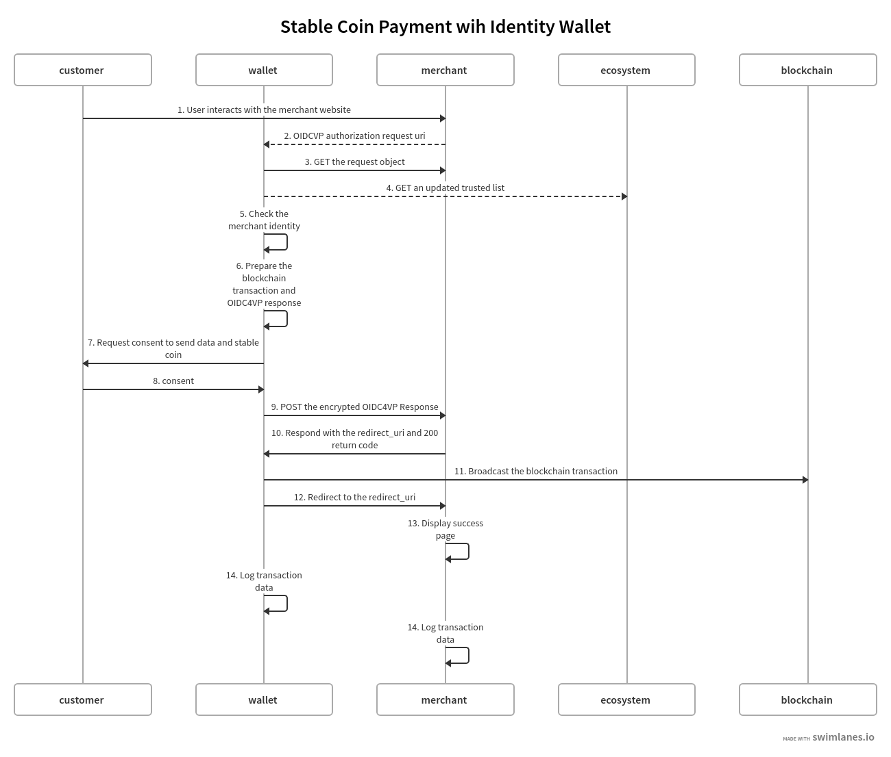

# Stablecoin Payments with EUDI compatible Wallet

- **Version** : 1.3
- **Date** : 23rd July 2025
- **Status** : Draft
- **Maintainer** : Altme Identity & Compliance Team

## Table of Contents

1. [Overview](#overview)
   - [Objectives](#objectives)
   - [Regulatory and Legal Context](#regulatory-and-legal-context)
   - [Compliance Mapping](#compliance-mapping)
   - [Use Cases](#use-cases)
   - [Standards and Technologies Used](#standards-and-technologies-used)
2. [Payment Flow](#payment-flow)
   - [Preconditions](#preconditions)
   - [Flow Steps](#flow-steps)
3. [Authorization Request from Merchant](#authorization-request-from-merchant)
   - [Minimal SD-JWT VC for Identity](#1-minimal-identity-sd-jwt-vc-pid-like)
   - [SD-JWT VC for Blockchain Ownership](#2-sd-jwt-vc-for-blockchain-ownership)
   - [OIDC4VP Authorization Request Overview](#oidc4vp-authorization-request-overview)
   - [Transaction Data for Stablecoin Payment](#4-transaction-data-for-stablecoin-payment)
   - [Presentation Definition](#5-presentation-definition)
4. [Response from Wallet](#response-from-wallet)
   - [Presentation Submission](#presentation-submission)
   - [VP Token](#vp-token)
   - [Key Binding JWT](#key-binding-jwt)
5. [Security Considerations](#security-considerations)
6. [Error Handling and Recovery](#error-handling-and-recovery)
7. [Merchant-Side Verifier Implementation Strategies](#merchant-side-verifier-implementation-strategies)
   - [In-House Verifier Server](#1-in-house-verifier-server)
   - [Vendor-Managed Verifier API](#2-vendor-managed-verifier-api-hosted-service)
   - [Hybrid Model (API + Merchant Key Management)](#3-hybrid-model-api--merchant-key-management)
   - [Payment Link via Vendor Gateway](#4-payment-link-via-vendor-gateway)
8. [Annex](#annex)
   - [User Consent](#user-consent)
   - [Transaction Data](#transaction-data)

## Overview

### Objectives

This document describes how **stablecoin payments** (e.g., **USDC**, **USDT**, **DAI**, **USDE**, **TUSD**) can be seamlessly supported using an **EUDI Wallet** or an equivalent **non-custodial data wallet** that implements **OIDC4VP**, **Verifiable Credentials (VCs)**, and **digital asset transfer mechanisms**.

For a detailed explanation of the **concept and motivation** behind this approach, see the Medium article:  
[The Future of Compliant Crypto in Europe – EUDI Wallets and Stablecoin Transfers](https://medium.com/@thierry.thevenet/the-future-of-compliant-crypto-in-europe-eudi-wallets-and-stablecoin-transfers-9d4c6c799c82)

Rather than introducing a new protocol, it defines a **wallet profile** designed to ensure that **self-sovereign wallets** can comply with identity and digital transfer regulations (e.g., **MiCA**, **TFR**, **AMLD6**) while preserving user control and privacy.

The key objectives are to:

- **Enable secure, privacy-preserving, and user-consented payments** with stablecoins across **multiple blockchain networks** (Ethereum, Etherlink, Polygon, EVM-compatible chains).
- Use **cryptographic proofs** to verify blockchain address ownership in a **blockchain-agnostic** way.
- Leverage **selective disclosure (SD-JWT VC)** to share only the minimum identity data required for **AML/KYC compliance**, ensuring **data minimization** as mandated by regulations like **GDPR**.
- Guarantee **compliance with substantial assurance levels** for regulated digital asset transactions, including auditable logs and verifiable proofs of consent.
- Foster **interoperability** between wallets, issuers, and merchants through a **minimal, standardized framework**, while allowing the integration of **future extensions** (e.g., post-quantum cryptography or advanced credential types).


### Regulatory and Legal Context

The design of this wallet profile aligns with current and upcoming **EU regulations** and global standards for digital payments:

- **MiCA (Markets in Crypto-Assets Regulation)** – Ensures stablecoins (e.g., USDC, DAI) are issued and managed in a compliant framework.
- **AMLD6 (6th Anti-Money Laundering Directive)** – Requires **identity verification (KYC)** and **transaction traceability** for digital assets.
- **DAC8 (EU Directive on Administrative Cooperation)** – Imposes **reporting obligations** for crypto transactions across EU states.
- **eIDAS 2.0 & EUDI Wallets** – Provides a **standardized digital identity framework** and supports **Verifiable Credentials** for cross-border identity verification.

This wallet profile leverages **OIDC4VP** and **SD-JWT VC** to ensure compliance with these frameworks while preserving user privacy through **selective disclosure**.

### Compliance Mapping

The following table summarizes how the technical components address compliance requirements:


| Requirement                 | Technical Solution                                     |
| ----------------------------- | -------------------------------------------------------- |
| Proof of wallet ownership   | **Blockchain ownership SD-JWT VC** (linked to tx_hash) |
| KYC / Identity verification | **Identity VC (PID/eID)** via SD-JWT VC                |
| Data minimization (GDPR)    | **Selective disclosure** with SD-JWT VC                |
| Auditability                | **Transaction receipts** with `tx_hash`                |
| Integrity and authenticity  | **Signed JWT requests** and **KB JWT responses**       |
| Confidentiality             | **JWE encrypted responses**                            |

### Use Cases

This wallet profile supports a wide range of real-world scenarios, from retail payments to institutional services:

1. **E-Commerce** – Users can pay for goods/services with stablecoins while sharing only minimal identity data for AML/KYC compliance.
2. **Banking and Institutional Services** – Banks or financial institutions can offer high-value clients a **regulated crypto management experience**, allowing verified customers to hold and transfer stablecoins while remaining fully compliant with AMLD6, MiCA, and national regulations.
3. **Digital Identity-Linked Payments** – Combining verifiable identity (eIDAS 2.0, EUDI) with payments for scenarios like **age-restricted goods**, **ticketing**, or **government-related fees**, where identity confirmation is mandatory.
4. **DeFi & Web3 Services** – Verifiable account ownership for lending, staking, or DAO participation, ensuring regulatory compliance for certain financial operations.
5. **Cross-border Remittances** – Compliant, instant stablecoin transfers across jurisdictions with built-in audit trails.
6. **Loyalty and Reward Programs** – Businesses can issue stablecoin-based rewards or vouchers tied to verifiable identity credentials, ensuring traceability and preventing fraud.
7. **B2B Settlements and Supply Chain Payments** – Businesses can make fast, auditable stablecoin payments to verified suppliers, reducing settlement times and ensuring regulatory compliance.

### Standards and Technologies Used

This wallet profile builds upon several open standards and technologies to ensure interoperability, security, and privacy:

- **OIDC4VP (OpenID Connect for Verifiable Presentations)**

  - **[OIDC4VP Draft 22 or newer](https://openid.net/specs/openid-4-verifiable-presentations-1_0-22.html)** – Required minimum version supporting `transaction_data` and `direct_post.jwt`.
  - **Signed JWT Authorization Requests (JAR)** – Requests must be **signed JWTs** for integrity and authenticity.
  - **Response Mode: `direct_post.jwt`** – For secure wallet-to-merchant communication.
  - **Presentation Definition (PE)** – Based on **DIF Presentation Exchange** to define required VCs and claims.
- **Credential Formats**

  - **[SD-JWT VC Draft 10](https://www.ietf.org/archive/id/draft-ietf-oauth-sd-jwt-vc-10.html)** – Mandatory selective disclosure format for VCs, ensuring data minimization.
  - **W3C Verifiable Credentials (VC Data Model)** – Supported for interoperability with other ecosystems.
  - **DID Methods** – Including `did:jwk`, `did:key`, or `did:ebsi` for decentralized identity references.
- **JOSE and JWT Standards**

  - **[JWS – JSON Web Signature (RFC 7515)](https://www.rfc-editor.org/rfc/rfc7515)** – Used for signing SD-JWT VC payloads.
  - **[JWE – JSON Web Encryption (RFC 7516)](https://www.rfc-editor.org/rfc/rfc7516)** – Used for encrypting wallet responses.
  - **Key Binding JWTs** – Binding credentials and transaction hashes (`tx_hash`).
- **Cryptographic Primitives**

  - **Elliptic Curves**: `P-256` for identity keys, `secp256k1` and `ed25519` for blockchain addresses.
  - **Hash Algorithms**: `SHA-256` for transaction and credential binding.
  - **Key Agreement**: `ECDH-ES` (P-256).
  - **Encryption**: `AES-128-GCM` for symmetric encryption.
- **Blockchain and Token Standards**

  - **ERC-20** – Standard for stablecoins on Ethereum and EVM-compatible chains (e.g., USDC, DAI).
  - **Multi-chain Support** – Ethereum mainnet, Etherlink, EVM-compatible chains, and others.
- **Trust Infrastructure**

  - **Trusted Verifier Registry** – Ecosystem-managed **trusted list** of merchants and issuers (based on **X.509 certificates**).
  - **client_id_scheme = x509_san_dns** – Required for verifying merchant identity against the trusted list.
- **Transport and Interaction**

  - **QR Codes / Deep Links** – For wallet-merchant interaction.
  - **HTTP POST / direct_post.jwt** – For delivering encrypted VP responses.

## Technical Steps for Payment Flow



### Preconditions

- The **merchant** is registered as a relying party in the **trusted list** maintained by the ecosystem.
- The **customer** has a reusable **KYC/eID attestation** (e.g., eID or PID) stored in their **identity wallet**.
- The **wallet** holds previously generated **blockchain address ownership proofs** signed with the user's private blockchain keys.

### Flow Steps

#### 1. User Interaction with Merchant

The **customer** initiates a payment by interacting with the **merchant website** (e.g., clicking "Pay with Wallet").

#### 2. Authorization Request URI

The **merchant** generates a **signed OIDC4VP authorization request JWT at the request_uri endpoint**, which includes:

- `nonce` and `state` attached to the session.
- `transaction_data` (payment details like amount, currency, recipient address).
- `presentation_definition` or `dcql_query` specifying the **required VCs** (identity VC and blockchain ownership VC).
- `client_metadata` with the public key for encryption.
- `response_mode=direct_post.jwt`

This request is encoded into a **QR code** or **deep link**, which the **customer scans** using their wallet app.

#### 3. Wallet Fetches the Request Object

The **wallet** retrieves the **authorization request object as a signed JWT** (via a GET request) from the merchant's endpoint to obtain the detailed payment and credential requirements.

#### 4. Update Trusted List

If needed the **wallet** requests the latest **trusted list** from the **ecosystem** to ensure the **merchant's status and keys are valid**.

#### 5. Merchant Identity Check

The **wallet** validates the **merchant identity** by verifying:

- Merchant registration in the trusted list through X509 check.
- Integrity and authenticity of the authorization request.

#### 6. Preparation of Blockchain Transaction and OIDC4VP Response

The **wallet**:

- Generates **the blockchain unsigned transaction** and computes the **`tx_hash`** for the pending transfer.
- Prepares an **OIDC4VP response** containing the **Verifiable Presentation (VP)**, which includes:
  - The presentation_submission for 2 SD-JWT VC.
  - The **identity SD-JWT VC** with selective disclosure for given_name, family_name and birth date.
  - The **KB** of the Identity SD-JWT VC that **includes**:
    - The original `transaction_data` hash(amount, currency, merchant address, etc.).
    - The computed `tx_hash` to bind the VP to the specific blockchain transaction.
  - The **blockchain ownership SD-JWT VC with KB** proving control over the blockchain address.

#### 7. Consent Request

To comply with **MiCA** and **TFR**, the consent flow must provide the customer with **clear, auditable, and transparent information** about both the payment and the data being shared. See [Annex](#user-consent) for more information about user consent.

#### 8. Customer Consent

The **customer** consents to the request using **1-click** or **biometric authentication**.
The wallet finalizes the prepared VP and blockchain transaction.

#### 9. POST Encrypted OIDC4VP Response

The **wallet** sends the encrypted **OIDC4VP response** to the **merchant** via an **HTTP POST**.

#### 10. Merchant Verification & Redirect Response

The **merchant server**:

- Validates all **SD-JWT VCs**, the VPs, and `transaction_data_hash`.
- Confirms the request integrity, including the **`tx_hash`** binding.

Upon success, it responds with:

- **HTTP 200 OK** status.
- A **redirect_uri** for final redirection.

#### 11. Blockchain Transaction Broadcast

Upon receiving the 200 OK, the **wallet** signs and broadcasts the **stablecoin transfer** on the blockchain network.

#### 12. Redirect to Success URI

The **wallet** redirects the user to the **merchant-provided redirect_uri**, confirming completion.

#### 13. Display Success Page

The **merchant** displays a **success page** to the customer, confirming the payment and transaction status.

#### 14. Store Transaction Data

To comply with **MiCA** and the **EU Transfer of Funds Regulation (TFR)**, merchants and customers must retain specific transaction data for auditability, AML/KYC checks, and regulatory reporting. Logging ensures that each stablecoin payment can be traced back to its source, with all required identity attributes preserved. See Annex.

## Authorization request from merchant

### 1. Minimal Identity SD-JWT VC (PID-like)

This SD-JWT VC is is signed by the issuer of the Identity VC with a P-256 key and an x509 certificates attached in the header. The root certificate must be in the trusted list of the ecosystem. Claims are encoded and so are only disclosed with user consent.

Header

```json
{
    "alg": "ES256",
    "typ": "dc+sd-jwt",
    "x5c": [
        "MIICoDCCAY.....Fs9dKu+GSGECfQ==",
        "MIIDbDCCAl....eT5ZMR/GP6Q9rfWycznofgwbpUBg=="
    ]
}

```

Payload

```json

{
  "iss": "https://talao.co",
  "iat": 1734560000,
  "exp": 1739999999,
  "vct": "eu:europa:ec.eudi.pid.1",
  "given_name": "Alice",
  "family_name": "Doe",
  "birth_date": "1990-05-20",
  "age_over_18": true,
  "cnf": {
    "jwk": {
      "kty": "EC",
      "crv": "P-256",
      "x": "f83OJ3D2xF4...",
      "y": "x_FEzRu9VnA..."
    }
  }
}
```

---

### 2. SD-JWT VC for Blockchain Ownership

This **SD-JWT VC is signed by the key of the blockchain address** of the wallet used to transfer the stable coins. The `cnf` is the wallet key of the Identity SD-JWT VC of the user. Claims are readable (no disclosures needed).

We use the **did:jwk** method to provide a simple URI (`iss`) to the key of the blockchain address.

The signature must be compliant with [JOSE RFC7515](https://www.rfc-editor.org/rfc/rfc7515.html) and its [extension](https://datatracker.ietf.org/doc/html/draft-jones-webauthn-secp256k1-00) for elliptic curve secp256k1.

Header

```json
{
  "alg": "ES256K",
  "typ": "dc+sd-jwt",
  "kid": "did:jwk:eyJrdHkiOiJFQyIsImNydiI6InNlY3AyNTZrMSIsIngiOiI1SmQ1QlNjMFRYOC4uLiIsInkiOiJMOTl1Zks1cENkVS4uLiJ9#0"
}
```

Payload

```json

{
  "iss": "did:jwk:eyJrdHkiOiJFQyIsImNydiI6InNlY3AyNTZrMSIsIngiOiI1SmQ1QlNjMFRYOC4uLiIsInkiOiJMOTl1Zks1cENkVS4uLiJ9",
  "iat": 1734561000,
  "vct": "urn:dev:vct:blockchain-ownership",
  "blockchain_network": "Ethereum",
  "wallet_address": "0x742d35Cc6634C0532925a3b844Bc454e4438f44e",
  "cnf": {
    "jwk": {
      "kty": "EC",
      "crv": "P-256",
      "x": "f83OJ3D2xF4...",
      "y": "x_FEzRu9VnA..."
    }
  }
}
```

### OIDC4VP Authorization Request overview

Based on OIDC4VP draft 23 syntax, this request must be provided by the merchant as a JWT signed with a P-256 key and an x509 certificates in the header. The root certificate must be in the trusted list of the ecosystem.

Header

```json
{
    "alg": "ES256",
    "typ": "oauth-authz-req+jwt",
    "x5c": [
        "MIICoDCCAY.....Fs9dKu+GSGECfQ==",
        "MIIDbDCCAl....eT5ZMR/GP6Q9rfWycznofgwbpUBg=="
    ]
}
```

Payload

```json
{
  "aud": "https://self-issued.me/v2",
  "response_type": "vp_token",
  "response_mode": "direct_post.jwt",
  "client_id": "x509_san_dns:merchant.example.com",
  "response_uri": "https://merchant.example.com/response",
  "state": "s-456",
  "nonce": "n-123",
  "presentation_definition": "%7B%22id%22%3A%....2C%22fields%22%3A%5B%7B%22path%22%3A%5B%22%24.gi",
  "transaction_data": ["eyJ0eXBlIjoic3Rh....b2YgZGlnaXRhbCBnb29kcyJ9"],
  "client_metadata": {
    "jwks": {
      "keys": [
        {
          "kty":"EC",
          "kid":"ac",
          "use":"enc",
          "crv":"P-256",
          "alg":"ECDH-ES",
          "x":"YO4epjifD-KWeq1sL2tNmm36BhXnkJ0He-WqMYrp9Fk",
          "y":"Hekpm0zfK7C-YccH5iBjcIXgf6YdUvNUac_0At55Okk"
        }
      ]
    }
  },
  "exp": 1734567890,
  "iat": 1734560000
}
```

- **`aud`**
  Audience for the request. Set to `https://self-issued.me/v2` to indicate that this is a self-issued OpenID Connect request intended for a wallet.
- **`response_type`**
  Specifies the response type expected. Here, `vp_token` indicates that a Verifiable Presentation token is requested.
- **`response_mode`**
  Indicates how the response should be returned.
  `direct_post.jwt` means the wallet will send a signed JWT response directly to the merchant’s endpoint via HTTP POST.
- **`client_id`**
  Identifier of the relying party (merchant).
  Uses `x509_san_dns:merchant.example.com` to bind the request to a verified merchant identity.
- **`response_uri`**
  The endpoint on the merchant’s server where the wallet should POST the encrypted response.
- **`state`**
  A random string to maintain state between request and response.
  Protects against CSRF attacks.
- **`nonce`**
  A unique value to prevent replay attacks and link the response to this request.
- **`presentation_definition`**
  A URL-encoded JSON structure defining the types of Verifiable Credentials (VCs) and claims the merchant requires from the wallet.
- **`transaction_data`**
  A Base64 URL-encoded array of payment details, such as the amount, currency, payee, and purpose of the transaction.
- **`client_metadata`** Metadata about the client, including the **JWKS** (JSON Web Key Set) used for encrypting the response from the wallet.

  - **`keys`**: Contains public keys (e.g., EC keys on P-256 curve) used for ECDH key exchange.
- **`exp`**
  Expiration time of the authorization request, in **Unix epoch** format (seconds).
  After this time, the request is invalid.
- **`iat`**
  Issued-at time, in Unix epoch format (seconds), indicating when the authorization request was generated.

### 4. Transaction Data for Stablecoin Payment

In this example the payee is the merchant identified by the `client_id` of the OIDC4VP request JWT.
The transaction data must be BASE64 URL safe encoded before being added to the authorization request.

```json
{
  "type": "stablecoin_payment",
  "credential_ids": ["eid-limited"],
  "amount": {
    "currency": "USDC",
    "value": "100.00"
  },
  "token": {
    "symbol": "USDC",
    "contract_address": "0xA0b86991c6218B36c1d19D4a2e9Eb0cE3606eB48",
    "decimals": 6
  },
  "network": {
    "name": "Ethereum",
    "chain_id": 1
  },
  "payee": {
    "name": "ACME Store",
    "wallet_address": "0x742d35Cc6634C0532925a3b844Bc454e4438f44e"
  },
  "transaction_id": "1234567890",
  "timestamp": "2025-07-18T14:30:00Z",
  "purpose": "Purchase of digital goods"
}
```

- **`type`**
  Specifies the type of transaction.
  In this case, it is `"stablecoin_payment"`.
- **`credential_ids`**
  Identifiers of the Verifiable Credentials required or linked to the payment (e.g., `"eid-limited"`).
- **`amount`** Describes the payment amount and currency:

  - **`currency`** – The stablecoin currency code (e.g., `USDC`).
  - **`value`** – The payment amount as a string with decimals.
- **`token`** Details of the stablecoin token contract:

  - **`symbol`** – Token symbol (e.g., `USDC`).
  - **`contract_address`** – The contract address of the token on the blockchain (EVM format).
  - **`decimals`** – Number of decimal places used by the token.
- **`network`** Describes the blockchain network where the payment occurs:

  - **`name`** – Human-readable name (e.g., `Ethereum`).
  - **`chain_id`** – Numeric chain identifier for the network.
- **`payee`** Information about the merchant or recipient of the payment:

  - **`name`** – Merchant name (e.g., `ACME Store`).
  - **`wallet_address`** – Blockchain wallet address of the merchant (EVM format).
- **`transaction_id`**
  An internal reference identifier for the payment, not to be confused with the on-chain `tx_hash`.
- **`timestamp`**
  The date and time when the transaction request was generated, in **ISO 8601** format.
- **`purpose`**
  A short description of the reason for the payment (e.g., `Purchase of digital goods`).

### 5. Presentation Definition

The presentation definition must URL encoded before being added in the authorization request.

```json
{
  "id": "stablecoin-payment-auth",
  "input_descriptors": [
    {
      "id": "eid-limited",
      "name": "Electronic ID",
      "purpose": "Verify identity for AML/KYC",
      "format": {
        "vc+sd-jwt": {
          "dc-jwt_alg_values": [
            "ES256",
          ],
          "kb-jwt_alg_values": [
            "ES256"
          ]
        }
      },
      "constraints": {
        "limit_disclosure": "required",
        "fields": [
          { "path": ["$.given_name"]},
          { "path": ["$.family_name"]},
          { "path": ["$.birth_date"]}
        ]
      }
    },
    {
      "id": "blockchain-ownership",
      "name": "Proof of Blockchain Account Ownership",
      "purpose": "Prove control of blockchain account used for payment",
      "format": {
        "dc+sd-jwt": {
          "dc-jwt_alg_values": [
            "ES256K",
            "EdDSA"
          ],
          "kb-jwt_alg_values": [
            "ES256",
          ]
        }
      },
      "constraints": {
        "fields": [
          { "path": ["$.blockchain_network"] },
          { "path": ["$.wallet_address"] }
        ]
      }
    }
  ]
}
```

## Response from wallet

```http
POST /response HTTP/1.1
Host: https://merchant.example.com
Content-Type: application/x-www-form-urlencoded

response=eyJra...9t2LQ
```

The wallet’s response **SHOULD be encrypted as a JWE (JSON Web Encryption)**, depending on the selected merchant verifier strategy.

- When **personal data or sensitive claims are disclosed**, encryption **MUST** be applied to prevent intermediaries (e.g., external API verifiers or payment gateways) from accessing user data.
- If the merchant is using a fully **in-house verifier** with a secure channel (e.g., TLS and direct communication), encryption MAY be optional, depending on the privacy requirements.

When JWE encryption is used:

- The JWE `alg` header parameter **MUST** be `ECDH-ES` for key agreement using keys on the **P-256** curve.
- The `enc` parameter **MUST** be `A128GCM` for symmetric encryption.

The response is encrypted so that only the merchant can read its contents.
However, the payload is not signed, meaning the JWE itself does not provide cryptographic proof of origin or end-to-end integrity beyond encryption. For higher security and non-repudiation, the payload should first be signed (JWS) and then encrypted, resulting in a nested JWT structure (JWS → JWE).

JWE Header

```json
{
  "alg": "ECDH-ES",
  "enc": "A128GCM",
  "kid": "ac",
  "epk": {
    "kty": "EC",
    "x": "nnmVpm3V3jbhcafQaRBkSVNHlwZHwt-9rOpJufyYIuk",
    "y": "r4fjDqwJys9qUOP-_b3mR5SZG--CwO2mic5VSNTYN9g",
    "crv": "P-256"
  }
}
```

Payload (before encryption)

```json
{
  "iat": 1734560000,
  "exp": 1734560500,
  "presentation_submission": "ey....'",
  "vp_token": ["ey...123DR4~", "ey..3456~"],
  "state": "s-456"
}
```

### Presentation Submission

```json

{
  "id": "stablecoin-payment-response",
  "definition_id": "stablecoin-payment-auth",
  "descriptor_map": [
    {
      "id": "eid-limited",
      "format": "dc+sd-jwt",
      "path": "$[0]"
    },
    {
      "id": "blockchain-ownership",
      "format": "dc+sd-jwt",
      "path": "$[1]"
    }
  ]
}
```

### VP_token

**There are 2 SD-JWT VC in the vp_token array**. The Identity SD-JWT VC must provide disclosures of `given_name`, `family_name` and `birth_date`. Each SD-JWT VC has its own Key Binding JWT according to the IETF [SD-JWT VC](https://www.ietf.org/archive/id/draft-ietf-oauth-selective-disclosure-jwt-22.html#name-key-binding-jwt) specifications.

### Key Binding JWT attached to the Identity SD-JWT VC

Header

```json
{
  "typ": "kb+jwt",
  "alg": "ES256"
}
```

Payload of the KB JWT attached to the Identity SD-JWT VC with `transaction_data_hashes` and `tx_hash`

```json
{
  "nonce": "n-123",
  "aud": "x509_san_dns:merchant.example.com",
  "iat": 1709838604,
  "sd_hash": "Dy-RYwZfaaoC3inJbLslgPvMp09bH-clYP_3qbRqtW4",
  "transaction_data_hashes": [ "fOBUSQvo46yQO-wRwXBcGqvnbKIueISEL961_Sjd4do" ],
  "tx_hash": "0xb3b20624b9eaf92d3b46db2783da9e5e86e41dd5807d1fd5a0f6dce7d2f5b51f"
}
```

- **`nonce`**
  A unique value from the authorization request, used to prevent replay attacks and link this Key Binding JWT to a specific transaction session.
- **`aud`**
  The audience for this JWT, typically the relying party (e.g., `x509_san_dns:merchant.example.com`).
  It ensures that the Key Binding JWT is intended for a specific merchant or service.
- **`iat`**
  The "issued at" timestamp (in Unix epoch seconds) indicating when this Key Binding JWT was created.
- **`sd_hash`**
  A cryptographic hash of the disclosed claims from the **SD-JWT VC**.
  It binds this KB JWT to the selective disclosure of identity data, ensuring the presented claims correspond to the original signed VC.
- **`transaction_data_hashes`**
  An array of hashes that link the payment transaction data to this KB JWT.
  This ensures the identity proof and the specific stablecoin transaction are cryptographically tied together, preventing substitution of transaction details.
- **`tx_hash`**
  The hash of the unsigned blockchain transaction that will be broadcast.
  This binds the identity proof (SD-JWT VC) to a specific blockchain operation, enabling strong integrity and non-repudiation guarantees.

## Merchant-Side Verifier Implementation Strategies

When designing the verifier infrastructure, merchants must balance **control**, **security**, and **privacy**.Key aspects include:

- **Who controls the cryptographic keys** for `authorization_request` JWT signing and response decryption.
- **How personal data is encrypted or exposed** when intermediaries are involved.
- **What tools and technical expertise are needed** to maintain secure and compliant operations.

Below are **four main strategies** for implementing the merchant-side verifier:

### **1. In-House Verifier Server**

- **Description:** The merchant operates a self-managed verifier backend that:

  - Generates and signs `authorization_request` JWTs using **merchant-owned private keys**.
  - Receives and verifies wallet responses (VP tokens, SD-JWTs, KB-JWTs).
  - Decrypts responses using **merchant-owned encryption keys**.
  - Manages its own x.509 certificates, JWKS, and trusted registries.
- **Key Management:**
  Both **signing keys** (for JWTs) and **encryption keys** (for JWE responses) are entirely managed by the merchant.
- **Privacy Impact:**
  This is the **most privacy-preserving** setup: no personal or transaction data is accessible to third parties.
- **Merchant Requirements:**

  - Expertise in **OIDC4VP**, **SD-JWT VC verification**, and cryptographic libraries.
  - Tools for **certificate lifecycle management** (e.g., HSMs, KMS, or secure vaults).
  - Backend infrastructure to handle the verifier logic and audit logs.

### **2. Vendor-Managed Verifier API (Hosted Service)**

- **Description:** A third-party **Verifier-as-a-Service** generates `authorization_request` JWTs and validates wallet responses.

  - The **vendor manages signing keys** for JWTs.
  - Wallet responses may be encrypted with keys managed by the **vendor**.
- **Key Management:**

  - All keys (JWT signing and JWE decryption) are handled by the vendor.
  - The merchant may receive only signed verification results or tokens.
- **Privacy Impact:**
  The vendor could see **all disclosed personal attributes** and transaction metadata unless the payload is **double-encrypted** before sending to the vendor.
- **Merchant Requirements:**

  - Minimal cryptographic expertise.
  - Only API integration with the vendor is required.

### **3. Hybrid Model (API + Merchant Key Management)**

- **Description:**

  - The **vendor manages the signing keys** for `authorization_request` JWTs.
  - The **merchant manages the encryption keys** for decrypting wallet responses.
  - This means the vendor **cannot read personal claims** in wallet responses, but **does handle metadata** for initiating the flow.
- **Key Management:**

  - Vendor: JWT signing key for authorization requests.
  - Merchant: JWE decryption key for the wallet response.
- **Privacy Impact:**

  - The vendor sees the transaction setup (e.g., amount, nonce) but **not user identity data**, as it's encrypted.
  - The merchant gains privacy over sensitive claims but must operate decryption tools.
- **Merchant Requirements:**

  - Tools for **JWE decryption** and key rotation (e.g., KMS/HSM).
  - Light knowledge of cryptographic operations for handling encrypted responses.
  - API integration with the vendor.

### **4. Payment Link via Vendor Gateway**

- **Description:**

  - The vendor provides a **payment link or QR code** and manages the entire OIDC4VP and SD-JWT flow.
  - Merchant **does not manage any cryptographic keys**.
  - Vendor returns a payment confirmation or status to the merchant.
- **Key Management:**
  All keys (signing and encryption) are managed by the vendor.
- **Privacy Impact:**

  - **Highest risk of data tracking** by the vendor, who has access to user identity data and payment metadata.
  - Privacy relies solely on vendor compliance and policies.
- **Merchant Requirements:**

  - No cryptographic expertise is required.
  - Minimal technical setup: only process final verification callbacks or webhooks.

### **Encryption and Response Handling**

- If the **merchant controls the decryption keys (1 or 3)**, wallet responses **MUST be encrypted** (JWE with `ECDH-ES` and `A128GCM`) to ensure end-to-end confidentiality.
- If **vendor manages all keys (2 or 4)**, the wallet **may return unencrypted responses** (signed-only) since data will be verified inside the vendor environment — but this reduces user privacy.

### **Suggested Approach**

- **Maximum privacy & compliance:** **In-House Verifier (1)**.
- **Balanced control & outsourcing:** **Hybrid (3)**.
- **Rapid integration:** **Vendor API (2)**, but enforce payload encryption.
- **Minimal infrastructure:** **Payment Link (4)**, with explicit privacy risk acknowledgment.

## Security Considerations

The wallet profile relies on industry-standard cryptographic mechanisms and trust frameworks to ensure the confidentiality, integrity, and authenticity of transactions. Below are the key security considerations:

1. **End-to-End Data Protection**

   - All sensitive data exchanged between wallet and merchant is encrypted using **JWE (ECDH-ES + A128GCM)**.
   - For authenticity, it is recommended to use **nested JWTs** (sign-then-encrypt).
2. **Replay Attack Prevention**

   - Authorization requests and responses include unique **`nonce`** and **`state`** values, preventing replay attacks and ensuring session binding.
3. **Selective Disclosure & Privacy**

   - **SD-JWT VC** enables the wallet to disclose only the required claims (e.g., name, birth date) while keeping other identity attributes hidden.
   - Hash-based disclosure ensures claims cannot be tampered with without invalidating signatures.
4. **Key Binding & Transaction Integrity**

   - The **Key Binding JWT (KB-JWT)** links the verifiable credentials to the `transaction_data_hash` and computed `tx_hash`, ensuring that the identity proof is directly tied to the specific payment.
5. **Trusted List Validation**

   - Merchants and issuers must be verified against a **trusted registry** using **X.509 certificates** to avoid phishing or rogue actors.
6. **Key Management**

   - Private keys in wallets should be stored in secure hardware or environments (e.g., HSMs, Secure Enclaves) to prevent unauthorized access or signing.
7. **Audit and Traceability**

   - Each transaction is accompanied by verifiable proofs (`vp_token`, `tx_hash`), enabling reliable audit trails while maintaining user privacy.

## Error Handling and Recovery

Stablecoin payments involve multiple steps, cryptographic exchanges, and interactions with both the wallet and blockchain networks. To ensure reliability and regulatory compliance, the wallet profile must define **error-handling procedures** for common failure scenarios.

### 1. Authorization Request Failures

**Potential Issues:**

- Invalid or expired `authorization_request` (e.g., expired `iat`/`exp` claims).
- Failed merchant verification (e.g., merchant not found in trusted list or invalid x509 certificate).
- Network errors when fetching the request object.

**Mitigation & Recovery:**

- **Fail fast:** The wallet must abort the process if the merchant identity or signature cannot be verified.
- **User notification:** Show a clear error message (e.g., *“The payment request cannot be verified. Please try again or contact the merchant.”*).
- **Retry logic:** For transient network errors, retry fetching the `request_uri` up to 3 times with exponential backoff.

### 2. User Consent Interruptions

**Potential Issues:**

- User cancels the consent process or fails biometric/PIN authentication.
- Consent screen times out due to inactivity.

**Mitigation & Recovery:**

- Discard all prepared transactions and credentials if the user cancels.
- The wallet should log the incomplete attempt for audit purposes without storing sensitive data.
- Allow the user to re-initiate payment by rescanning the QR code or refreshing the merchant checkout page.

### 3. OIDC4VP Response Errors

**Potential Issues:**

- Failure to encrypt the wallet response (JWE) or mismatched `client_metadata` keys.
- The merchant endpoint is unreachable during `POST /response`.

**Mitigation & Recovery:**

- **Retry sending the response** (with exponential backoff) if the merchant endpoint is temporarily unreachable.
- **Store pending VP responses** for a short duration (e.g., 5 minutes) with strict encryption in the wallet. Allow the user to retry manually.
- If the JWE encryption fails due to an invalid `client_metadata`, notify the user and abort. The merchant must regenerate the authorization request.

### 4. Blockchain Transaction Errors

**Potential Issues:**

- Insufficient funds, gas fees, or nonce issues during signing/broadcasting.
- Blockchain network congestion or temporary downtime.
- Transaction replaced, dropped, or stuck in the mempool.

**Mitigation & Recovery:**

- Pre-check the user’s balance and estimated fees before requesting consent.
- If broadcast fails, **display a retry option** to the user with updated gas fee estimates.
- Generate a **new `tx_hash`** if the transaction must be re-signed and re-broadcast.
- Log all failed attempts (with reason) in an **audit-safe record**.

### 5. Merchant Verification Errors

**Potential Issues:**

- Merchant rejects the VP response due to signature mismatch or expired `nonce/state`.
- Merchant’s trusted list entry is revoked between request initiation and response.

**Mitigation & Recovery:**

- The wallet must **re-fetch the trusted list** if verification fails and prompt the user if the merchant is untrusted.
- Provide the user with a **“safe exit”** option (cancel payment and return to merchant).

### 6. Post-Payment Discrepancies

**Potential Issues:**

- Payment broadcast succeeds, but the merchant does not confirm receipt (e.g., HTTP response error or timeout).
- Network partitioning between merchant and blockchain indexers.

**Mitigation & Recovery:**

- The wallet should monitor the blockchain for confirmation of the `tx_hash` and allow the user to **resend the VP proof** (if needed).
- Generate an **immutable payment receipt** (with `tx_hash`, `transaction_data_hash`, and timestamp) so the user can prove payment later.

### 7. Audit and Incident Handling

- **Error Logging:** Every failure event (e.g., rejected VPs, failed broadcasts) must be logged locally and tied to a session identifier for debugging and compliance.
- **Regulatory Reporting:** Serious errors (e.g., failed AML/KYC checks) must be escalated according to AMLD6 reporting obligations.
- **User Experience:** Always provide the user with actionable next steps (e.g., *“Retry Payment”*, *“Contact Merchant”*, *“Check Blockchain Explorer”*).

## Annex

### User consent

To comply with **MiCA** and **TFR**, the consent flow must provide the customer with **clear, auditable, and transparent information** about both the payment and the data being shared.

1. **Display Mandatory Payment Details**

   - **Amount and currency** of the transaction (e.g., `100.00 USDC`).
   - **Merchant name and legal entity** as retrieved from the trusted list (`client_id`).
   - **Blockchain network and token contract address** (e.g., Ethereum Mainnet, USDC ERC-20 address).
   - **Estimated network fees (gas fees)** and total cost.
2. **Show Credential Disclosure Requirements**

   - The **identity attributes** required by the merchant (e.g., `given_name`, `family_name`, `birth_date`) for **KYC/AML compliance**.
   - Any **wallet ownership proofs** (e.g., blockchain ownership SD-JWT VC).
   - A clear statement of **why the data is requested** (e.g., to comply with AML checks for transactions over €1,000).
3. **Allow User Control**

   - **Select blockchain address:** The user chooses the address from which the stablecoin transfer will originate.
   - **Review selective disclosure:** The user can see exactly which identity claims are being shared and which remain private.
4. **Provide Strong Authentication and Explicit Consent**

   - **1-click confirmation with biometric or PIN** to ensure the action is deliberate.
   - Log a **signed consent record** (timestamp, hash of disclosed data, transaction data) for audit purposes.
   - Display a **"final confirmation screen"** summarizing:
     - Amount, merchant details, disclosed identity data, and transaction hash (pre-broadcast).
5. **Audit and Legal Proof**

   - The wallet must generate a **consent receipt** linking:
     - The **presentation_submission** (Verifiable Credential disclosures),
     - The **transaction_data hash**, and
     - The **user confirmation event** (with timestamp).
   - This ensures verifiable proof of customer consent as required by **TFR Article 14** and **MiCA transaction reporting rules**.

### Transaction data

To comply with **MiCA** and the **EU Transfer of Funds Regulation (TFR)**, merchants and wallet providers must retain specific transaction data for auditability, AML/KYC checks, and regulatory reporting. Logging ensures that each stablecoin payment can be traced back to its source, with all required identity attributes preserved.

**Data that must be logged includes:**

1. **Payment Information**

   - `transaction_id`: Internal reference for the payment.
   - `tx_hash`: The blockchain transaction hash once the transfer is broadcasted.
   - `transaction_data`: Details such as amount, currency, and token contract address.
   - `timestamp`: Date and time when the payment was initiated and confirmed.
2. **Merchant and Payee Information**

   - Merchant’s **legal entity name** and **wallet address**.
   - `client_id` of the OIDC4VP authorization request.
   - Payment purpose (`purpose`) if specified.
3. **Customer (Payer) Information***From the Verifiable Presentation (VP):*

   - Selectively disclosed **KYC/eID attributes** (e.g., `given_name`, `family_name`, `birth_date`).
   - **Wallet address** (payer address) used for the blockchain payment.
4. **Regulatory Proofs**

   - `presentation_submission` and `vp_token` identifiers to link the identity data to the payment.
   - `transaction_data_hash` (binding the blockchain transaction with the identity proof).
   - Signature verification results for the SD-JWT VC and KB-JWT components.
5. **Security and Audit Metadata**

   - Nonces (`nonce`) and session identifiers (`state`) used in the OIDC4VP request/response.
   - Results of merchant identity checks (e.g., trusted list validation).
   - Logs of consent confirmation (timestamp and authentication method such as biometric or PIN).
