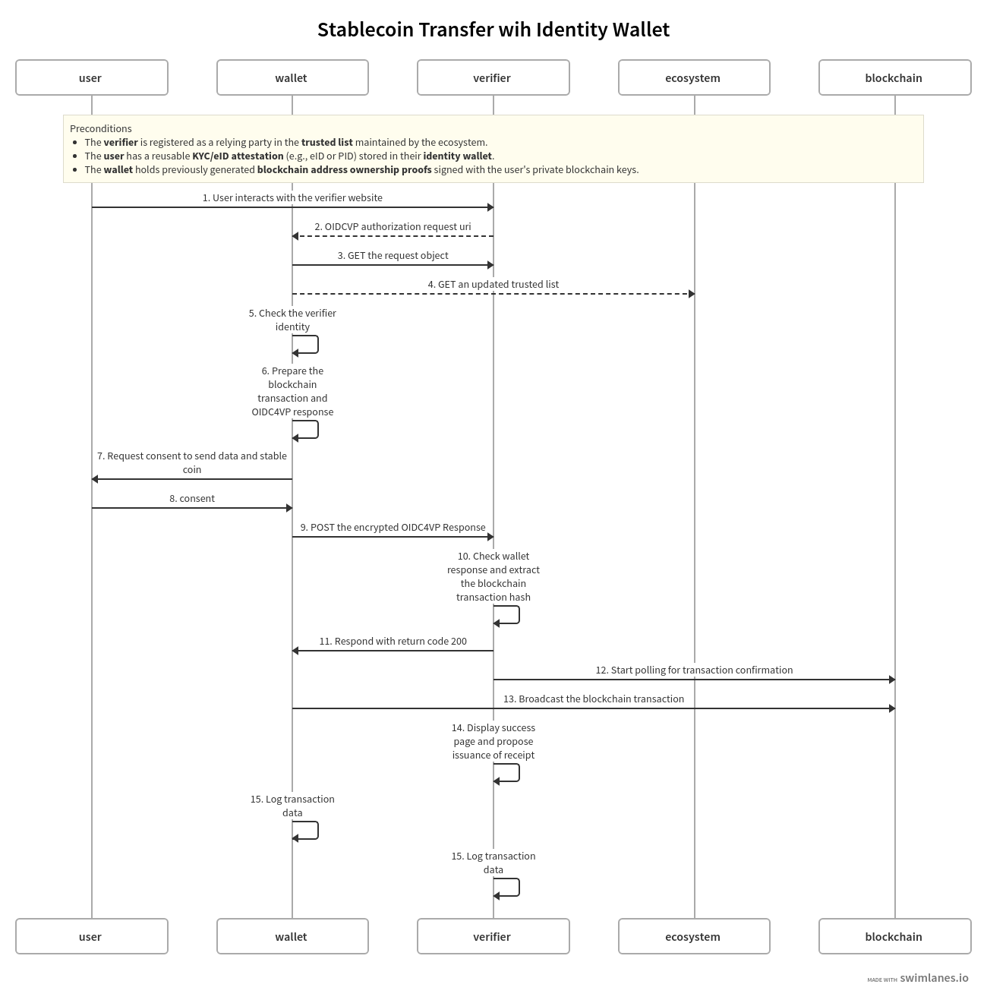

# Crypto Transfers with EUDI compatible Crypto Wallet

- **Version** : 2.1
- **Date** : 18th October 2025
- **Status** : Draft
- **Maintainer** : Altme Identity & Compliance Team

## Table of Contents

> **Note:** This document outlines the architecture and technical details of crypto payments using EUDI-compatible wallets.

- [Table of Contents](#table-of-contents)
- [Overview](#overview)
  - [Objectives](#objectives)
  - [Regulatory and Legal Context](#regulatory-and-legal-context)
  - [Compliance Mapping](#compliance-mapping)
  - [Strategies to Associate Identity and Crypto Transactions](#strategies-to-associate-identity-and-crypto-transactions)
  - [Standards and Technologies Used](#standards-and-technologies-used)
  - [Interoperability Considerations](#interoperability-considerations)
- [Technical Steps for Transfer Flow in a Embedded Transaction Data Approach](#technical-steps-for-transfer-flow-in-a-embedded-transaction-data-approach)
  - [Preconditions](#preconditions)
  - [Flow Steps](#flow-steps)
- [Authorization request from Verifier](#authorization-request-from-verifier)
  - [Minimal Identity SD-JWT VC (PID-like)](#minimal-identity-sd-jwt-vc-pid-like)
  - [SD-JWT VC for Blockchain Ownership](#sd-jwt-vc-for-blockchain-ownership)
  - [OIDC4VP Authorization Request Overview](#oidc4vp-authorization-request-overview)
  - [Transaction Data Pattern for JSON-RPC Methods](#transaction-data-pattern-for-json-rpc-methods)
  - [Presentation Definition Option](#presentation-definition-option)
  - [Digital Credential Query Option](#digital-credential-query-option)
- [Response from Wallet](#response-from-wallet)
  - [Presentation Submission](#presentation-submission)
  - [VP_token](#vp_token)
  - [Key Binding JWT attached to the Identity SD-JWT VC](#key-binding-jwt-attached-to-the-identity-sd-jwt-vc)
- [Security Considerations](#security-considerations)
- [Error Handling and Recovery](#error-handling-and-recovery)
  - [Authorization Request Failures](#authorization-request-failures)
  - [User Consent Interruptions](#user-consent-interruptions)
  - [OIDC4VP Response Errors](#oidc4vp-response-errors)
  - [Blockchain Transaction Errors](#blockchain-transaction-errors)
  - [Verifier Verification Errors](#verifier-verification-errors)
  - [Post-Payment Discrepancies](#post-payment-discrepancies)
  - [Audit and Incident Handling](#audit-and-incident-handling)
- [Annex](#annex)
  - [User consent](#user-consent)
  - [Transaction data](#transaction-data)
  - [Minimum Wallet Crypto & Chain Capabilities](minimum-wallet-crypto-&-chain-capabilities)

## Overview

This section provides a high-level description of the crypto transfer architecture and its compliance with European regulations.

### Objectives

This document describes how **cryptos and stablecoin transfers** (e.g., **USDC**, **USDT**, **DAI**, **USDE**, **TUSD**) can be seamlessly supported using an **EUDI Wallet** or an equivalent **non-custodial data Wallet** that implements **OIDC4VP**, **Verifiable Credentials (VCs)**, and **digital asset transfer mechanisms**.

For a detailed explanation of the **concept and motivation** behind this approach, see the Medium article:
[The Future of Compliant Crypto in Europe – EUDI Wallets and Stablecoin Transfers](https://medium.com/@thierry.thevenet/the-future-of-compliant-crypto-in-europe-eudi-wallets-and-stablecoin-transfers-9d4c6c799c82)

Rather than introducing a new protocol, it defines a **Wallet profile** designed to ensure that **self-sovereign wallets** can comply with identity and digital transfer regulations (e.g., **MiCA**, **TFR**, **AMLD6**) while preserving user control and privacy.

In particular:

- The **objective** is to use a **data wallet** like an EUDI Wallet to enhance crypto transfers by **relying on the wallet’s existing features**. The plan is to adapt crypto transfer flows to the data wallet, **not the other way around**.
- This document proposes **different `transaction_data` patterns** adapted to crypto transfers, consistent with the OIDC4VP specification.
- While the stablecoin use case is a priority, this document addresses **crypto transfers in general** as a broader design framework.

The key objectives are to:

- **Enable secure, privacy-preserving, and User-consented transfers** with cryptos across **multiple blockchain networks** (Ethereum, Etherlink, Polygon, EVM-compatible chains).
- Use **cryptographic proofs** to verify blockchain address ownership in a **blockchain-agnostic** way.
- Leverage **selective disclosure (SD-JWT VC)** to share only the minimum identity data required for **AML/KYC compliance**, ensuring **data minimization** as mandated by regulations like **GDPR**.
- Guarantee **compliance with substantial assurance levels** for regulated digital asset transactions, including auditable logs and verifiable proofs of consent.
- Foster **interoperability** between wallets, issuers, and verifiers (relying parties) through a **minimal, standardized framework**, while allowing the integration of **future extensions** (e.g., post-quantum cryptography or advanced credential types).

### Regulatory and Legal Context

The design of this Wallet profile aligns with current and upcoming **EU regulations** and global standards for digital transfers:

- **MiCA (Markets in Crypto-Assets Regulation)** – Ensures cryptos (e.g., USDC, DAI) are issued and managed in a compliant framework.
- **AMLD6 (6th Anti-Money Laundering Directive)** – Requires **identity verification (KYC)** and **transaction traceability** for digital assets.
- **DAC8 (EU Directive on Administrative Cooperation)** – Imposes **reporting obligations** for crypto transactions across EU states.
- **eIDAS 2.0 & EUDI Wallets** – Provides a **standardized digital identity framework** and supports **Verifiable Credentials** for cross-border identity verification.

This Wallet profile leverages **OIDC4VP** and **SD-JWT VC** to ensure compliance with these frameworks while preserving User privacy through **selective disclosure**.

### Compliance Mapping

The following table summarizes how the technical components address compliance requirements:


| Requirement                 | Technical Solution                                     |
| ----------------------------- | -------------------------------------------------------- |
| Proof of Wallet ownership   | **Blockchain ownership SD-JWT VC** (linked to tx_hash) |
| KYC / Identity verification | **Identity VC (PID/eID)** via SD-JWT VC                |
| Data minimization (GDPR)    | **Selective disclosure** with SD-JWT VC                |
| Auditability                | **Transaction receipts** with `tx_hash`                |
| Integrity and authenticity  | **Signed JWT requests** and **KB JWT responses**       |
| Confidentiality             | **JWE encrypted responses**                            |

### Strategies to Associate Identity and Crypto Transactions

In the context of compliant crypto transfers, there are two main architectural patterns for linking the **identity proof** (via OIDC4VP) and the **crypto payment** (via blockchain transaction). The choice between them impacts UX, complexity, and interoperability.

#### 1. Embedded Transaction Data (One-Step Approach)

In this model, the blockchain transfer details are **embedded directly inside** the `transaction_data` field of the OIDC4VP authorization request.This can include formats such as:

- **EIP-681 payment URI** (e.g., `ethereum:0xabc...@1/transfer?address=0xdef...&uint256=1000000`)
- **EIP-712 structured message** representing the payment intent
- Raw blockchain transaction payload

The identity wallet prepares the Verifiable Presentation **and** the payment request in the same flow, presenting both in a single user interaction.

> **Note:** Even if the identity wallet does not directly support crypto transactions, it can still hand off the embedded payment request to a **separate crypto wallet** via:
>
> - Deeplink to the crypto wallet app
> - Raw Ethereum URI (`ethereum:...`)
> - WalletConnect request
>   This keeps the apps separate while still initiating both steps from a single QR code scan.

**Pros**

- ✅ **Single QR code / deep link** → fewer user steps
- ✅ **Single consent interaction** → identity disclosure and payment initiation happen together
- ✅ Works with **either one app or two separate apps** (handoff from identity wallet to crypto wallet)
- ✅ Strong binding: payment intent is cryptographically tied to identity proof (`transaction_data_hash` + `tx_hash`) in one package
- ✅ Simpler for verifiers — only one request/response cycle

**Cons**

- ❌ Requires the identity wallet to implement the **handoff logic** to a crypto wallet
- ❌ Less modular — identity proof cannot easily be reused independently of the payment
- ❌ If either the identity or payment step fails, the whole process must be retried

#### 2. Linked Transactions via Order ID (Two-Step Approach)

In this model, the identity proof and blockchain payment are **performed separately**.An `order_id` (or equivalent unique transaction reference) is generated and included in **both**:

1. The OIDC4VP transaction data (identity proof step)
2. The crypto payment request (payment step)

The verifier (or payment processor) uses the `order_id` to correlate the two events off-chain.

**Flow example:**

1. User scans QR code to provide OIDC4VP identity proof (wallet A)
2. User signs & sends payment transaction (wallet B), passing the same `order_id` in the memo, extra data, or payment request metadata

**Pros**

- ✅ Works when identity and crypto wallets are **different apps/devices**
- ✅ Maintains protocol separation — OIDC4VP for identity, EIP-1193/EIP-681 for payment
- ✅ Easier to integrate with existing payment processors and wallet APIs

**Cons**

- ❌ Typically requires **two QR scans** or deep links (unless wallets integrate)
- ❌ User has to approve twice (once for identity, once for payment)
- ❌ Weaker on-chain binding — correlation relies on off-chain metadata (`order_id`), though identity proof can still be linked via cryptographic evidence if payment includes a signature

#### Summary Table


| Feature / Requirement   | Embedded (One-Step)                                    | Linked (Two-Step)                          |
| ------------------------- | -------------------------------------------------------- | -------------------------------------------- |
| **User interactions**   | 1 scan, 1 consent                                      | 2 scans, 2 consents                        |
| **Wallet requirements** | Identity + Crypto**or** two separate apps with handoff | Can be separate                            |
| **Binding strength**    | Cryptographic on-chain & off-chain                     | Mostly off-chain (unless extra signatures) |
| **Protocol modularity** | Low                                                    | High                                       |
| **Retry handling**      | All-or-nothing                                         | Independent steps                          |
| **Ease for verifier**   | Simpler                                                | Requires correlation logic                 |

### Standards and Technologies Used

This Wallet profile builds upon several open standards and technologies to ensure interoperability, security, and privacy:

- **OIDC4VP (OpenID Connect for Verifiable Presentations)**

  - **[OIDC4VP Draft 22 or newer](https://openid.net/specs/openid-4-verifiable-presentations-1_0-22.html)** – Required minimum version supporting `transaction_data` and `direct_post.jwt`.
  - **Signed JWT Authorization Requests (JAR)** – Requests must be **signed JWTs** for integrity and authenticity.
  - **Response Mode: `direct_post.jwt`** – For secure Wallet-to-Verifier communication.
  - **Presentation Definition (PE)** – Based on **DIF Presentation Exchange** to define required VCs and claims.
- **Credential Formats**

  - **[SD-JWT VC Draft 10](https://www.ietf.org/archive/id/draft-ietf-oauth-sd-jwt-vc-10.html)** – Mandatory selective disclosure format for VCs, ensuring data minimization.
  - **W3C Verifiable Credentials (VC Data Model)** – Supported for interoperability with other ecosystems.
  - **DID Methods** – Including `did:jwk`, `did:key`, or `did:ebsi` for decentralized identity references.
- **JOSE and JWT Standards**

  - **[JWS – JSON Web Signature (RFC 7515)](https://www.rfc-editor.org/rfc/rfc7515)** – Used for signing SD-JWT VC payloads.
  - **[JWE – JSON Web Encryption (RFC 7516)](https://www.rfc-editor.org/rfc/rfc7516)** – Used for encrypting Wallet responses.
  - **Key Binding JWTs** – Binding credentials and transaction hashes (`tx_hash`).
- **Cryptographic Primitives**

  - **Elliptic Curves**: `P-256` for identity keys, `secp256k1` and `ed25519` for blockchain addresses.
  - **Hash Algorithms**: `SHA-256` for transaction and credential binding.
  - **Key Agreement**: `ECDH-ES` (P-256).
  - **Encryption**: `AES-128-GCM` for symmetric encryption.
- **Blockchain and Token Standards**

  - **[ERC-20](https://eips.ethereum.org/EIPS/eip-20)** – Standard for fungible tokens and cryptos on Ethereum and EVM-compatible chains (e.g., USDC, DAI).
  - **[Ethereum URI Scheme (`ethereum:`)](https://eips.ethereum.org/EIPS/eip-681)** – Recognized by many wallets for initiating transactions from links or QR codes.
  - **Multi-chain Support** – Ethereum mainnet, Etherlink, and other EVM-compatible chains.
- **JSON-RPC Methods for Crypto Signing or Transfers**

  - **`eth_sendTransaction`** – Standard RPC method for sending native or ERC-20 token transfers on-chain.
  - **`eth_signTypedData_v4`** – RPC method for signing [EIP-712](https://eips.ethereum.org/EIPS/eip-712) structured data, typically for off-chain payment intents or agreements.
  - **`personal_sign`** – RPC method for signing arbitrary messages (hex or UTF-8), often used for binding identity proofs to wallet ownership.
  - **`evm.erc20_transfer.v1`** – Specialization of `eth_sendTransaction` for ERC-20 transfers using the `transfer(address,uint256)` function ABI.
  - **[EIP-681](https://eips.ethereum.org/EIPS/eip-681)** – Ethereum Payment Request URI scheme; can be embedded in `transaction_data`, QR codes, or deep links to trigger wallet actions.
- **Wallet Communication**

  - **WalletConnect v2** – Open protocol for connecting dApps to crypto wallets, supporting both same-device and cross-device flows, transporting JSON-RPC calls securely.
  - **Custom Deep Links** – App-specific URL schemes (e.g., `metamask://`) for handing off payment requests between identity and crypto wallets.
- **Trust Infrastructure**

  - **Trusted Verifier Registry** – Ecosystem-managed **trusted list** of verifiers and issuers (based on **X.509 certificates**).
  - **client_id_scheme = x509_san_dns** – Required for verifying Verifier identity against the trusted list.
- **Transport and Interaction**

  - **QR Codes / Deep Links** – For Wallet-Verifier and Wallet-to-Wallet interaction (OIDC4VP, EIP-681, WalletConnect).
  - **HTTP POST / direct_post.jwt** – For delivering encrypted VP responses.

### Interoperability Considerations

This profile is designed to be interoperable with widely adopted wallet interaction protocols and EVM-compatible environments.

- **WalletConnect v2 Support**

  - All JSON-RPC methods defined in this specification (`eth_sendTransaction`, `eth_signTypedData_v4`, `personal_sign`, `erc20_transfer.v1`) can be transmitted over [WalletConnect v2](https://walletconnect.com/), enabling cross-device and same-device flows.
  - QR codes or deep links can be used to initiate a WalletConnect session from the Verifier to the Wallet.
- **MetaMask and EVM-Compatible Wallets**

  - The JSON-RPC patterns used are compatible with MetaMask, Coinbase Wallet, Trust Wallet, and other EVM-compatible wallets supporting [EIP-1193](https://eips.ethereum.org/EIPS/eip-1193) provider API.
  - For wallets without native OIDC4VP support, the crypto transaction can still be triggered via a deep link containing `ethereum:` or EIP-681 URIs.
- **EUDI Wallet Integration**

  - In an **embedded transaction data** approach, a compliant EUDI Wallet can directly execute or delegate the JSON-RPC method to a linked crypto wallet.
  - In a **two-step linked transaction** approach, the EUDI Wallet handles the identity proof (VP) and the crypto wallet performs the transaction, linked via `order_id`.
- **Multi-Chain Compatibility**

  - While the examples focus on Ethereum mainnet, the JSON-RPC methods are applicable to any EVM-compatible blockchain (e.g., Polygon, Binance Smart Chain, Avalanche, Etherlink).
  - For non-EVM blockchains, equivalent RPC method mappings can be defined following the same `transaction_data` pattern.

## Technical Steps for Transfer Flow in a Embedded Transaction Data Approach



### Preconditions

- The **Verifier** is registered as a relying party in the **trusted list** maintained by the ecosystem.
- The **User** has a reusable **KYC/eID attestation** (e.g., eID or PID) stored in their **identity Wallet**.
- The **Wallet** holds previously generated **blockchain address ownership proofs** signed with the User's private blockchain keys.

### Flow Steps

#### **1.** User Interaction with Verifier

The **User** initiates a transfer by interacting with the **Verifier website** (e.g., clicking "Pay with Wallet").

#### **2.** Authorization Request URI

The **Verifier** generates a **signed OIDC4VP authorization request JWT at the request_uri endpoint**, which includes:

- `nonce` and `state` attached to the session.
- `transaction_data` (details like amount, currency, recipient address).
- `presentation_definition` or `dcql_query` specifying the **required VCs** (identity VC and blockchain ownership VC).
- `client_metadata` with the public key for encryption.
- `response_mode=direct_post.jwt`

This request is encoded into a **QR code** or **deep link**, which the **User scans** using their Wallet app.

#### **3.** Wallet Fetches the Request Object

The **Wallet** retrieves the **authorization request object as a signed JWT** (via a GET request) from the Verifier's endpoint to obtain the detailed transaction data and credential requirements.

#### **4.** Update Trusted List

If needed the **Wallet** requests the latest **trusted list** from the **ecosystem** to ensure the **Verifier's status and keys are valid**.

#### **5.** Verifier Identity Check

The **Wallet** validates the **Verifier identity** by verifying:

- Verifier registration in the trusted list through X509 check.
- Integrity and authenticity of the authorization request.

#### **6.** Preparation of Blockchain Transaction and OIDC4VP Response

The **Wallet**:

- Generates **the blockchain unsigned transaction** and computes the **`tx_hash`** for the pending transfer.
- Prepares an **OIDC4VP response** containing the **Verifiable Presentation (VP)**, which includes:
  - The presentation_submission for 2 SD-JWT VC.
  - The **identity SD-JWT VC** with selective disclosure for given_name, family_name and birth date.
  - The **KB** of the Identity SD-JWT VC that **includes**:
    - The original `transaction_data` hash(amount, currency, Verifier address, etc.).
    - The computed `tx_hash` to bind the VP to the specific blockchain transaction.
  - The **blockchain ownership SD-JWT VC with KB** proving control over the blockchain address.

#### **7.** Consent Request

To comply with **MiCA** and **TFR**, the consent flow must provide the User with **clear, auditable, and transparent information** about both the payment and the data being shared. See [Annex](#User-consent) for more information about User consent.

#### **8.** User Consent

The **User** consents to the request using **1-click** or **biometric authentication**.
The Wallet finalizes the prepared VP and blockchain transaction.

#### **9.** POST Encrypted OIDC4VP Response

The **Wallet** sends the encrypted **OIDC4VP response** to the **Verifier** via an **HTTP POST**.

#### **10.** Verifier Verification & Redirect Response

The **Verifier server**:

- Validates all **SD-JWT VCs**, the VPs, and `transaction_data_hash`.
- Confirms the request integrity, including the **`blockchain_transaction_hash`** binding.


#### **11.** Verifier Response

Upon success, it responds with:

- **HTTP 200 OK** status.

#### **12.** Verifier Starts Polling

- Verifier looks for the blockchain transaction confirmation

#### **13.** Wallet Sends Transaction

Upon receiving the 200 OK, the **Wallet** signs and broadcasts the **crypto transfer** on the blockchain network.

#### **14.** Display Success Page

The **Verifier** displays a **success page** to the User, confirming the payment and transaction status. Verifier may offer a receipt to the user (issuance flow to consider).

#### **15.** Store Transaction Data

To comply with **MiCA** and the **EU Transfer of Funds Regulation (TFR)**, verifiers and users must retain specific transaction data for auditability, AML/KYC checks, and regulatory reporting. Logging ensures that each crypto payment can be traced back to its source, with all required identity attributes preserved. See Annex.

## Authorization request from Verifier

### Minimal Identity SD-JWT VC (PID-like)

This SD-JWT VC is is signed by the issuer of the Identity VC with a P-256 key and an x509 certificates attached in the header. The root certificate must be in the trusted list of the ecosystem. Claims are encoded and so are only disclosed with User consent.

Header

```json
{
    "alg": "ES256",
    "typ": "dc+sd-jwt",
    "x5c": [
        "MIICoDCCAY.....Fs9dKu+GSGECfQ==",
        "MIIDbDCCAl....eT5ZMR/GP6Q9rfWycznofgwbpUBg=="
    ]
}

```

Payload

```json

{
  "iss": "https://talao.co",
  "iat": 1734560000,
  "exp": 1739999999,
  "vct": "eu:europa:ec.eudi.pid.1",
  "given_name": "Alice",
  "family_name": "Doe",
  "birth_date": "1990-05-20",
  "age_over_18": true,
  "cnf": {
    "jwk": {
      "kty": "EC",
      "crv": "P-256",
      "x": "f83OJ3D2xF4...",
      "y": "x_FEzRu9VnA..."
    }
  }
}
```

---

### SD-JWT VC for Blockchain Ownership

This **SD-JWT VC is signed by the key of the blockchain address** of the Wallet used to transfer the stable coins. The `cnf` is the Wallet key of the Identity SD-JWT VC of the User. Claims are readable (no disclosures needed).

We use the **did:jwk** method to provide a simple URI (`iss`) to the key of the blockchain address.

The signature must be compliant with [JOSE RFC7515](https://www.rfc-editor.org/rfc/rfc7515.html) and its [extension](https://datatracker.ietf.org/doc/html/draft-jones-webauthn-secp256k1-00) for elliptic curve secp256k1.

Header

```json
{
  "alg": "ES256K",
  "typ": "dc+sd-jwt",
  "kid": "did:jwk:eyJrdHkiOiJFQyIsImNydiI6InNlY3AyNTZrMSIsIngiOiI1SmQ1QlNjMFRYOC4uLiIsInkiOiJMOTl1Zks1cENkVS4uLiJ9#0"
}
```

Payload

```json

{
  "iss": "did:jwk:eyJrdHkiOiJFQyIsImNydiI6InNlY3AyNTZrMSIsIngiOiI1SmQ1QlNjMFRYOC4uLiIsInkiOiJMOTl1Zks1cENkVS4uLiJ9",
  "iat": 1734561000,
  "vct": "urn:dev:vct:blockchain-ownership",
  "blockchain_network": "Ethereum",
  "wallet_address": "0x742d35Cc6634C0532925a3b844Bc454e4438f44e",
  "cnf": {
    "jwk": {
      "kty": "EC",
      "crv": "P-256",
      "x": "f83OJ3D2xF4...",
      "y": "x_FEzRu9VnA..."
    }
  }
}
```

### OIDC4VP Authorization Request Overview

Based on OIDC4VP draft 23 syntax, this request must be provided by the Verifier as a JWT signed with a P-256 key and an x509 certificates in the header. The root certificate must be in the trusted list of the ecosystem.

Header

```json
{
    "alg": "ES256",
    "typ": "oauth-authz-req+jwt",
    "x5c": [
        "MIICoDCCAY.....Fs9dKu+GSGECfQ==",
        "MIIDbDCCAl....eT5ZMR/GP6Q9rfWycznofgwbpUBg=="
    ]
}
```

Payload

```json
{
  "aud": "https://self-issued.me/v2",
  "response_type": "vp_token",
  "response_mode": "direct_post.jwt",
  "client_id": "x509_san_dns:Verifier.example.com",
  "response_uri": "https://Verifier.example.com/response",
  "nonce": "n-123",
  "presentation_definition": "%7B%22id%22%3A%....2C%22fields%22%3A%5B%7B%22path%22%3A%5B%22%24.gi",
  "transaction_data": ["eyJ0eXBlIjoic3Rh....b2YgZGlnaXRhbCBnb29kcyJ9"],
  "client_metadata": {
    "jwks": {
      "keys": [
        {
          "kty":"EC",
          "kid":"ac",
          "use":"enc",
          "crv":"P-256",
          "alg":"ECDH-ES",
          "x":"YO4epjifD-KWeq1sL2tNmm36BhXnkJ0He-WqMYrp9Fk",
          "y":"Hekpm0zfK7C-YccH5iBjcIXgf6YdUvNUac_0At55Okk"
        }
      ]
    },
    {
      "vp_formats_supported": {
        "dc+sd-jwt": {
          "sd-jwt_alg_values": ["ES256"],
          "kb-jwt_alg_values": ["ES256"]
        }
      }
    }
  },
  "exp": 1734567890,
  "iat": 1734560000
}
```

- **`aud`**
  Audience for the request. Set to `https://self-issued.me/v2` to indicate that this is a self-issued OpenID Connect request intended for a Wallet.
- **`response_type`**
  Specifies the response type expected. Here, `vp_token` indicates that a Verifiable Presentation token is requested.
- **`response_mode`**
  Indicates how the response should be returned.
  `direct_post.jwt` means the Wallet will send a signed JWT response directly to the Verifier’s endpoint via HTTP POST.
- **`client_id`**
  Identifier of the relying party (Verifier).
  Uses `x509_san_dns:Verifier.example.com` to bind the request to a verified Verifier identity.
- **`response_uri`**
  The endpoint on the Verifier’s server where the Wallet should POST the encrypted response.
- **`nonce`**
  A unique value to prevent replay attacks and link the response to this request. Verifier can use the nonce to bind the wallet response.
- **`presentation_definition`or `dcql_query`**
  A URL-encoded JSON structure defining the types of Verifiable Credentials (VCs) and claims the Verifier requires from the Wallet.
- **`transaction_data`**
  A Base64 URL-encoded array of payment details, such as the amount, currency, payee, and purpose of the transaction.
- **`client_metadata`** Metadata about the client, including the **JWKS** (JSON Web Key Set) used for encrypting the response from the Wallet.

  - **`keys`**: Contains public keys (e.g., EC keys on P-256 curve) used for ECDH key exchange.
  - **`vp_formats_supported`**: Contains formats and algorithms supported for presentation.
- **`exp`**
  Expiration time of the authorization request, in **Unix epoch** format (seconds).
  After this time, the request is invalid.
- **`iat`**
  Issued-at time, in Unix epoch format (seconds), indicating when the authorization request was generated.

### Transaction Data Pattern for JSON-RPC Methods

This profile defines a **transaction_data** format that supports both **on-chain transactions** (`eth_sendTransaction`) and **off-chain signed messages** (`eth_signTypedData_v4`, `personal_sign`), while complying with the [OIDC4VP transaction_data specification](https://openid.net/specs/openid-4-verifiable-presentations-1_0.html#name-transaction-data).

In case of an off-chain signed message, a second JSON-RPC method (`eth_sendTransaction`) could be added to the transastion data array to execute the transfer.

#### 1. General Requirements from the OIDC4VP Spec

- **transaction_data**: OPTIONAL.
  A **non-empty array of strings**, where each string is a **base64url-encoded JSON object** containing a typed parameter set for the transaction the Verifier is requesting the End-User to authorize.
- Each decoded object MUST include:
  - **`type`**: REQUIRED. Example: `evm.eth_sendTransaction`, `evm.eth_signTypedData_v4`, `evm.personal_sign`.
  - **`credential_ids`**: REQUIRED. Non-empty array of **DCQL Credential Query `id`** values referencing credentials that can authorize the transaction. If multiple IDs are present, the Wallet MUST use exactly one.
  - Additional parameters as defined by the transaction data type.
- The Wallet MUST reject the entire authorization request if **any** transaction data entry:
  - Has an unknown `type`
  - Does not conform to the type definition

#### 2. Common Parameters for This Profile

In addition to `type` and `credential_ids`, this profile supports optional parameters:


| Parameter  | Type   | Description                              |
| ------------ | -------- | ------------------------------------------ |
| `ui_hints` | object | UI hints:`{ title, subtitle, icon_uri }` |

#### 3. Supported JSON-RPC–Based Patterns

##### **`evm.eth_sendTransaction`**

Directly maps to the [EIP-1193 `eth_sendTransaction`](https://eips.ethereum.org/EIPS/eip-1193) method.

**Parameters:**

- **`rpc.method`** — REQUIRED. Must be `"eth_sendTransaction"`.
- **`rpc.params`** — REQUIRED. An array with a single transaction object containing:
  - `to`
  - `value`
  - optional `data`
  - optional gas parameters

**Wallet behavior:**

- Complete OIDC4VP first.
- Send the transaction via the connected wallet using JSON-RPC.
- Always require user confirmation.

**Example (simple ETH transfer):**

```json
{
  "type": "evm.eth_sendTransaction",
  "credential_ids": ["eid_limited"],
  "chain_id": 1,
  "ui_hints": {
    "title": "Pay 1 ETH to ACME",
    "subtitle": "Order ORD-001",
    "icon_uri": "https://acme.example/logo.png",
    "purpose": "Invoice 2025-08-13"
  },
  "rpc": {
    "method": "eth_sendTransaction",
    "params": [{
      "to": "0x9c2b00000000000000000000000000000000dEAD",
      "value": "0xDE0B6B3A7640000",
      /* optional:
      "maxFeePerGas": "0x59682f00",
      "maxPriorityFeePerGas": "0x3b9aca00",
      "gas": "0x5208"
      "data": "0x...",
      "nonce": "0x..." 
      */
    }]
  },
  "order_id": "ORD-001",
  "eip681": "ethereum:0x9c2b00000000000000000000000000000000dEAD@1?value=1000000000000000000"
}

```

##### `evm.erc20_transfer`

Direct mapping to **[EIP-1193 `eth_sendTransaction`](https://eips.ethereum.org/EIPS/eip-1193)**.

**Parameters**

- **`rpc.method`** — **REQUIRED.** Must be `"eth_sendTransaction"`.
- **`rpc.params`** — **REQUIRED.** An array of length **1** containing a transaction object:
  - **`to`** — **REQUIRED.** The **token contract address** (not the recipient address).
  - **`value`** — **REQUIRED.** Must be `"0x0"` for ERC-20 transfers.
  - **`data`** — **REQUIRED.** ABI-encoded call to `transfer(address,uint256)`:
    - Function selector `0xa9059cbb`
    - 32-byte padded recipient address
    - 32-byte padded amount (token base units)
  - **Gas fields (optional)** — `gas`, `maxFeePerGas`, `maxPriorityFeePerGas` (all hex quantities).
  - **`from`** — OPTIONAL; will be set by the wallet/provider if omitted.

**Additional UI/intent fields (not part of the signed transaction):**

- **`chain_id`** — **RECOMMENDED.** If present, the wallet **MUST** execute on this chain or prompt the user to switch.
- **`asset`** — `{ symbol, address, decimals }` for display/validation.
- **`amount`**, **`recipient`** — Strings for display/validation; **source of truth remains `rpc.data`**.
- **`credential_ids`**, **`ui_hints`**, **`order_id`** — Optional UX/correlation fields.
- **`eip681`** — Optional deep link (may not be supported by all wallets).

**Wallet behavior**

1. Complete OIDC4VP (VP) flow first.
2. If `chain_id` is present and differs from the current network, **prompt to switch** and only proceed on the specified chain.
3. Decode `rpc.data` and ensure it is an ERC-20 `transfer`; **reject** if the function selector ≠ `0xa9059cbb`.
4. Optionally cross-check `asset.address`, `recipient`, and `amount` against decoded calldata and warn on mismatches.
5. Present a confirmation screen to the user and send the transaction via JSON-RPC `eth_sendTransaction`.

**Example — USDC transfer 50.0**

```json
{
  "type": "evm.erc20_transfer",
  "credential_ids": ["eid_limited"],
  "chain_id": 1,
  "asset": {
    "symbol": "USDC",
    "address": "0xA0b86991c6218b36c1d19D4a2e9Eb0cE3606eB48",
    "decimals": 6
  },
  "amount": "50000000",
  "recipient": "0x1111111111111111111111111111111111111111",
  "order_id": "ORD-004",
  "ui_hints": {
    "icon_uri": "https://example.com/usdc.png",
    "purpose": "Pay Pizza Hut"
  },
  "rpc": {
    "method": "eth_sendTransaction",
    "params": [
      {
        "to": "0xA0b86991c6218b36c1d19D4a2e9Eb0cE3606eB48",
        "value": "0x0",
        "data": "0xa9059cbb00000000000000000000000011111111111111111111111111111111111111110000000000000000000000000000000000000000000000000000000002faf080",
        /* optional
        "maxFeePerGas": "0x59682f00",
        "maxPriorityFeePerGas": "0x3b9aca00",
        "gas": "0x186a0"
        */
      }
    ]
  },
  "eip681": "ethereum:0xA0b86991c6218b36c1d19D4a2e9Eb0cE3606eB48@1/transfer?address=0x1111111111111111111111111111111111111111&uint256=50000000"
}

```

##### **`evm.eth_signTypedData_v4`**

Maps to the [EIP-712](https://eips.ethereum.org/EIPS/eip-712) / [EIP-1193 `eth_signTypedData_v4`](https://eips.ethereum.org/EIPS/eip-1193) method.

**Parameters:**

- **`rpc.method`** — REQUIRED. Must be `"evm.eth_signTypedData_v4"`.
- **`rpc.params`** — REQUIRED. Two elements:
  1. The signing address
  2. The full EIP-712 typed data object

**Wallet behavior:**

- Complete **OIDC4VP** first.
- Sign the typed data and return the signature; **do not broadcast** on-chain.
- Typical usage: **off-chain payment intents**, **order approvals**.

**Profile rule**If `rpc.params[0] === "__auto__"`, the wallet **MUST** replace it with:

1) The account proven by a **Crypto Account Binding VC** among `credential_ids`, or
2) Otherwise the wallet’s **currently selected account** for the declared `chain_id`.

**Verifier check**
Recover the signer from the returned signature and verify it matches the address in the binding VC (if provided).

**Example**

```json
{
  "type": "evm.eth_signTypedData_v4",
  "credential_ids": ["kyc_vc", "account_binding_vc"],
  "ui_hints": { "title": "Authorize payment intent", "subtitle": "Order ORD-003" },
  "rpc": {
    "method": "eth_signTypedData_v4",
    "params": [
      "__auto__",
      {
        "types": {
          "EIP712Domain": [
            { "name": "name", "type": "string"  },
            { "name": "version", "type": "string"  },
            { "name": "chainId", "type": "uint256" },
            { "name": "verifyingContract", "type": "address" }
          ],
          "PaymentIntent": [
            { "name": "order_id",  "type": "string"  },
            { "name": "recipient", "type": "address" },
            { "name": "token",     "type": "address" },
            { "name": "amount",    "type": "uint256" },
            { "name": "deadline",  "type": "uint256" }
          ]
        },
        "primaryType": "PaymentIntent",
        "domain": {
          "name": "Web3IDPay",
          "version": "1",
          "chainId": 1,
          "verifyingContract": "0xCcCCccccCCCCcCCCCCCcCcCccCcCCCcCcccccccC"
        },
        "message": {
          "order_id": "ORD-003",
          "recipient": "0x1111111111111111111111111111111111111111",
          "token":     "0x0000000000000000000000000000000000000000",
          "amount":    "500000000000000000",
          "deadline":  1924992000
        }
      }
    ]
  }
}

```

In this case a **hex-encoded ECDSA signature** of the EIP-712 typed data. (with EVM signature and not JOSE signature) should be returned in the KB of the wallet presentation.

### Presentation Definition Option

The presentation definition must URL encoded before being added in the authorization request.

```json
{
  "id": "crypto-payment-auth",
  "input_descriptors": [
    {
      "id": "eid-limited",
      "name": "Electronic ID",
      "purpose": "Verify identity for AML/KYC",
      "format": {
        "vc+sd-jwt": {
          "dc-jwt_alg_values": [
            "ES256",
          ],
          "kb-jwt_alg_values": [
            "ES256"
          ]
        }
      },
      "constraints": {
        "limit_disclosure": "required",
        "fields": [
          { "path": ["$.given_name"]},
          { "path": ["$.family_name"]},
          { "path": ["$.birth_date"]}
        ]
      }
    },
    {
      "id": "blockchain-ownership",
      "name": "Proof of Blockchain Account Ownership",
      "purpose": "Prove control of blockchain account used for payment",
      "format": {
        "dc+sd-jwt": {
          "dc-jwt_alg_values": [
            "ES256K",
            "EdDSA"
          ],
          "kb-jwt_alg_values": [
            "ES256",
          ]
        }
      },
      "constraints": {
        "fields": [
          { "path": ["$.blockchain_network"] },
          { "path": ["$.wallet_address"] }
        ]
      }
    }
  ]
}
```

### Digital Credential Query Option

The Digital Credential Query must be URL encoded before being added in the authorization request.

```json

{
  "credentials": [
    {
      "id": "eid-limited",
      "format": "dc+sd-jwt",
      "meta": {
        "vct_values": ["eu:europa:ec.eudi.pid.1"]
      },
      "claims": [
        {"path": ["given_name"]},
        {"path": ["family_name"]},
        {"path": ["birth_date"]}
      ]
    },
    {
      "id": "blockchain-ownership",
      "format": "dc+sd-jwt",
      "meta": {
        "vct_value": "urn:dev:vct:blockchain-ownership"
      },
      "claims": [
        {"path": ["blockchain_network"]},
        {"path": ["wallet_address"]}
      ]
    }
  ]
}

```

## Response from Wallet

```http
POST /response HTTP/1.1
Host: https://Verifier.example.com
Content-Type: application/x-www-form-urlencoded

response=eyJra...9t2LQ
```

The Wallet’s response **MAY be encrypted as a JWE (JSON Web Encryption)**, depending on the selected Verifier Verifier strategy.

- When **personal data or sensitive claims are disclosed**, encryption **MUST** be applied to prevent intermediaries (e.g., external API verifiers or payment gateways) from accessing User data.
- If the Verifier is using a fully **in-house Verifier** with a secure channel (e.g., TLS and direct communication), encryption MAY be optional, depending on the privacy requirements.

When JWE encryption is used:

- The JWE `alg` header parameter **MUST** be `ECDH-ES` for key agreement using keys on the **P-256** curve.
- The `enc` parameter **MUST** be `A128GCM` for symmetric encryption.

The response is encrypted so that only the Verifier can read its contents.
However, the payload is not signed, meaning the JWE itself does not provide cryptographic proof of origin or end-to-end integrity beyond encryption. For higher security and non-repudiation, the payload should first be signed (JWS) and then encrypted, resulting in a nested JWT structure (JWS → JWE).

JWE Header

```json
{
  "alg": "ECDH-ES",
  "enc": "A128GCM",
  "kid": "ac",
  "epk": {
    "kty": "EC",
    "x": "nnmVpm3V3jbhcafQaRBkSVNHlwZHwt-9rOpJufyYIuk",
    "y": "r4fjDqwJys9qUOP-_b3mR5SZG--CwO2mic5VSNTYN9g",
    "crv": "P-256"
  }
}
```

Payload (before encryption)

```json
{
  "iat": 1734560000,
  "exp": 1734560500,
  "presentation_submission": ".....",
  "vp_token": ["ey...123DR4~", "ey..3456~"],
}
```

### Presentation Submission

```json

{
  "id": "crypto-payment-response",
  "definition_id": "crypto-payment-auth",
  "descriptor_map": [
    {
      "id": "eid-limited",
      "format": "dc+sd-jwt",
      "path": "$[0]"
    },
    {
      "id": "blockchain-ownership",
      "format": "dc+sd-jwt",
      "path": "$[1]"
    }
  ]
}
```

### VP_token

**There are 2 SD-JWT VC in the vp_token array**. The Identity SD-JWT VC must provide disclosures of `given_name`, `family_name` and `birth_date`. Each SD-JWT VC has its own Key Binding JWT according to the IETF [SD-JWT VC](https://www.ietf.org/archive/id/draft-ietf-oauth-selective-disclosure-jwt-22.html#name-key-binding-jwt) specifications.

### Key Binding JWT attached to the Identity SD-JWT VC

Header

```json
{
  "typ": "kb+jwt",
  "alg": "ES256"
}
```

Payload of the KB JWT attached to the Identity SD-JWT VC with `transaction_data_hashes` and `tx_hash`

```json
{
  "nonce": "n-123",
  "aud": "x509_san_dns:verifier.example.com",
  "iat": 1709838604,
  "sd_hash": "Dy-RYwZfaaoC3inJbLslgPvMp09bH-clYP_3qbRqtW4",
  "transaction_data_hashes": [ "fOBUSQvo46yQO-wRwXBcGqvnbKIueISEL961_Sjd4do" ],
  "blockchain_transaction_hashes": [ "BUfdSQvo46yQO56wRwXBcGqvnbKIueISEL961_Sjd4do" ]
}
```

- **`nonce`**
  A unique value from the authorization request, used to prevent replay attacks and link this Key Binding JWT to a specific transaction session.
- **`aud`**
  The audience for this JWT, typically the relying party (e.g., `x509_san_dns:Verifier.example.com`).
  It ensures that the Key Binding JWT is intended for a specific Verifier or service.
- **`iat`**
  The "issued at" timestamp (in Unix epoch seconds) indicating when this Key Binding JWT was created.
- **`sd_hash`**
  A cryptographic hash of the disclosed claims from the **SD-JWT VC**.
  It binds this KB JWT to the selective disclosure of identity data, ensuring the presented claims correspond to the original signed VC.
- **`transaction_data_hashes`**
  An array of hashes that link the payment transaction data to this KB JWT.
  This ensures the identity proof and the specific crypto transaction are cryptographically tied together, preventing substitution of transaction details.
- **`blockchain_transaction_hashes`**
  An array of hashes that link the calculated blockchain transaction to this KB JWT.
  This allows the verifier to track the blockchain transaction. Notice that the transaction hash is calculated by the wallet before the transaction is sent.
  This binds the identity proof (SD-JWT VC) to a specific blockchain operation, enabling strong integrity and non-repudiation guarantees.

## Security Considerations

This section outlines the security principles and mechanisms ensuring the integrity, confidentiality, and compliance of transactions.

The Wallet profile relies on industry-standard cryptographic mechanisms and trust frameworks to ensure the confidentiality, integrity, and authenticity of transactions. Below are the key security considerations:

1. **End-to-End Data Protection**

   - All sensitive data exchanged between Wallet and Verifier is encrypted using **JWE (ECDH-ES + A128GCM)**.
   - For authenticity, it is recommended to use **nested JWTs** (sign-then-encrypt).
2. **Replay Attack Prevention**

   - Authorization requests and responses include unique **`nonce`** and **`state`** values, preventing replay attacks and ensuring session binding.
3. **Selective Disclosure & Privacy**

   - **SD-JWT VC** enables the Wallet to disclose only the required claims (e.g., name, birth date) while keeping other identity attributes hidden.
   - Hash-based disclosure ensures claims cannot be tampered with without invalidating signatures.
4. **Key Binding & Transaction Integrity**

   - The **Key Binding JWT (KB-JWT)** links the verifiable credentials to the `transaction_data_hash` and computed `tx_hash`, ensuring that the identity proof is directly tied to the specific payment.
5. **Trusted List Validation**

   - verifiers and issuers must be verified against a **trusted registry** using **X.509 certificates** to avoid phishing or rogue actors.
6. **Key Management**

   - Private keys in wallets should be stored in secure hardware or environments (e.g., HSMs, Secure Enclaves) to prevent unauthorized access or signing.
7. **Audit and Traceability**

   - Each transaction is accompanied by verifiable proofs (`vp_token`, `tx_hash`), enabling reliable audit trails while maintaining User privacy.

## Error Handling and Recovery

This section provides strategies to handle potential errors and ensure smooth payment flows.

Stablecoin payments involve multiple steps, cryptographic exchanges, and interactions with both the Wallet and blockchain networks. To ensure reliability and regulatory compliance, the Wallet profile must define **error-handling procedures** for common failure scenarios.

### Authorization Request Failures

**Potential Issues:**

- Invalid or expired `authorization_request` (e.g., expired `iat`/`exp` claims).
- Failed Verifier verification (e.g., Verifier not found in trusted list or invalid x509 certificate).
- Network errors when fetching the request object.

**Mitigation & Recovery:**

- **Fail fast:** The Wallet must abort the process if the Verifier identity or signature cannot be verified.
- **User notification:** Show a clear error message (e.g., *“The payment request cannot be verified. Please try again or contact the Verifier.”*).
- **Retry logic:** For transient network errors, retry fetching the `request_uri` up to 3 times with exponential backoff.

### User Consent Interruptions

**Potential Issues:**

- User cancels the consent process or fails biometric/PIN authentication.
- Consent screen times out due to inactivity.

**Mitigation & Recovery:**

- Discard all prepared transactions and credentials if the User cancels.
- The Wallet should log the incomplete attempt for audit purposes without storing sensitive data.
- Allow the User to re-initiate payment by rescanning the QR code or refreshing the Verifier checkout page.

### OIDC4VP Response Errors

**Potential Issues:**

- Failure to encrypt the Wallet response (JWE) or mismatched `client_metadata` keys.
- The Verifier endpoint is unreachable during `POST /response`.

**Mitigation & Recovery:**

- **Retry sending the response** (with exponential backoff) if the Verifier endpoint is temporarily unreachable.
- **Store pending VP responses** for a short duration (e.g., 5 minutes) with strict encryption in the Wallet. Allow the User to retry manually.
- If the JWE encryption fails due to an invalid `client_metadata`, notify the User and abort. The Verifier must regenerate the authorization request.

### Blockchain Transaction Errors

**Potential Issues:**

- Insufficient funds, gas fees, or nonce issues during signing/broadcasting.
- Blockchain network congestion or temporary downtime.
- Transaction replaced, dropped, or stuck in the mempool.

**Mitigation & Recovery:**

- Pre-check the User’s balance and estimated fees before requesting consent.
- If broadcast fails, **display a retry option** to the User with updated gas fee estimates.
- Generate a **new `tx_hash`** if the transaction must be re-signed and re-broadcast.
- Log all failed attempts (with reason) in an **audit-safe record**.

### Verifier Verification Errors

**Potential Issues:**

- Verifier rejects the VP response due to signature mismatch or expired `nonce/state`.
- Verifier’s trusted list entry is revoked between request initiation and response.

**Mitigation & Recovery:**

- The Wallet must **re-fetch the trusted list** if verification fails and prompt the User if the Verifier is untrusted.
- Provide the User with a **“safe exit”** option (cancel payment and return to Verifier).

### Post-Payment Discrepancies

**Potential Issues:**

- Payment broadcast succeeds, but the Verifier does not confirm receipt (e.g., HTTP response error or timeout).
- Network partitioning between Verifier and blockchain indexers.

**Mitigation & Recovery:**

- The Wallet should monitor the blockchain for confirmation of the `tx_hash` and allow the User to **resend the VP proof** (if needed).
- Generate an **immutable payment receipt** (with `tx_hash`, `transaction_data_hash`, and timestamp) so the User can prove payment later.

### Audit and Incident Handling

- **Error Logging:** Every failure event (e.g., rejected VPs, failed broadcasts) must be logged locally and tied to a session identifier for debugging and compliance.
- **Regulatory Reporting:** Serious errors (e.g., failed AML/KYC checks) must be escalated according to AMLD6 reporting obligations.
- **User Experience:** Always provide the User with actionable next steps (e.g., *“Retry Payment”*, *“Contact Verifier”*, *“Check Blockchain Explorer”*).

## Annex

### User consent

To comply with **MiCA** and **TFR**, the consent flow must provide the User with **clear, auditable, and transparent information** about both the payment and the data being shared.

1. **Display Mandatory Payment Details**

   - **Amount and currency** of the transaction (e.g., `100.00 USDC`).
   - **Verifier name and legal entity** as retrieved from the trusted list (`client_id`).
   - **Blockchain network and token contract address** (e.g., Ethereum Mainnet, USDC ERC-20 address).
   - **Estimated network fees (gas fees)** and total cost.
2. **Show Credential Disclosure Requirements**

   - The **identity attributes** required by the Verifier (e.g., `given_name`, `family_name`, `birth_date`) for **KYC/AML compliance**.
   - Any **Wallet ownership proofs** (e.g., blockchain ownership SD-JWT VC).
   - A clear statement of **why the data is requested** (e.g., to comply with AML checks for transactions over €1,000).
3. **Allow User Control**

   - **Select blockchain address:** The User chooses the address from which the crypto transfer will originate.
   - **Review selective disclosure:** The User can see exactly which identity claims are being shared and which remain private.
4. **Provide Strong Authentication and Explicit Consent**

   - **1-click confirmation with biometric or PIN** to ensure the action is deliberate.
   - Log a **signed consent record** (timestamp, hash of disclosed data, transaction data) for audit purposes.
   - Display a **"final confirmation screen"** summarizing:
     - Amount, Verifier details, disclosed identity data, and transaction hash (pre-broadcast).
5. **Audit and Legal Proof**

   - The Wallet must generate a **consent receipt** linking:
     - The **presentation_submission** (Verifiable Credential disclosures),
     - The **transaction_data hash**, and
     - The **User confirmation event** (with timestamp).
   - This ensures verifiable proof of User consent as required by **TFR Article 14** and **MiCA transaction reporting rules**.

### Transaction data

To comply with **MiCA** and the **EU Transfer of Funds Regulation (TFR)**, verifiers and Wallet providers must retain specific transaction data for auditability, AML/KYC checks, and regulatory reporting. Logging ensures that each crypto payment can be traced back to its source, with all required identity attributes preserved.

**Data that must be logged includes:**

1. **Payment Information**

   - `transaction_id`: Internal reference for the payment.
   - `tx_hash`: The blockchain transaction hash once the transfer is broadcasted.
   - `transaction_data`: Details such as amount, currency, and token contract address.
   - `timestamp`: Date and time when the payment was initiated and confirmed.
2. **Verifier and Payee Information**

   - Verifier’s **legal entity name** and **Wallet address**.
   - `client_id` of the OIDC4VP authorization request.
   - Payment purpose (`purpose`) if specified.
3. **User (Payer) Information***From the Verifiable Presentation (VP):*

   - Selectively disclosed **KYC/eID attributes** (e.g., `given_name`, `family_name`, `birth_date`).
   - **Wallet address** (payer address) used for the blockchain payment.
4. **Regulatory Proofs**

   - `presentation_submission` and `vp_token` identifiers to link the identity data to the payment.
   - `transaction_data_hash` (binding the blockchain transaction with the identity proof).
   - Signature verification results for the SD-JWT VC and KB-JWT components.
5. **Security and Audit Metadata**

   - Nonces (`nonce`) and session identifiers (`state`) used in the OIDC4VP request/response.
   - Results of Verifier identity checks (e.g., trusted list validation).
   - Logs of consent confirmation (timestamp and authentication method such as biometric or PIN).

### Minimum Wallet Crypto & Chain Capabilities

#### Key Material

- Generate **secp256k1** keys (ECDSA) for EVM accounts; support secure randomness (≥128-bit entropy).
- (Optional) **ed25519** support if planning non-EVM chains later.
- Derive Ethereum **address** from secp256k1 public key; output **EIP-55 checksum** form.
- Encrypt and store private keys in a secure enclave/keystore or equivalent.
- Support seed/mnemonic import (BIP-39) and HD derivation (BIP-32/44) for `m/44'/60'/…` (recommended, though not strictly required for a single account).

#### Transaction Building (EVM)

- Build **EIP-1559** transactions:
  - Fields: `to`, `value`, optional `data`, `maxFeePerGas`, `maxPriorityFeePerGas`, `gas`, `nonce`, `chainId`.
  - Support legacy/EIP-155 if needed.
- ABI-encode ERC-20 `transfer(address,uint256)`:
  - Selector `0xa9059cbb`
  - 32-byte padded parameters.
- Handle amounts with big-int math and base-unit conversion (e.g., USDC has 6 decimals).

#### Signing

- Sign EVM transactions with **secp256k1 ECDSA**, including proper **chainId** domain separation (EIP-155 / typed tx).
- (Nice to have) Support **EIP-712** typed-data signing (`eth_signTypedData_v4`) for off-chain intents/approvals.

#### Node/Provider & RPC

- JSON-RPC provider with **EIP-1193**-compatible calls:
  - `eth_sendTransaction` (wallet-managed signing + send) or `eth_sendRawTransaction` (if signing locally).
  - `eth_getTransactionCount` (nonce).
  - `eth_estimateGas`.
  - `eth_gasPrice` / `eth_feeHistory`.
  - `eth_chainId`.

#### Chain Configuration

- Maintain per-network configuration:
  - **chainId**
  - RPC endpoint
  - Native currency symbol
  - Known token addresses.
- Ensure correct network selection before signing.

#### Basic Validation & Safety

- **ETH transfers**: Require `to` be an EOA or handle contract fallback; handle `value` in wei.
- **ERC-20 transfers**: Enforce `value = 0x0` and `data` selector `0xa9059cbb` when using the `"evm.erc20_transfer"` pattern.

#### Nice-to-Have

- **Gas strategy**: Implement fee estimation (EIP-1559) with fallback to manual overrides.
- **EIP-681** URI parsing (ETH & ERC-20) to create tx objects from URIs/QR codes.
- **WalletConnect v2** transport to delegate sending to external crypto wallets when needed.

#### Minimal “Done” Test

With the above, the wallet should be able to:

1. Generate/hold a secp256k1 key and derive an ETH address.
2. Build an **EIP-1559** transaction:
   - ETH send → `{ to, value }`
   - ERC-20 send → `{ to: <token>, value: 0, data: transfer(...) }`
3. Sign the transaction correctly for the **right chainId** and broadcast via JSON-RPC.
