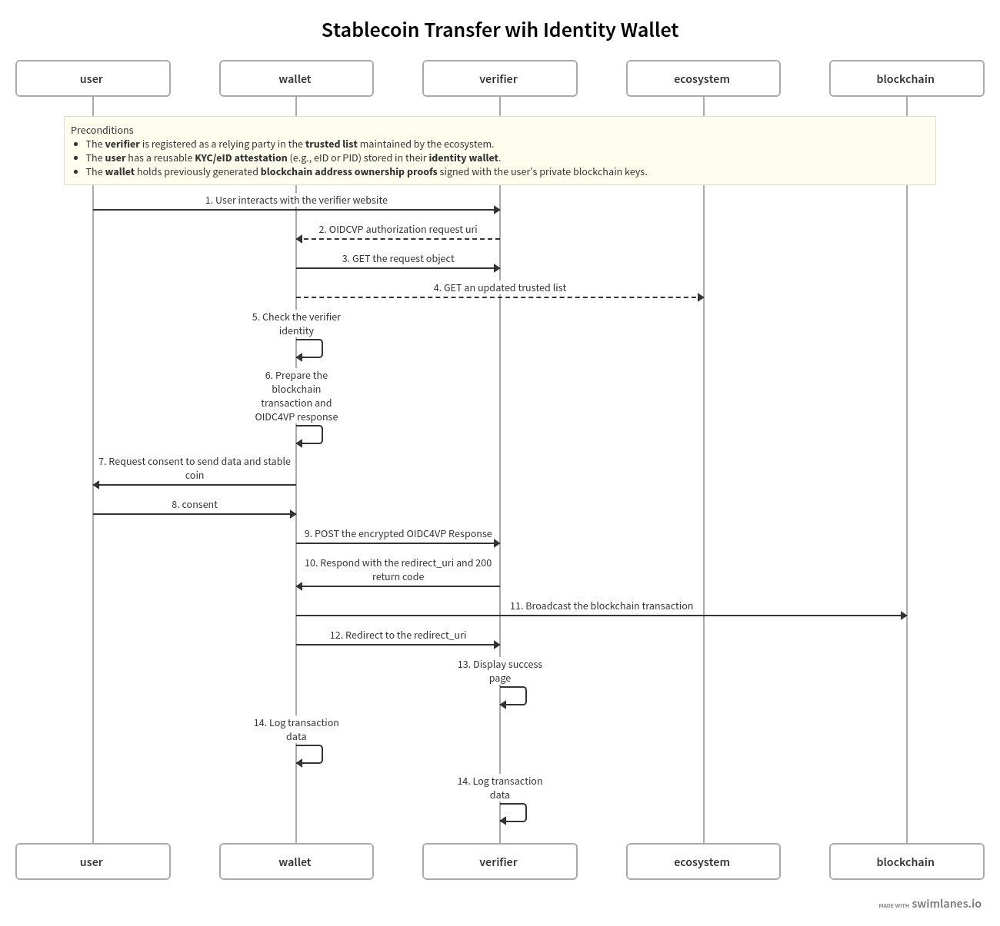

# Stablecoin Payments with EUDI compatible Wallet

- **Version** : 1.5
- **Date** : 25th July 2025
- **Status** : Draft
- **Maintainer** : Altme Identity & Compliance Team
## Table of Contents

1. [Overview](#overview)  
   - [Objectives](#objectives)  
   - [Regulatory and Legal Context](#regulatory-and-legal-context)  
   - [Compliance Mapping](#compliance-mapping)  
   - [Standards and Technologies Used](#standards-and-technologies-used)  
2. [Use Cases](#use-cases)  
   - [1. E-Commerce Payments (Retail)](#1-e-commerce-payments-retail)  
   - [2. Banking & Institutional Services](#2-banking--institutional-services)  
   - [3. Digital Identity-Linked Payments](#3-digital-identity-linked-payments)  
   - [4. DeFi & Web3 Services](#4-defi--web3-services)  
   - [5. Cross-Border Remittances](#5-cross-border-remittances)  
   - [6. Loyalty and Reward Programs](#6-loyalty-and-reward-programs)  
   - [7. B2B Settlements & Supply Chain Payments](#7-b2b-settlements--supply-chain-payments)  
   - [8. Tokenized Financial Products (Flagship Use Case)](#8-tokenized-financial-products-flagship-use-case)  
   - [Highlight: Why Tokenized Products are the Best Use Case](#highlight-why-tokenized-products-are-the-best-use-case)  
3. [Payment Flow](#payment-flow)  
   - [Preconditions](#preconditions)  
   - [Flow Steps](#flow-steps)  
4. [Authorization Request from Verifier](#authorization-request-from-verifier)  
   - [Minimal SD-JWT VC for Identity](#1-minimal-identity-sd-jwt-vc-pid-like)  
   - [SD-JWT VC for Blockchain Ownership](#2-sd-jwt-vc-for-blockchain-ownership)  
   - [OIDC4VP Authorization Request Overview](#oidc4vp-authorization-request-overview)  
   - [Transaction Data for Stablecoin Payment](#4-transaction-data-for-stablecoin-payment)  
   - [Presentation Definition](#5-presentation-definition)  
5. [Response from Wallet](#response-from-wallet)  
   - [Presentation Submission](#presentation-submission)  
   - [VP Token](#vp-token)  
   - [Key Binding JWT](#key-binding-jwt)  
6. [Verifier Implementation Strategies (Verifier, Vendor, Beneficiary Roles)](#verifier-implementation-strategies-verifier-vendor-and-beneficiary-roles)  
   - [Scenario 1 – Verifier = Beneficiary (Self-Custody Model)](#scenario-1--verifier--beneficiary-self-custody-model)  
   - [Scenario 2 – Verifier = Vendor (Vendor as Beneficiary Wallet)](#scenario-2--verifier--vendor-vendor-as-beneficiary-wallet)  
   - [Scenario 3 – Split Role (Verifier = Vendor + Beneficiary)](#scenario-3--split-role-verifier--vendor--beneficiary)  
   - [Scenario 4 – Vendor Gateway (Verifier and Wallet Fully Outsourced)](#scenario-4--vendor-gateway-verifier-and-wallet-fully-outsourced)  
   - [Scenario 5 – Peer-to-Peer Wallet (Verifier Separate, Wallets User-Controlled)](#scenario-5--peer-to-peer-wallet-verifier-separate-wallets-user-controlled)  
   - [Comparison Table](#comparison-table)  
   - [Regulatory Recommendations](#regulatory-recommendations)  
7. [Security Considerations](#security-considerations)  
8. [Error Handling and Recovery](#error-handling-and-recovery)  
9. [Annex](#annex)  
   - [User Consent](#user-consent)  
   - [Transaction Data](#transaction-data)


## Overview

### Objectives

This document describes how **stablecoin payments** (e.g., **USDC**, **USDT**, **DAI**, **USDE**, **TUSD**) can be seamlessly supported using an **EUDI Wallet** or an equivalent **non-custodial data wallet** that implements **OIDC4VP**, **Verifiable Credentials (VCs)**, and **digital asset transfer mechanisms**.

For a detailed explanation of the **concept and motivation** behind this approach, see the Medium article:
[The Future of Compliant Crypto in Europe – EUDI Wallets and Stablecoin Transfers](https://medium.com/@thierry.thevenet/the-future-of-compliant-crypto-in-europe-eudi-wallets-and-stablecoin-transfers-9d4c6c799c82)

Rather than introducing a new protocol, it defines a **wallet profile** designed to ensure that **self-sovereign wallets** can comply with identity and digital transfer regulations (e.g., **MiCA**, **TFR**, **AMLD6**) while preserving user control and privacy.

The key objectives are to:

- **Enable secure, privacy-preserving, and user-consented payments** with stablecoins across **multiple blockchain networks** (Ethereum, Etherlink, Polygon, EVM-compatible chains).
- Use **cryptographic proofs** to verify blockchain address ownership in a **blockchain-agnostic** way.
- Leverage **selective disclosure (SD-JWT VC)** to share only the minimum identity data required for **AML/KYC compliance**, ensuring **data minimization** as mandated by regulations like **GDPR**.
- Guarantee **compliance with substantial assurance levels** for regulated digital asset transactions, including auditable logs and verifiable proofs of consent.
- Foster **interoperability** between wallets, issuers, and verifiers (relying parties) through a **minimal, standardized framework**, while allowing the integration of **future extensions** (e.g., post-quantum cryptography or advanced credential types).

### Regulatory and Legal Context

The design of this wallet profile aligns with current and upcoming **EU regulations** and global standards for digital payments:

- **MiCA (Markets in Crypto-Assets Regulation)** – Ensures stablecoins (e.g., USDC, DAI) are issued and managed in a compliant framework.
- **AMLD6 (6th Anti-Money Laundering Directive)** – Requires **identity verification (KYC)** and **transaction traceability** for digital assets.
- **DAC8 (EU Directive on Administrative Cooperation)** – Imposes **reporting obligations** for crypto transactions across EU states.
- **eIDAS 2.0 & EUDI Wallets** – Provides a **standardized digital identity framework** and supports **Verifiable Credentials** for cross-border identity verification.

This wallet profile leverages **OIDC4VP** and **SD-JWT VC** to ensure compliance with these frameworks while preserving user privacy through **selective disclosure**.

### Compliance Mapping

The following table summarizes how the technical components address compliance requirements:


| Requirement                 | Technical Solution                                     |
| ----------------------------- | -------------------------------------------------------- |
| Proof of wallet ownership   | **Blockchain ownership SD-JWT VC** (linked to tx_hash) |
| KYC / Identity verification | **Identity VC (PID/eID)** via SD-JWT VC                |
| Data minimization (GDPR)    | **Selective disclosure** with SD-JWT VC                |
| Auditability                | **Transaction receipts** with `tx_hash`                |
| Integrity and authenticity  | **Signed JWT requests** and **KB JWT responses**       |
| Confidentiality             | **JWE encrypted responses**                            |


### Standards and Technologies Used

This wallet profile builds upon several open standards and technologies to ensure interoperability, security, and privacy:

- **OIDC4VP (OpenID Connect for Verifiable Presentations)**

  - **[OIDC4VP Draft 22 or newer](https://openid.net/specs/openid-4-verifiable-presentations-1_0-22.html)** – Required minimum version supporting `transaction_data` and `direct_post.jwt`.
  - **Signed JWT Authorization Requests (JAR)** – Requests must be **signed JWTs** for integrity and authenticity.
  - **Response Mode: `direct_post.jwt`** – For secure wallet-to-verifier communication.
  - **Presentation Definition (PE)** – Based on **DIF Presentation Exchange** to define required VCs and claims.
- **Credential Formats**

  - **[SD-JWT VC Draft 10](https://www.ietf.org/archive/id/draft-ietf-oauth-sd-jwt-vc-10.html)** – Mandatory selective disclosure format for VCs, ensuring data minimization.
  - **W3C Verifiable Credentials (VC Data Model)** – Supported for interoperability with other ecosystems.
  - **DID Methods** – Including `did:jwk`, `did:key`, or `did:ebsi` for decentralized identity references.
- **JOSE and JWT Standards**

  - **[JWS – JSON Web Signature (RFC 7515)](https://www.rfc-editor.org/rfc/rfc7515)** – Used for signing SD-JWT VC payloads.
  - **[JWE – JSON Web Encryption (RFC 7516)](https://www.rfc-editor.org/rfc/rfc7516)** – Used for encrypting wallet responses.
  - **Key Binding JWTs** – Binding credentials and transaction hashes (`tx_hash`).
- **Cryptographic Primitives**

  - **Elliptic Curves**: `P-256` for identity keys, `secp256k1` and `ed25519` for blockchain addresses.
  - **Hash Algorithms**: `SHA-256` for transaction and credential binding.
  - **Key Agreement**: `ECDH-ES` (P-256).
  - **Encryption**: `AES-128-GCM` for symmetric encryption.
- **Blockchain and Token Standards**

  - **ERC-20** – Standard for stablecoins on Ethereum and EVM-compatible chains (e.g., USDC, DAI).
  - **Multi-chain Support** – Ethereum mainnet, Etherlink, EVM-compatible chains, and others.
- **Trust Infrastructure**

  - **Trusted Verifier Registry** – Ecosystem-managed **trusted list** of verifiers and issuers (based on **X.509 certificates**).
  - **client_id_scheme = x509_san_dns** – Required for verifying verifier identity against the trusted list.
- **Transport and Interaction**

  - **QR Codes / Deep Links** – For wallet-verifier interaction.
  - **HTTP POST / direct_post.jwt** – For delivering encrypted VP responses.


## Use Cases

This wallet profile enables a **new generation of compliant, privacy-preserving stablecoin payments** by combining **EUDI-based identity credentials** with **self-custodial crypto transactions**. It covers both **consumer** and **institutional** scenarios where **identity verification and instant settlement** are equally important.


### **1. E-Commerce Payments (Retail)**

**Example Scenario:**  
A user purchases electronics online and pays **100 USDC** directly to the merchant using a **self-custodial wallet**.

**Key Benefits:**  
- **Seamless Checkout:** Scanning a QR code launches the EUDI wallet, combining **payment authorization + identity verification** in a single step.  
- **AML/KYC Compliance:** Shares **only minimal identity data** (e.g., age confirmation or name), via **selective disclosure (SD-JWT)**.  
- **Faster Settlement:** On-chain stablecoin settlement avoids chargebacks and reduces transaction costs.

**Best Fit:**  
Merchants seeking **low-cost, instant global payments** with privacy-preserving KYC.


### **2. Banking & Institutional Services**

**Example Scenario:**  
A private bank enables high-net-worth clients to transfer **EURC** while meeting MiCA and TFR obligations.

**Key Benefits:**  
- **Regulatory Compliance:** Clients present **verifiable KYC credentials** using **OIDC4VP** and **SD-JWT**, ensuring full AML checks.  
- **Identity-Payment Binding:** Every transaction is cryptographically linked to identity proofs via **Key Binding JWTs**.  
- **Non-Custodial Transfers:** Users hold funds in their own wallet; the bank only receives payments into its self-custody account, avoiding CASP obligations.

**Best Fit:**  
Banks and regulated entities that need **compliant crypto rails** and **real-time settlements**.


### **3. Digital Identity-Linked Payments**

**Example Scenario:**  
A user buys **age-restricted event tickets** or pays for **government services** that require strong identity verification.

**Key Benefits:**  
- **One-Step Identity + Payment:** The wallet confirms identity and completes the payment in the same flow.  
- **Selective Disclosure:** Only necessary attributes (e.g., "over 18") are shared, ensuring **GDPR compliance**.  
- **Traceability:** Payments and identity claims are linked via **transaction hashes** for legal reporting.

**Best Fit:**  
Ticketing platforms, public sector payments, and regulated retailers.

### **4. DeFi & Web3 Services**

**Example Scenario:**  
A DAO requires verified KYC for members participating in on-chain governance or staking.

**Key Benefits:**  
- **Proof of Verified User:** Users can present **KYC credentials** without revealing all personal data.  
- **Ownership Proof:** Blockchain accounts are linked to user credentials via **blockchain ownership SD-JWT**.  
- **Regulatory Gatekeeping:** Ensures compliance for DeFi protocols without sacrificing decentralization.

**Best Fit:**  
DeFi protocols, staking services, and DAOs with **compliance requirements**.


### **5. Cross-Border Remittances**

**Example Scenario:**  
An individual in Germany sends **500 USDC** to family in the Philippines.

**Key Benefits:**  
- **Instant Transfers:** Stablecoin transactions avoid delays and high remittance fees.  
- **Built-In KYC & TFR Compliance:** Each transaction includes **identity-linked proofs** for AML checks.  
- **Auditability:** Wallet generates **verifiable payment receipts** with `tx_hash` and identity data hashes.

**Best Fit:**  
Remittance services and global payment gateways.


### **6. Loyalty and Reward Programs**

**Example Scenario:**  
A retailer issues **stablecoin-based loyalty rewards** redeemable across its store network.

**Key Benefits:**  
- **Fraud Prevention:** Rewards are linked to **verified identities** to prevent abuse.  
- **Instant Redemption:** Tokens can be spent or transferred on-chain instantly.  
- **Cross-Vendor Interoperability:** Stablecoin rewards can integrate with multiple merchants.

**Best Fit:**  
Retail ecosystems, airline rewards, and hospitality programs.


### **7. B2B Settlements & Supply Chain Payments**

**Example Scenario:**  
A manufacturer pays **€50,000 USDC** to a verified supplier.

**Key Benefits:**  
- **Instant Settlement:** Eliminates delays from cross-border bank transfers.  
- **Verified Counterparty:** Supplier identity (legal entity) is confirmed via SD-JWT before transfer.  
- **Audit-Ready:** Payment, `tx_hash`, and identity proofs are stored for compliance reporting.

**Best Fit:**  
Cross-border trade, supply chain payments, and enterprise settlements.


### **8. Tokenized Financial Products (Flagship Use Case)**

**Example Scenario:**  
A user buys **€10,000 of a tokenized bond** issued by a bank.

**Key Benefits:**  
- **Identity + Payment Binding:** EUDI wallet shares **KYC attributes** and links them to the **stablecoin payment (`tx_hash`)**.  
- **Instant Settlement of Assets:** The bank issues **tokenized securities** directly to the user’s wallet after on-chain payment.  
- **Compliance & Audit:** Full traceability for **MiCA and AMLD6**, with cryptographic binding of identity, payment, and token issuance.

**Best Fit:**  
Banks and fintechs issuing **tokenized bonds, funds, or real-world assets**, bridging **traditional finance and Web3**.


### **Highlight: Why Tokenized Products are the Best Use Case**

This wallet is particularly well-suited for **regulated tokenized products**, where **identity verification, instant payment, and asset transfer** must be **cryptographically linked**.

**Advantages:**
- **Fast settlement (via stablecoins)**.  
- **Seamless KYC compliance** (via EUDI + SD-JWT).  
- **Auditable proofs** that satisfy **MiCA and TFR** obligations.


## Technical Steps for Payment Flow



### Preconditions

- The **verifier** is registered as a relying party in the **trusted list** maintained by the ecosystem.
- The **user** has a reusable **KYC/eID attestation** (e.g., eID or PID) stored in their **identity wallet**.
- The **wallet** holds previously generated **blockchain address ownership proofs** signed with the user's private blockchain keys.

### Flow Steps

#### 1. User Interaction with Verifier

The **user** initiates a payment by interacting with the **verifier website** (e.g., clicking "Pay with Wallet").

#### 2. Authorization Request URI

The **verifier** generates a **signed OIDC4VP authorization request JWT at the request_uri endpoint**, which includes:

- `nonce` and `state` attached to the session.
- `transaction_data` (payment details like amount, currency, recipient address).
- `presentation_definition` or `dcql_query` specifying the **required VCs** (identity VC and blockchain ownership VC).
- `client_metadata` with the public key for encryption.
- `response_mode=direct_post.jwt`

This request is encoded into a **QR code** or **deep link**, which the **user scans** using their wallet app.

#### 3. Wallet Fetches the Request Object

The **wallet** retrieves the **authorization request object as a signed JWT** (via a GET request) from the verifier's endpoint to obtain the detailed payment and credential requirements.

#### 4. Update Trusted List

If needed the **wallet** requests the latest **trusted list** from the **ecosystem** to ensure the **verifier's status and keys are valid**.

#### 5. Verifier Identity Check

The **wallet** validates the **verifier identity** by verifying:

- verifier registration in the trusted list through X509 check.
- Integrity and authenticity of the authorization request.

#### 6. Preparation of Blockchain Transaction and OIDC4VP Response

The **wallet**:

- Generates **the blockchain unsigned transaction** and computes the **`tx_hash`** for the pending transfer.
- Prepares an **OIDC4VP response** containing the **Verifiable Presentation (VP)**, which includes:
  - The presentation_submission for 2 SD-JWT VC.
  - The **identity SD-JWT VC** with selective disclosure for given_name, family_name and birth date.
  - The **KB** of the Identity SD-JWT VC that **includes**:
    - The original `transaction_data` hash(amount, currency, verifier address, etc.).
    - The computed `tx_hash` to bind the VP to the specific blockchain transaction.
  - The **blockchain ownership SD-JWT VC with KB** proving control over the blockchain address.

#### 7. Consent Request

To comply with **MiCA** and **TFR**, the consent flow must provide the user with **clear, auditable, and transparent information** about both the payment and the data being shared. See [Annex](#user-consent) for more information about user consent.

#### 8. user Consent

The **user** consents to the request using **1-click** or **biometric authentication**.
The wallet finalizes the prepared VP and blockchain transaction.

#### 9. POST Encrypted OIDC4VP Response

The **wallet** sends the encrypted **OIDC4VP response** to the **verifier** via an **HTTP POST**.

#### 10. Verifier Verification & Redirect Response

The **verifier server**:

- Validates all **SD-JWT VCs**, the VPs, and `transaction_data_hash`.
- Confirms the request integrity, including the **`tx_hash`** binding.

Upon success, it responds with:

- **HTTP 200 OK** status.
- A **redirect_uri** for final redirection.

#### 11. Blockchain Transaction Broadcast

Upon receiving the 200 OK, the **wallet** signs and broadcasts the **stablecoin transfer** on the blockchain network.

#### 12. Redirect to Success URI

The **wallet** redirects the user to the **verifier-provided redirect_uri**, confirming completion.

#### 13. Display Success Page

The **verifier** displays a **success page** to the user, confirming the payment and transaction status.

#### 14. Store Transaction Data

To comply with **MiCA** and the **EU Transfer of Funds Regulation (TFR)**, verifiers and users must retain specific transaction data for auditability, AML/KYC checks, and regulatory reporting. Logging ensures that each stablecoin payment can be traced back to its source, with all required identity attributes preserved. See Annex.

## Authorization request from verifier

### 1. Minimal Identity SD-JWT VC (PID-like)

This SD-JWT VC is is signed by the issuer of the Identity VC with a P-256 key and an x509 certificates attached in the header. The root certificate must be in the trusted list of the ecosystem. Claims are encoded and so are only disclosed with user consent.

Header

```json
{
    "alg": "ES256",
    "typ": "dc+sd-jwt",
    "x5c": [
        "MIICoDCCAY.....Fs9dKu+GSGECfQ==",
        "MIIDbDCCAl....eT5ZMR/GP6Q9rfWycznofgwbpUBg=="
    ]
}

```

Payload

```json

{
  "iss": "https://talao.co",
  "iat": 1734560000,
  "exp": 1739999999,
  "vct": "eu:europa:ec.eudi.pid.1",
  "given_name": "Alice",
  "family_name": "Doe",
  "birth_date": "1990-05-20",
  "age_over_18": true,
  "cnf": {
    "jwk": {
      "kty": "EC",
      "crv": "P-256",
      "x": "f83OJ3D2xF4...",
      "y": "x_FEzRu9VnA..."
    }
  }
}
```

---

### 2. SD-JWT VC for Blockchain Ownership

This **SD-JWT VC is signed by the key of the blockchain address** of the wallet used to transfer the stable coins. The `cnf` is the wallet key of the Identity SD-JWT VC of the user. Claims are readable (no disclosures needed).

We use the **did:jwk** method to provide a simple URI (`iss`) to the key of the blockchain address.

The signature must be compliant with [JOSE RFC7515](https://www.rfc-editor.org/rfc/rfc7515.html) and its [extension](https://datatracker.ietf.org/doc/html/draft-jones-webauthn-secp256k1-00) for elliptic curve secp256k1.

Header

```json
{
  "alg": "ES256K",
  "typ": "dc+sd-jwt",
  "kid": "did:jwk:eyJrdHkiOiJFQyIsImNydiI6InNlY3AyNTZrMSIsIngiOiI1SmQ1QlNjMFRYOC4uLiIsInkiOiJMOTl1Zks1cENkVS4uLiJ9#0"
}
```

Payload

```json

{
  "iss": "did:jwk:eyJrdHkiOiJFQyIsImNydiI6InNlY3AyNTZrMSIsIngiOiI1SmQ1QlNjMFRYOC4uLiIsInkiOiJMOTl1Zks1cENkVS4uLiJ9",
  "iat": 1734561000,
  "vct": "urn:dev:vct:blockchain-ownership",
  "blockchain_network": "Ethereum",
  "wallet_address": "0x742d35Cc6634C0532925a3b844Bc454e4438f44e",
  "cnf": {
    "jwk": {
      "kty": "EC",
      "crv": "P-256",
      "x": "f83OJ3D2xF4...",
      "y": "x_FEzRu9VnA..."
    }
  }
}
```

### OIDC4VP Authorization Request Overview

Based on OIDC4VP draft 23 syntax, this request must be provided by the verifier as a JWT signed with a P-256 key and an x509 certificates in the header. The root certificate must be in the trusted list of the ecosystem.

Header

```json
{
    "alg": "ES256",
    "typ": "oauth-authz-req+jwt",
    "x5c": [
        "MIICoDCCAY.....Fs9dKu+GSGECfQ==",
        "MIIDbDCCAl....eT5ZMR/GP6Q9rfWycznofgwbpUBg=="
    ]
}
```

Payload

```json
{
  "aud": "https://self-issued.me/v2",
  "response_type": "vp_token",
  "response_mode": "direct_post.jwt",
  "client_id": "x509_san_dns:verifier.example.com",
  "response_uri": "https://verifier.example.com/response",
  "state": "s-456",
  "nonce": "n-123",
  "presentation_definition": "%7B%22id%22%3A%....2C%22fields%22%3A%5B%7B%22path%22%3A%5B%22%24.gi",
  "transaction_data": ["eyJ0eXBlIjoic3Rh....b2YgZGlnaXRhbCBnb29kcyJ9"],
  "client_metadata": {
    "jwks": {
      "keys": [
        {
          "kty":"EC",
          "kid":"ac",
          "use":"enc",
          "crv":"P-256",
          "alg":"ECDH-ES",
          "x":"YO4epjifD-KWeq1sL2tNmm36BhXnkJ0He-WqMYrp9Fk",
          "y":"Hekpm0zfK7C-YccH5iBjcIXgf6YdUvNUac_0At55Okk"
        }
      ]
    }
  },
  "exp": 1734567890,
  "iat": 1734560000
}
```

- **`aud`**
  Audience for the request. Set to `https://self-issued.me/v2` to indicate that this is a self-issued OpenID Connect request intended for a wallet.
- **`response_type`**
  Specifies the response type expected. Here, `vp_token` indicates that a Verifiable Presentation token is requested.
- **`response_mode`**
  Indicates how the response should be returned.
  `direct_post.jwt` means the wallet will send a signed JWT response directly to the verifier’s endpoint via HTTP POST.
- **`client_id`**
  Identifier of the relying party (verifier).
  Uses `x509_san_dns:verifier.example.com` to bind the request to a verified verifier identity.
- **`response_uri`**
  The endpoint on the verifier’s server where the wallet should POST the encrypted response.
- **`state`**
  A random string to maintain state between request and response.
  Protects against CSRF attacks.
- **`nonce`**
  A unique value to prevent replay attacks and link the response to this request.
- **`presentation_definition`**
  A URL-encoded JSON structure defining the types of Verifiable Credentials (VCs) and claims the verifier requires from the wallet.
- **`transaction_data`**
  A Base64 URL-encoded array of payment details, such as the amount, currency, payee, and purpose of the transaction.
- **`client_metadata`** Metadata about the client, including the **JWKS** (JSON Web Key Set) used for encrypting the response from the wallet.

  - **`keys`**: Contains public keys (e.g., EC keys on P-256 curve) used for ECDH key exchange.
- **`exp`**
  Expiration time of the authorization request, in **Unix epoch** format (seconds).
  After this time, the request is invalid.
- **`iat`**
  Issued-at time, in Unix epoch format (seconds), indicating when the authorization request was generated.

### 4. Transaction Data for Stablecoin Payment

In this example the payee is the verifier identified by the `client_id` of the OIDC4VP request JWT.
The transaction data must be BASE64 URL safe encoded before being added to the authorization request.

```json
{
  "type": "stablecoin_payment",
  "credential_ids": ["eid-limited"],
  "amount": {
    "currency": "USDC",
    "value": "100.00"
  },
  "token": {
    "symbol": "USDC",
    "contract_address": "0xA0b86991c6218B36c1d19D4a2e9Eb0cE3606eB48",
    "decimals": 6
  },
  "network": {
    "name": "Ethereum",
    "chain_id": 1
  },
  "payee": {
    "name": "ACME Store",
    "wallet_address": "0x742d35Cc6634C0532925a3b844Bc454e4438f44e"
  },
  "transaction_id": "1234567890",
  "timestamp": "2025-07-18T14:30:00Z",
  "purpose": "Purchase of digital goods"
}
```

- **`type`**
  Specifies the type of transaction.
  In this case, it is `"stablecoin_payment"`.
- **`credential_ids`**
  Identifiers of the Verifiable Credentials required or linked to the payment (e.g., `"eid-limited"`).
- **`amount`** Describes the payment amount and currency:

  - **`currency`** – The stablecoin currency code (e.g., `USDC`).
  - **`value`** – The payment amount as a string with decimals.
- **`token`** Details of the stablecoin token contract:

  - **`symbol`** – Token symbol (e.g., `USDC`).
  - **`contract_address`** – The contract address of the token on the blockchain (EVM format).
  - **`decimals`** – Number of decimal places used by the token.
- **`network`** Describes the blockchain network where the payment occurs:

  - **`name`** – Human-readable name (e.g., `Ethereum`).
  - **`chain_id`** – Numeric chain identifier for the network.
- **`payee`** Information about the verifier or recipient of the payment:

  - **`name`** – verifier name (e.g., `ACME Store`).
  - **`wallet_address`** – Blockchain wallet address of the verifier (EVM format).
- **`transaction_id`**
  An internal reference identifier for the payment, not to be confused with the on-chain `tx_hash`.
- **`timestamp`**
  The date and time when the transaction request was generated, in **ISO 8601** format.
- **`purpose`**
  A short description of the reason for the payment (e.g., `Purchase of digital goods`).

### 5. Presentation Definition

The presentation definition must URL encoded before being added in the authorization request.

```json
{
  "id": "stablecoin-payment-auth",
  "input_descriptors": [
    {
      "id": "eid-limited",
      "name": "Electronic ID",
      "purpose": "Verify identity for AML/KYC",
      "format": {
        "vc+sd-jwt": {
          "dc-jwt_alg_values": [
            "ES256",
          ],
          "kb-jwt_alg_values": [
            "ES256"
          ]
        }
      },
      "constraints": {
        "limit_disclosure": "required",
        "fields": [
          { "path": ["$.given_name"]},
          { "path": ["$.family_name"]},
          { "path": ["$.birth_date"]}
        ]
      }
    },
    {
      "id": "blockchain-ownership",
      "name": "Proof of Blockchain Account Ownership",
      "purpose": "Prove control of blockchain account used for payment",
      "format": {
        "dc+sd-jwt": {
          "dc-jwt_alg_values": [
            "ES256K",
            "EdDSA"
          ],
          "kb-jwt_alg_values": [
            "ES256",
          ]
        }
      },
      "constraints": {
        "fields": [
          { "path": ["$.blockchain_network"] },
          { "path": ["$.wallet_address"] }
        ]
      }
    }
  ]
}
```

## Response from wallet

```http
POST /response HTTP/1.1
Host: https://verifier.example.com
Content-Type: application/x-www-form-urlencoded

response=eyJra...9t2LQ
```

The wallet’s response **SHOULD be encrypted as a JWE (JSON Web Encryption)**, depending on the selected verifier verifier strategy.

- When **personal data or sensitive claims are disclosed**, encryption **MUST** be applied to prevent intermediaries (e.g., external API verifiers or payment gateways) from accessing user data.
- If the verifier is using a fully **in-house verifier** with a secure channel (e.g., TLS and direct communication), encryption MAY be optional, depending on the privacy requirements.

When JWE encryption is used:

- The JWE `alg` header parameter **MUST** be `ECDH-ES` for key agreement using keys on the **P-256** curve.
- The `enc` parameter **MUST** be `A128GCM` for symmetric encryption.

The response is encrypted so that only the verifier can read its contents.
However, the payload is not signed, meaning the JWE itself does not provide cryptographic proof of origin or end-to-end integrity beyond encryption. For higher security and non-repudiation, the payload should first be signed (JWS) and then encrypted, resulting in a nested JWT structure (JWS → JWE).

JWE Header

```json
{
  "alg": "ECDH-ES",
  "enc": "A128GCM",
  "kid": "ac",
  "epk": {
    "kty": "EC",
    "x": "nnmVpm3V3jbhcafQaRBkSVNHlwZHwt-9rOpJufyYIuk",
    "y": "r4fjDqwJys9qUOP-_b3mR5SZG--CwO2mic5VSNTYN9g",
    "crv": "P-256"
  }
}
```

Payload (before encryption)

```json
{
  "iat": 1734560000,
  "exp": 1734560500,
  "presentation_submission": "ey....'",
  "vp_token": ["ey...123DR4~", "ey..3456~"],
  "state": "s-456"
}
```

### Presentation Submission

```json

{
  "id": "stablecoin-payment-response",
  "definition_id": "stablecoin-payment-auth",
  "descriptor_map": [
    {
      "id": "eid-limited",
      "format": "dc+sd-jwt",
      "path": "$[0]"
    },
    {
      "id": "blockchain-ownership",
      "format": "dc+sd-jwt",
      "path": "$[1]"
    }
  ]
}
```

### VP_token

**There are 2 SD-JWT VC in the vp_token array**. The Identity SD-JWT VC must provide disclosures of `given_name`, `family_name` and `birth_date`. Each SD-JWT VC has its own Key Binding JWT according to the IETF [SD-JWT VC](https://www.ietf.org/archive/id/draft-ietf-oauth-selective-disclosure-jwt-22.html#name-key-binding-jwt) specifications.

### Key Binding JWT attached to the Identity SD-JWT VC

Header

```json
{
  "typ": "kb+jwt",
  "alg": "ES256"
}
```

Payload of the KB JWT attached to the Identity SD-JWT VC with `transaction_data_hashes` and `tx_hash`

```json
{
  "nonce": "n-123",
  "aud": "x509_san_dns:verifier.example.com",
  "iat": 1709838604,
  "sd_hash": "Dy-RYwZfaaoC3inJbLslgPvMp09bH-clYP_3qbRqtW4",
  "transaction_data_hashes": [ "fOBUSQvo46yQO-wRwXBcGqvnbKIueISEL961_Sjd4do" ],
  "tx_hash": "0xb3b20624b9eaf92d3b46db2783da9e5e86e41dd5807d1fd5a0f6dce7d2f5b51f"
}
```

- **`nonce`**
  A unique value from the authorization request, used to prevent replay attacks and link this Key Binding JWT to a specific transaction session.
- **`aud`**
  The audience for this JWT, typically the relying party (e.g., `x509_san_dns:verifier.example.com`).
  It ensures that the Key Binding JWT is intended for a specific verifier or service.
- **`iat`**
  The "issued at" timestamp (in Unix epoch seconds) indicating when this Key Binding JWT was created.
- **`sd_hash`**
  A cryptographic hash of the disclosed claims from the **SD-JWT VC**.
  It binds this KB JWT to the selective disclosure of identity data, ensuring the presented claims correspond to the original signed VC.
- **`transaction_data_hashes`**
  An array of hashes that link the payment transaction data to this KB JWT.
  This ensures the identity proof and the specific stablecoin transaction are cryptographically tied together, preventing substitution of transaction details.
- **`tx_hash`**
  The hash of the unsigned blockchain transaction that will be broadcast.
  This binds the identity proof (SD-JWT VC) to a specific blockchain operation, enabling strong integrity and non-repudiation guarantees.

## Verifier Implementation Strategies (Verifier, Vendor, and Beneficiary Roles)

In the payment architecture, three roles can exist:

- **Verifier** – The entity initiating and validating the OIDC4VP request and verifying SD-JWT and VP tokens.
- **Beneficiary** – The final recipient of the funds (e.g., a merchant).
- **Vendor** – A third-party service provider that can act as a verifier, hold the beneficiary’s wallet, or provide compliance and verification as a service.

The **beneficiary wallet** is the blockchain wallet that receives the stablecoin transfer.  
This wallet can be:
- **Owned by the beneficiary** (self-custody), or
- **Owned by a vendor** (custodial model).

The verifier role may be:
- Performed **entirely by the beneficiary**,
- Delegated to the **vendor**, or
- **Split between both**.

Below are the **main implementation scenarios**.


### **Scenario 1 – Verifier = Beneficiary (Self-Custody Model)**

**Roles and Wallet Ownership:**
- The **beneficiary acts as the verifier** and controls the beneficiary wallet.
- All OIDC4VP requests are generated by the beneficiary.

**How It Works:**
- The beneficiary generates the `authorization_request` JWT (OIDC4VP).
- The user’s wallet provides verifiable presentations (VP tokens and SD-JWT VCs).
- The beneficiary validates the responses and directly receives stablecoins on its self-custody wallet.

**Compliance (TFR & AML):**
- The beneficiary must log:
  - **Payer KYC attributes** (e.g., `given_name`, `family_name`, `birth_date` from the VP token).
  - **Transaction metadata** (`amount`, `currency`, `tx_hash`, and timestamp).
- Logs must be retained in compliance with **TFR** and **AMLD6** requirements.
- **Not a CASP**, since the beneficiary only receives funds on its own wallet.

**Use Case:**
- Large merchants, financial institutions, or regulated businesses with their own compliance teams.


### **Scenario 2 – Verifier = Vendor (Vendor as Beneficiary Wallet)**

**Roles and Wallet Ownership:**
- A **vendor acts as both verifier and beneficiary wallet owner**.
- The vendor controls the wallet receiving the funds and manages OIDC4VP flows.

**How It Works:**
- Vendor issues the OIDC4VP request and validates the VP tokens.
- Stablecoins are transferred from the user to the **vendor’s custodial wallet**.
- Vendor later settles with the beneficiary (off-chain or by transferring stablecoins).

**Compliance (TFR & AML):**
- Vendor is responsible for:
  - Collecting **payer KYC data** via VP tokens.
  - Recording all transaction details (`amount`, `currency`, `tx_hash`, and timestamp).
  - Reporting under **TFR** and AML regulations.
- **Vendor acts as a CASP/VASP**, since it holds custody of user funds.

**Use Case:**
- Smaller or non-technical businesses that outsource both crypto handling and compliance.


### **Scenario 3 – Split Role (Verifier = Vendor + Beneficiary)**

**Roles and Wallet Ownership:**
- The **verifier role is shared**:
  - Vendor handles OIDC4VP request creation and session orchestration.
  - Beneficiary owns the wallet receiving stablecoins and performs final data validation.

**How It Works:**
- Vendor issues the `authorization_request` JWT.
- User’s wallet sends stablecoins **directly to the beneficiary wallet** (self-custody).
- The OIDC4VP response (VP token and SD-JWT) is encrypted (JWE) so **only the beneficiary can access sensitive identity data**.
- Vendor may log session metadata but not personal data.

**Compliance (TFR & AML):**
- Beneficiary is responsible for logging:
  - **Payer KYC attributes** (from VP token).
  - **Transaction data** (`tx_hash`, `amount`, etc.).
- Vendor may log **non-sensitive metadata** (e.g., `nonce`, `state`) to provide audit traceability.
- **Not a CASP**, since the vendor never holds funds.

**Use Case:**
- Businesses wanting vendor support for OIDC4VP integration while maintaining custody of funds and privacy.


### **Scenario 4 – Vendor Gateway (Verifier and Wallet Fully Outsourced)**

**Roles and Wallet Ownership:**
- Vendor acts as both the **verifier and the beneficiary wallet owner**, managing the entire OIDC4VP and payment flow.

**How It Works:**
- Vendor generates the OIDC4VP request, verifies identity and blockchain proofs, and receives stablecoins on its custodial wallet.
- Vendor provides a **payment confirmation callback** or webhook to the beneficiary.
- Beneficiary does not directly interact with the blockchain.

**Compliance (TFR & AML):**
- Vendor logs and reports all **TFR-required data** and AML checks.
- Beneficiary relies entirely on vendor reports for audits.
- **Vendor is a CASP/VASP** (full custody).

**Use Case:**
- Businesses that require a "turnkey" crypto payment solution with fiat conversion.


### **Scenario 5 – Peer-to-Peer Wallet (Verifier Separate, Wallets User-Controlled)**

**Roles and Wallet Ownership:**
- Both **user and beneficiary have self-custodial wallets**.
- A verifier (beneficiary or a third-party vendor) only **validates compliance and identity proofs**, without holding funds.

**How It Works:**
- OIDC4VP flow is used to exchange identity data (VP tokens, SD-JWT VCs) and link it with the `tx_hash`.
- Stablecoins are transferred **directly from user to beneficiary**.

**Compliance (TFR & AML):**
- Beneficiary logs:
  - **Payer identity data** (from VP).
  - Transaction data (`tx_hash`, `amount`, timestamp).
- **No CASP** involved, since no third party holds funds.

**Use Case:**
- Decentralized, privacy-preserving payments with direct wallet-to-wallet transfers.


### **Comparison Table**

| Scenario                              | Verifier Role              | Beneficiary Wallet Owner | CASP/VASP Risk   | TFR Compliance Responsibility  |
|---------------------------------------|----------------------------|--------------------------|------------------|--------------------------------|
| **1. Verifier = Beneficiary**         | Beneficiary                | Beneficiary              | Low              | Beneficiary                    |
| **2. Verifier = Vendor**              | Vendor                     | Vendor                   | Vendor = CASP    | Vendor                         |
| **3. Split Role (Vendor + Beneficiary)** | Vendor + Beneficiary       | Beneficiary              | Low              | Beneficiary (Vendor logs meta) |
| **4. Vendor Gateway**                 | Vendor                     | Vendor                   | Vendor = CASP    | Vendor                         |
| **5. Peer-to-Peer Wallet**            | Beneficiary or Third-party | Beneficiary              | None             | Beneficiary                    |


### **Regulatory Recommendations**

- **For full privacy and compliance control:**  
  - Use **Scenario 1 (Verifier = Beneficiary)** or **Scenario 3 (Split Model)**.  
  - Both ensure the beneficiary directly controls the wallet and TFR records.

- **For fast integration with minimal technical work:**  
  - Use **Scenario 2 (Verifier = Vendor)** or **Scenario 4 (Vendor Gateway)**.  
  - Ensure the vendor is **CASP-compliant** and AML reporting is contractually covered.

- **For decentralized, CASP-free flows:**  
  - Use **Scenario 5 (Peer-to-Peer Wallet)** with direct wallet-to-wallet transfers and OIDC4VP proofs for TFR data exchange.


## Security Considerations

The wallet profile relies on industry-standard cryptographic mechanisms and trust frameworks to ensure the confidentiality, integrity, and authenticity of transactions. Below are the key security considerations:

1. **End-to-End Data Protection**

   - All sensitive data exchanged between wallet and verifier is encrypted using **JWE (ECDH-ES + A128GCM)**.
   - For authenticity, it is recommended to use **nested JWTs** (sign-then-encrypt).
2. **Replay Attack Prevention**

   - Authorization requests and responses include unique **`nonce`** and **`state`** values, preventing replay attacks and ensuring session binding.
3. **Selective Disclosure & Privacy**

   - **SD-JWT VC** enables the wallet to disclose only the required claims (e.g., name, birth date) while keeping other identity attributes hidden.
   - Hash-based disclosure ensures claims cannot be tampered with without invalidating signatures.
4. **Key Binding & Transaction Integrity**

   - The **Key Binding JWT (KB-JWT)** links the verifiable credentials to the `transaction_data_hash` and computed `tx_hash`, ensuring that the identity proof is directly tied to the specific payment.
5. **Trusted List Validation**

   - verifiers and issuers must be verified against a **trusted registry** using **X.509 certificates** to avoid phishing or rogue actors.
6. **Key Management**

   - Private keys in wallets should be stored in secure hardware or environments (e.g., HSMs, Secure Enclaves) to prevent unauthorized access or signing.
7. **Audit and Traceability**

   - Each transaction is accompanied by verifiable proofs (`vp_token`, `tx_hash`), enabling reliable audit trails while maintaining user privacy.

## Error Handling and Recovery

Stablecoin payments involve multiple steps, cryptographic exchanges, and interactions with both the wallet and blockchain networks. To ensure reliability and regulatory compliance, the wallet profile must define **error-handling procedures** for common failure scenarios.

### 1. Authorization Request Failures

**Potential Issues:**

- Invalid or expired `authorization_request` (e.g., expired `iat`/`exp` claims).
- Failed verifier verification (e.g., verifier not found in trusted list or invalid x509 certificate).
- Network errors when fetching the request object.

**Mitigation & Recovery:**

- **Fail fast:** The wallet must abort the process if the verifier identity or signature cannot be verified.
- **User notification:** Show a clear error message (e.g., *“The payment request cannot be verified. Please try again or contact the verifier.”*).
- **Retry logic:** For transient network errors, retry fetching the `request_uri` up to 3 times with exponential backoff.

### 2. User Consent Interruptions

**Potential Issues:**

- User cancels the consent process or fails biometric/PIN authentication.
- Consent screen times out due to inactivity.

**Mitigation & Recovery:**

- Discard all prepared transactions and credentials if the user cancels.
- The wallet should log the incomplete attempt for audit purposes without storing sensitive data.
- Allow the user to re-initiate payment by rescanning the QR code or refreshing the verifier checkout page.

### 3. OIDC4VP Response Errors

**Potential Issues:**

- Failure to encrypt the wallet response (JWE) or mismatched `client_metadata` keys.
- The verifier endpoint is unreachable during `POST /response`.

**Mitigation & Recovery:**

- **Retry sending the response** (with exponential backoff) if the verifier endpoint is temporarily unreachable.
- **Store pending VP responses** for a short duration (e.g., 5 minutes) with strict encryption in the wallet. Allow the user to retry manually.
- If the JWE encryption fails due to an invalid `client_metadata`, notify the user and abort. The verifier must regenerate the authorization request.

### 4. Blockchain Transaction Errors

**Potential Issues:**

- Insufficient funds, gas fees, or nonce issues during signing/broadcasting.
- Blockchain network congestion or temporary downtime.
- Transaction replaced, dropped, or stuck in the mempool.

**Mitigation & Recovery:**

- Pre-check the user’s balance and estimated fees before requesting consent.
- If broadcast fails, **display a retry option** to the user with updated gas fee estimates.
- Generate a **new `tx_hash`** if the transaction must be re-signed and re-broadcast.
- Log all failed attempts (with reason) in an **audit-safe record**.

### 5. verifier Verification Errors

**Potential Issues:**

- verifier rejects the VP response due to signature mismatch or expired `nonce/state`.
- verifier’s trusted list entry is revoked between request initiation and response.

**Mitigation & Recovery:**

- The wallet must **re-fetch the trusted list** if verification fails and prompt the user if the verifier is untrusted.
- Provide the user with a **“safe exit”** option (cancel payment and return to verifier).

### 6. Post-Payment Discrepancies

**Potential Issues:**

- Payment broadcast succeeds, but the verifier does not confirm receipt (e.g., HTTP response error or timeout).
- Network partitioning between verifier and blockchain indexers.

**Mitigation & Recovery:**

- The wallet should monitor the blockchain for confirmation of the `tx_hash` and allow the user to **resend the VP proof** (if needed).
- Generate an **immutable payment receipt** (with `tx_hash`, `transaction_data_hash`, and timestamp) so the user can prove payment later.

### 7. Audit and Incident Handling

- **Error Logging:** Every failure event (e.g., rejected VPs, failed broadcasts) must be logged locally and tied to a session identifier for debugging and compliance.
- **Regulatory Reporting:** Serious errors (e.g., failed AML/KYC checks) must be escalated according to AMLD6 reporting obligations.
- **User Experience:** Always provide the user with actionable next steps (e.g., *“Retry Payment”*, *“Contact verifier”*, *“Check Blockchain Explorer”*).

## Annex

### User consent

To comply with **MiCA** and **TFR**, the consent flow must provide the user with **clear, auditable, and transparent information** about both the payment and the data being shared.

1. **Display Mandatory Payment Details**

   - **Amount and currency** of the transaction (e.g., `100.00 USDC`).
   - **verifier name and legal entity** as retrieved from the trusted list (`client_id`).
   - **Blockchain network and token contract address** (e.g., Ethereum Mainnet, USDC ERC-20 address).
   - **Estimated network fees (gas fees)** and total cost.
2. **Show Credential Disclosure Requirements**

   - The **identity attributes** required by the verifier (e.g., `given_name`, `family_name`, `birth_date`) for **KYC/AML compliance**.
   - Any **wallet ownership proofs** (e.g., blockchain ownership SD-JWT VC).
   - A clear statement of **why the data is requested** (e.g., to comply with AML checks for transactions over €1,000).
3. **Allow User Control**

   - **Select blockchain address:** The user chooses the address from which the stablecoin transfer will originate.
   - **Review selective disclosure:** The user can see exactly which identity claims are being shared and which remain private.
4. **Provide Strong Authentication and Explicit Consent**

   - **1-click confirmation with biometric or PIN** to ensure the action is deliberate.
   - Log a **signed consent record** (timestamp, hash of disclosed data, transaction data) for audit purposes.
   - Display a **"final confirmation screen"** summarizing:
     - Amount, verifier details, disclosed identity data, and transaction hash (pre-broadcast).
5. **Audit and Legal Proof**

   - The wallet must generate a **consent receipt** linking:
     - The **presentation_submission** (Verifiable Credential disclosures),
     - The **transaction_data hash**, and
     - The **user confirmation event** (with timestamp).
   - This ensures verifiable proof of user consent as required by **TFR Article 14** and **MiCA transaction reporting rules**.

### Transaction data

To comply with **MiCA** and the **EU Transfer of Funds Regulation (TFR)**, verifiers and wallet providers must retain specific transaction data for auditability, AML/KYC checks, and regulatory reporting. Logging ensures that each stablecoin payment can be traced back to its source, with all required identity attributes preserved.

**Data that must be logged includes:**

1. **Payment Information**

   - `transaction_id`: Internal reference for the payment.
   - `tx_hash`: The blockchain transaction hash once the transfer is broadcasted.
   - `transaction_data`: Details such as amount, currency, and token contract address.
   - `timestamp`: Date and time when the payment was initiated and confirmed.
2. **verifier and Payee Information**

   - verifier’s **legal entity name** and **wallet address**.
   - `client_id` of the OIDC4VP authorization request.
   - Payment purpose (`purpose`) if specified.
3. **user (Payer) Information***From the Verifiable Presentation (VP):*

   - Selectively disclosed **KYC/eID attributes** (e.g., `given_name`, `family_name`, `birth_date`).
   - **Wallet address** (payer address) used for the blockchain payment.
4. **Regulatory Proofs**

   - `presentation_submission` and `vp_token` identifiers to link the identity data to the payment.
   - `transaction_data_hash` (binding the blockchain transaction with the identity proof).
   - Signature verification results for the SD-JWT VC and KB-JWT components.
5. **Security and Audit Metadata**

   - Nonces (`nonce`) and session identifiers (`state`) used in the OIDC4VP request/response.
   - Results of verifier identity checks (e.g., trusted list validation).
   - Logs of consent confirmation (timestamp and authentication method such as biometric or PIN).
